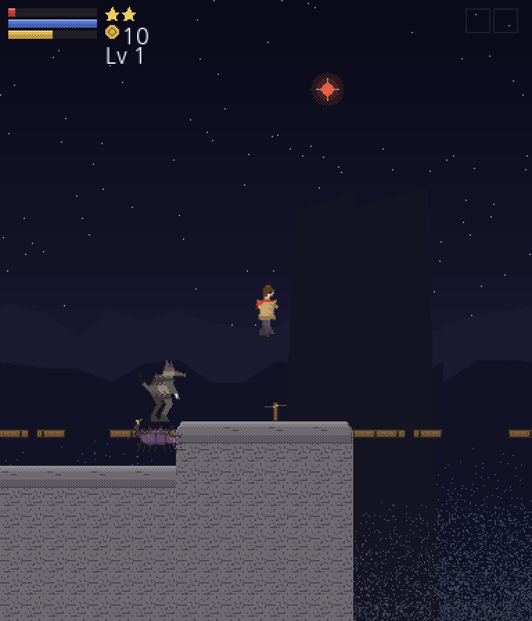
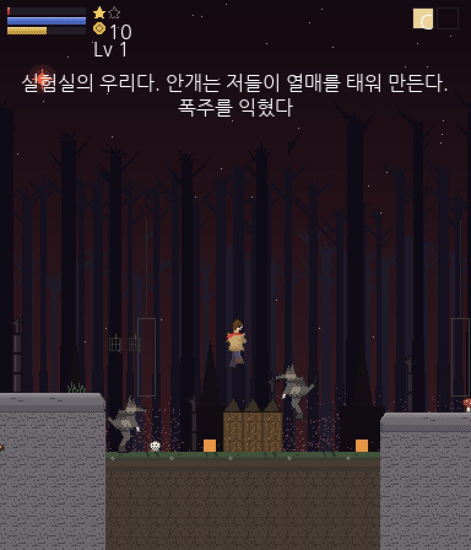

# 소개

개인적인 용도로 만든 C++ 기반 게임 엔진입니다. Windows에서는 GDI, macOS와 Android에서는 SDL2 백엔드로 렌더링합니다.

|      구분      |                    내용                     |
| :------------: | :-----------------------------------------: |
|    Version     |                    Beta                     |
|    Platform    |           Windows, macOS, Android           |
|   사용 언어    |                  C++, Lua                   |
|  Engine Type   |               자체 개발 엔진                |
|    Graphics    | Windows GDI / SDL2 Renderer (macOS, Android) |
|  이미지 포맷   |  PNG, BMP (GDI는 libpng, SDL2는 SDL2_image)  |
|  오디오 재생   |        OGG, WAV 등 (SDL2_mixer 사용)        |
| Script Engine  |                 Lua v5.3.5                  |
|  하드웨어 가속 |       SDL2 백엔드 지원 (GDI는 미지원)       |
|  Bitmap Font   |        지원 (BMFont, 한글 렌더링 포함)        |
| 동적 폰트 묘화 |       지원 (GetGlyphOutline, Windows 전용)       |
|   핫 리로드    |     지원 (실행 중인 게임에 Lua 스크립트 push)     |
|     테스트     | C++/Lua 단위 테스트, 픽셀 검증, GitHub Actions CI |
|   Map Editor   | [InitialEditor](https://github.com/biud436/InitialEditor) (웹 기반, 별도 저장소) |
|   Data Type    |      \*.json (Game Data), \*.sqlite (DB)      |
|     타일맵     |    지원 (JSON 맵 포맷 v1, 다층, 컬링)     |
|  동영상 재생   |                   미지원                    |
|     암호화     |                   미지원                    |

# 데모 게임: 알데바란 (횡스크롤 액션)

이 엔진으로 만든 **횡스크롤 액션** 게임입니다. 엔진 코드는 손대지 않고, 물리와 충돌과 전투를 전부 `scripts/games/aldebaran/`의 Lua로 작성했습니다.

보물 사냥꾼 카르토가 금단의 숲 알데바란에서 가면 원숭이에게 배낭과 지도를 빼앗기고, 검은 안개의 숲을 헤쳐 그것을 되찾는 한 판(3~5분)입니다. 원안은 저자의 기획서 「스피카」(Spica_v0.9)이며, 데모 분량으로 정돈한 기획서가 [docs/design/aldebaran.md](./docs/design/aldebaran.md)에 있습니다. `./build/Initial2D`를 실행하면 타이틀이 바로 뜹니다.

| 기암 절벽, 골짜기를 건넌다 | 늑대 인간의 마을, 안개가 붉다 |
| :---: | :---: |
|  |  |

```bash
# 실행하면 타이틀부터 시작합니다
./build/Initial2D

# 스테이지 바로 열기 (도입 컷씬 생략, 좌표 표시)
INITIAL2D_SCENE=aldebaran INITIAL2D_SKIP_INTRO=1 INITIAL2D_DEBUG=1 ./build/Initial2D
```

엔진이 장르에 중립이라는 것을 보이는 데모 셋(플래피 버드, 타일맵, 떠나기 전에)이 저장소에 남아 있지만 게임의 흐름에는 들어 있지 않습니다. `INITIAL2D_SCENE=flappy` 처럼 이름을 주면 그 씬으로 바로 열립니다.

| 조작 | PC | 모바일 |
| :--- | :--- | :--- |
| 이동 | ← → (같은 방향 빠르게 두 번 = 대쉬) | 왼쪽 아래 가상 패드 |
| 점프 | Z 또는 Space (공중에서 한 번 더 = 2단 점프) | **점프** 버튼 |
| 공격 | X 연타 (3단 베기 콤보) | **공격** 버튼 |
| 폭주 | C (MP 10, 4초, 쿨타임 12초) | **폭주** 버튼 |
| 검기 방출 | V (MP 8, 쿨타임 2.5초) | **검기** 버튼 |
| 일시 정지 | ESC 또는 P | 오른쪽 위 정지 버튼 |

폭주와 검기 방출은 처음에는 쓸 수 없습니다. 숲에서 흔적을 찾아야 얻습니다.

터치는 단일 터치라 패드와 버튼을 동시에 누를 수 없습니다. 그래서 공중에서는 관성이 유지되고, 패드에서 손을 뗀 직후(0.18초)의 점프는 직전 달리기 속도를 잇습니다. "달리다 손을 떼고 점프"가 키보드의 "달리며 점프"와 같은 궤적이 되도록 한 것입니다.

몬스터는 넷입니다. 밀림 전갈거미(근접형, 움츠림이 공격 신호이고 독침을 씁니다), 늑대 인간(돌격형, 발견하면 한 번 돌진하고 전투가 아닐 때 회복합니다), 마을의 우두머리인 검은 늑대(돌격을 다시 씁니다), 그리고 제단 앞의 가면 원숭이 짐도둑(투척형, 다가가면 달아나고 멀면 돌팔매를 던지며 절반에서 두 번째 판으로 넘어갑니다)입니다. 상태는 순찰 → 추적 → 공격으로 흐르고, 종별 차이는 코드가 아니라 표(`stage.lua`)입니다. 접촉 데미지는 없습니다. 선딜레이가 보이는 공격만 아픕니다.

## 걸을수록 숲이 달라지고, 이야기가 밝혀진다

스테이지는 256타일이며 **다섯 구간**입니다. 구간마다 무대가 바뀌고(경계에서 배경 두 벌을 겹쳐 서서히 갈아 끼웁니다), 위험이 달라지고, **흔적 하나가 이 숲의 내력을 한 조각 알려 줍니다.**

| 구간 | 무대 | 흔적이 알려 주는 것 |
| :--- | :--- | :--- |
| 숲 입구 | 마른 검은 나무, 옅은 안개 | 발자국이 여럿이다. 그놈은 혼자가 아니었다 |
| 옛 길 | 안개가 걷히고 부서진 석주와 포석 | 레굴루스가 낸 길이다. 숲이 나중에 덮었다 |
| 기암 절벽 | 나무가 끊기고 골짜기와 먼 산, 별이 많다 | 사람들은 짐도 두고 급히 떠났다 |
| 늑대 마을 | 오두막과 모닥불과 매달린 우리. 안개가 붉다 | 안개는 자연이 아니다. 열매를 태워 만들어 판다 |
| 제단 앞 | 마름모 제단과 네 화두의 빛 | 도둑이 노린 것은 금괴가 아니라 지도였다 |

흔적은 **힘도 하나씩 줍니다.** 보물 사냥꾼이 단검으로 늑대 인간을 벨 수는 없으므로, 검은 안개가 단검에 스미는 것으로 풀었습니다(원안의 "보라색 검기"와 "마법 캐스팅"이 여기에 쓰입니다). 검기, 흔적 읽기, 도약은 늘 켜져 있고, 폭주와 검기 방출은 쿨타임이 있는 스킬이라 화면 오른쪽 위 슬롯에서 식는 것이 보입니다.

**흔적은 강제가 아닙니다.** 지나쳐도 스테이지는 끝나지만, 결과 창의 "알아낸 것"이 비고 에필로그의 마지막 줄이 붙지 않으며, 늑대 무리를 폭주 없이 상대하게 됩니다. 이야기를 읽은 사람이 강해집니다.

레벨 디자인은 가르치고(평지의 거미 하나), 시험하고(턱 위의 거미), 비트는(둘) 순서입니다. 첫 낭떠러지는 빠져도 뛰어서 나오는 얕은 도랑이고, 그 다음 다리의 세 칸 구멍이 진짜입니다. 레벨이 오르면 HP가 가득 차므로 구간별 경험치를 맞물려 **다음 구간 직전에 오르도록** 배치했습니다.

| 파일 | 역할 |
| :--- | :--- |
| `scripts/games/aldebaran/title.lua`, `game.lua` | 타이틀과 스테이지 씬 (컷씬, HUD, 일시 정지, 에필로그) |
| `scripts/games/aldebaran/player.lua` | 이동 물리와 콤보 (엔진에 닿지 않는 순수 모듈) |
| `scripts/games/aldebaran/monster.lua` | 몬스터 상태 기계 (순찰, 추적, 공격, 돌격, 투척) |
| `scripts/games/aldebaran/combat.lua` | 데미지, 명중 굴림, 레벨 표, 버서커 (순수 함수) |
| `scripts/games/aldebaran/stage.lua` | 스테이지 데이터: 구간, 종별 능력치, 배치 좌표, 흔적과 이야기 글 |
| `scripts/games/aldebaran/hud.lua` | HP/MP/EXP 막대와 목숨, 골드 |

그림과 맵과 효과음은 전부 코드로 만들어 커밋했습니다. 도트는 단색 스케치 위에 디더링 명암을 얹고 테두리를 두르는 순서로 그립니다.

```bash
# 시트(카르토, 몬스터 셋), 타일셋, 원경, 타이틀, HUD, 효과음 8종
python3 tools/generate_aldebaran_assets.py

# 스테이지 1-1 검은 안개의 숲 (128x28). 지형과 배치는 전부 손으로 정한 좌표
python3 tools/generate_aldebaran_maps.py
```

인수 테스트(`tests/engine/scenes/aldebaran_scene.lua`)가 타이틀 → 도입 컷씬 → 게임 오버와 다시 하기 → 대쉬와 턱과 다리 → 전투와 성장 → 체크포인트 부활 → 짐도둑 → 배낭 → 에필로그 → 타이틀을 입력 재생기로 매번 다시 통과합니다. 전투 굴림이 시드 난수라 시나리오는 항상 같은 결과를 냅니다.

```bash
# 첫 화면을 헤드리스로 찍어 눈으로 확인
INITIAL2D_SCENE=aldebaran INITIAL2D_SKIP_INTRO=1 INITIAL2D_NO_RTP=1 \
  INITIAL2D_SCREENSHOT=/tmp/aldebaran_%04ld.bmp INITIAL2D_SCREENSHOT_FRAME=20 \
  INITIAL2D_EXIT_AFTER=30 ./build/Initial2D
```

# 개발 히스토리

엔진과 에디터의 발전 과정을 시간 순으로 정리합니다. 초기의 엔진과 에디터는 전부 손수 개발했으며, 최근의 포팅과 검수 자동화부터는 AI와의 협업으로 진행하고 있습니다.

## Windows GDI 엔진 (원형, 2018~)

Win32 GDI로 렌더링하는 엔진 원형입니다. Lua 스크립트로 게임 로직을 작성하는 구조, 비트맵 폰트 한글 렌더링, GetGlyphOutline 기반 동적 폰트, SDL2_mixer 오디오 등 핵심 구조가 이 시기에 만들어졌습니다. 전부 직접 설계하고 구현했습니다.

## C# Winform 맵 에디터 (초안, 개발 중단)

1차원 배열로 되어있는 타일맵을 편집하고 테스트 플레이를 하면 자체 개발된 게임 엔진에 그대로 반영되는 간단한 툴로 시작하였습니다만 스크립트 에디터까지 추가하면서 차차 발전을 하였습니다. 그러나 타일맵을 직접 페인트 이벤트로 그리기에는 다양한 문제가 있는데다가 윈폼은 크로스 플랫폼도 아니기 때문에 현재는 중단되었습니다.

|          구분           |    내용     |
| :---------------------: | :---------: |
|          버전           |  개발 중단  |
|       레이어 갯수       |     1개     |
| 오브젝트 배치 가능 여부 | 아직 불가능 |
| 오브젝트 속성 변경 가능 | 아직 불가능 |
|     스크립트 에디터     |    있음     |
|      맵 파일 생성       |    가능     |
|   테스트 플레이 기능    |    있음     |
|    다중 타일셋 처리     |   불가능    |


## 웹 맵 에디터 InitialEditor (개발 중)

C# Winform 초안에 비해 상당한 UI 개선과 설계 개선이 있으며 자체 개발되었습니다. 크로스 플랫폼 에디터를 목표로 TypeScript와 PIXI.js 기반으로 개발하고 있습니다. 저장소는 [InitialEditor](https://github.com/biud436/InitialEditor)입니다.

|          구분           |    내용     |
| :---------------------: | :---------: |
|          버전           |   개발 중   |
|       레이어 갯수       |     4개     |
| 오브젝트 배치 가능 여부 | 아직 불가능 |
| 오브젝트 속성 변경 가능 | 아직 불가능 |
|     스크립트 에디터     |    없음     |
|      맵 파일 생성       |    가능     |
|   테스트 플레이 기능    |    없음     |
|    다중 타일셋 처리     |    가능     |


## macOS 포팅 (SDL2, 2026)

Windows GDI 전용이던 엔진을 SDL2 백엔드로 포팅하여 macOS에서 구동됩니다. 이 작업부터는 AI(Claude)와의 협업으로 진행하였으며, 게임 로직과 Lua 스크립트는 손대지 않고 플랫폼 차이를 어댑터 계층에서 흡수하는 원칙을 지켰습니다. GDI 원형은 `archive/windows-gdi` 브랜치에 그대로 보존되어 있습니다.

## Android 포팅 (SDL2, 2026)

macOS 포팅을 기반으로 Android까지 확장하였습니다. 역시 AI와의 협업으로 진행하였고, 실기(Galaxy S24)에서 풀 스크린 구동, 터치 입력, 오디오 재생을 확인했습니다. APK를 다시 설치하지 않고 Lua 스크립트를 실행 중인 게임에 밀어 넣는 핫 리로드(HMR)도 이때 추가되었습니다. 이후 검수 자동화(단위 테스트, 픽셀 검증, CI)도 같은 방식으로 구축하고 있습니다.

# 앞으로의 계획

롤플레잉 게임 제작이 가능한 수준까지 엔진을 확장하는 것이 다음 목표입니다. 단계별 계획과 진행 상황은 [docs/plans](./docs/plans/index.md)에서 관리합니다.

- 타일맵 시스템과 맵 파일 포맷 정리 (완료, 2026-08)
- InitialEditor 연동: 로컬 브리지 서버를 통한 맵 저장과 스크립트 편집 (완료, 2026-08)
- 리소스 파이프라인: RPG Maker 2003 RTP 변환과 규격 데이터 (완료, 2026-08)
- Lua로 작성하는 RPG 프레임워크: 캐릭터 이동, 이벤트, 대화창 (완료, 2026-08)
- 위 요소를 모두 사용하는 데모 게임 (완료, 2026-08). 기획서를 먼저 쓰고 그대로 만든 「떠나기 전에」 ([기획서](./docs/design/port-town.md))
- 이벤트를 데이터 커맨드로 적어 맵 에디터가 만들 수 있게 (엔진 쪽 완료, 2026-08). 맵 포맷 v2가 이벤트를 실어 나릅니다 ([계획](./docs/plans/10-demo-v2.md))
- 아이템과 소지품, 그리고 마을 사람들을 잇는 심부름 (완료, 2026-08). 걷고 읽는 것 말고 할 일이 생겼습니다 ([계획](./docs/plans/11-game-systems.md))
- 세 번째 장르: 횡스크롤 액션 「알데바란」 (완료, 2026-08). 저자의 기획서 「스피카」를 데모로 만들었고, 엔진 코드는 손대지 않았습니다 ([기획서](./docs/design/aldebaran.md))
- 다음 로드맵: 에디터의 이벤트 편집기, 저장과 로드, 오토타일, 씬 스택 ([로드맵 v2](./docs/plans/roadmap-v2.md))

# 스크립트 예제

C++ 에선 내부적으로 WinMain을 Entry Point로 삼고 초기화를 거치고, 상태 머신을 통해 순서대로 initialize, update, render 등의 메소드를 자동으로 호출할 수 있습니다.

Initialize 함수가 유일한 Entry Point 입니다. 다음으로 중요한 함수는 Update 함수와 Render 함수로 매 프레임마다 호출되며 마지막으로 Destroy 함수에서 메모리 해제를 합니다.

```lua
local Font = require("scripts/Font")
local Image = require("scripts/image")

function Initialize()

	-- -- Create background image
	-- background = Image("./resources/titles/title.png", 0, 0, 640, 480, 1, "Title")

	-- -- Create button text
	buttonText = Image("./resources/titles/start_button.png" , 0, 0, 256, 30, 1, "buttonText")

	-- -- Create Image
	mx = WindowWidth() / 2 - buttonText.getWidth() / 2
	my = WindowHeight() / 2 - buttonText.getHeight() + WindowHeight() / 4
	buttonText.setPosition(mx, my)
	buttonText.setAngle(0.0)
	buttonText.setScale(1.0)
	buttonText.setLoop(false)

	-- Play background music
	Audio.PlayMusic("./resources/audio/bless.ogg", "mainBGM", true)

	isValid = PreparaFont("./resources/fonts/hangul.fnt")

	myElapsed = 0.0
	tt = 0

	print("hi...",  "안녕하십니까")

	tilemap = Tilemap.Load("./resources/maps/sample.json")

	local res = GetResourcesFiles()
	for k, v in ipairs(res) do
		print(v)
	end

end

function Update(elapsed)
	-- background.update(elapsed)

	buttonText.setAngle(Input.GetMouseY())
	buttonText.update(elapsed)

	tt = tt + 1
	if tt > WindowWidth() then
		tt = 0
	end

	myElapsed = elapsed
end

function DrawTempText()
	-- Create a text
	local text = "2020년입니다~ 하하"
	myFont = Font("나눔고딕", 32, 400, 440)
	myFont.setText(text)

	-- myFont.setPosition(WindowWidth() - myFont.getTextWidth(text), 0)
	myFont.setTextColor(math.floor(math.random() * 255), math.floor(math.random() * 255), math.floor(math.random() * 255))
	myFont.setOpacity( 200 )
	myFont.setAngle(tt % 360)
	myFont.setPosition(WindowWidth() / 2 - myFont.getTextWidth(text) / 2, WindowHeight() / 4)

	myFont.update(myElapsed)

	myFont.draw()
	myFont.dispose()
end

function Render()
	-- background.draw()
	buttonText.draw()

	-- 두 레이어를 카메라 오프셋과 함께 그립니다 (오른쪽으로 흐르는 스크롤)
	Tilemap.Draw(tilemap, 1, 2, tt, 0)

	DrawTempText()

	if isValid then
		DrawText(100, 0, "테스트")
		frameCount = GetFrameCount()
		DrawText(0, 0, tostring(frameCount))
	end

end

function Destroy()
	-- background.dispose()
	buttonText.dispose()

	Tilemap.Dispose(tilemap)

	Audio.ReleaseMusic("mainBGM")
end
```

# Image

Image 객체는 Sprite Sheet를 사용하여 Character Animation을 표현하기 위한 객체입니다.
또한 Sprite class의 Wrapper입니다.
루아의 GC 대상이 아니므로 비트맵 메모리 해제를 명시적으로 호출해줘야 할 필요성이 있습니다.

```lua
	image = Image(path, x, y, width, height, max_frames, id)
	image.update(elapsed) -- 프레임 업데이트
	image.draw() -- 렌더링
	image.dispose() -- 메모리 해제
	image.getPosition() -- 위치
	image.getScale() -- 스케일
	image.getWidth() -- 가로 크기
	image.getHeight() -- 세로 크기
	image.getRadians() -- 각도를 라디안으로 반환
	image.getAngle() -- 각도 반환
	image.getVisible() -- Visible 값 반환
	image.getOpacity() -- 투명도
	image.getFrameDelay() -- 프레임 딜레이
	image.getStartFrame() -- 시작 프레임
	image.getEndFrame() -- 종료 프레임
	image.getAnimComplete() -- 애니메이션 완료
	image.getRect() -- Rect Table 반환
	image.setPosition(x, y)
	image.setScale(n)
	image.setAngle(degree)
	image.setRadians(rotation)
	image.setVisible(visible)
	image.setOpacity(n)
	image.setFrameDelay(delay)
	image.setFrames(s, e)
	image.setCurrentFrame(currentFrame)
	image.setSheetGrid(cols, rows) -- 시트 분할 (기본 4x4, 가로 한 줄 시트는 (frames, 1))
	image.setRect(x, y, width, height)
	image.setLoop(isLooping)
	image.setAnimComplete(isCompletedAnimation)
```

저수준 `Sprite.*` API로는 다음 기능도 사용할 수 있습니다.

```lua
	-- 스프라이트 시트의 분할을 지정합니다. 기본값은 4x4입니다.
	Sprite.SetSheetGrid(spriteId, cols, rows)
	-- 스프라이트 메모리를 해제합니다. 텍스처는 TextureManager.Remove로 따로 해제합니다.
	Sprite.Dispose(spriteId)
```

# TextureManager

이미지 파일(_.png, _.bmp)을 로드하여 DIB로 변환합니다. DIB는 GDI 기반으로 렌더링 시 이용됩니다.
PNG 파일의 경우, 내부적으로 libpng를 이용하여 색상 RAW 값을 얻은 후 DIB로 디코딩하였습니다.

Image 객체에서 내부적으로 호출하므로 굳이 수동으로 사용할 필요는 없습니다.

```lua
	-- id는 문자열이어야 합니다.
	-- "my_character"와 같은 식으로 지정하십시오.
	TextureManager.Load(filename, id)
	TextureManager.Remove(id)
	local isValid = TextureManager.IsValid(id)
```

# Audio

OGG 파일 또는 WAV 파일, 미디 파일 등 여러가지 포맷의 오디오 파일을 재생할 수 있습니다.

```lua
	-- loop: true = 무한 반복, false = 한 번 재생
	-- 숫자를 주면 SDL_mixer의 루프 값을 그대로 사용합니다.
	Audio.PlayMusic(path, id, loop) -- BGM 재생
	Audio.PlaySound(path, id, loop) -- SE 재생
	Audio.SetVolume(vol) -- BGM 볼륨 설정
	Audio.GetVolume() -- BGM 볼륨 획득
	Audio.InsertNextMusic(path, id, loop) -- 다음 BGM 추가
	Audio.PauseMusic() -- BGM 일시 정지
	Audio.StopMusic() -- BGM 정지
	Audio.ResumeMusic() -- BGM 재개
	Audio.IsPlayingMusic() -- BGM 재생 여부
	Audio.FadeOutMusic(ms) -- BGM 페이드아웃
	Audio.SetMusicPosition(position) -- BGM 재생 위치 설정
	Audio.ReleaseMusic(id) -- 메모리 해제
```

음악 재생 시 오디오 파일을 자동으로 로드합니다. 하지만 메모리는 반드시 수동으로 해제해야 합니다.

# Input

키보드 및 마우스 입력을 처리합니다.

```lua

	-- vKey는 가상 키 값입니다.
	Input.IsKeyDown(vKey)
	Input.IsKeyUp(vKey)
	Input.IsKeyPress(vKey)
	Input.IsAnyKeyDown()
	Input.GetMouseX()
	Input.GetMouseY()

	-- 마우스에서의 가상 키는 다음과 같습니다.
	-- 0 : 마우스 왼쪽
	-- 1 : 마우스 오른쪽
	-- 2 : 마우스 중앙
	Input.IsMouseDown(vKey)
	Input.IsMouseUp(vKey)
	Input.IsMousePress(vKey)
	Input.IsAnyMouseDown()

	-- 마우스 휠 처리는 메시지 콜백 함수에서 수신합니다.
	-- 마우스 휠 올림 내림 판단을 -1과 1로 처리합니다.
	Input.GetMouseZ()
	Input.SetMouseZ(wheel)

	-- Enter 키를 누르고 있는가?
	local vKey = string.byte("\r\n") -- 13
	if Input.IsKeyPress(vKey) then
		-- 처리
	end

	-- A 키를 눌렀는가?
	local vKey = string.byte("A") --65
	if Input.IsKeyDown(vKey) then
		-- 처리
	end

```

키 입력은 고정 스텝(16ms)마다 상태를 읽습니다. 그 사이에 눌렸다 떼어진 입력(리맵 도구나 매크로가 만든 키는 눌림과 뗌이 같은 프레임에 들어옵니다)은 상태만 봐서는 관측되지 않으므로, SDL 키 이벤트를 래치해 한 틱 동안 눌린 것으로 반영합니다. 마우스 클릭도 같은 방식입니다. (macOS에서 ESC가 어느 씬에서도 먹지 않던 원인이었습니다.)

# Bitmap Text

텍스트를 화면에 그립니다. Bitmap Text(비트맵 텍스트)로 되어있으나 \n과 같은 개행 문자(Line Break)도 처리합니다. **한글**과 **영어**를 사용할 수 있습니다. BMFont로 만든 **PNG 파일**과 **XML 규격**으로 된 **FNT 파일**이 리소스 폴더에 있어야 합니다.

동적 할당이 아닌 고정적으로 수 만자에 대한 텍스트 메모리를 한 번에 할당합니다. 이렇게 하는 이유는 동적 할당으로 인한 캐시 문제 때문입니다.

글자 크기는 폰트 파일이 가진 크기 그대로입니다. 그리는 쪽에 확대나 축소가 없으므로, 크기를 바꾸려면 그 크기로 구운 폰트를 따로 준비합니다. `PreparaFont`는 실행 중에 다시 불러 폰트를 갈아 끼울 수 있습니다 (RPG 데모가 렌더 배율 2에 맞춰 16px 폰트로 바꿨다가 나갈 때 되돌립니다).

```bash
# TTF에서 비트맵 폰트를 굽습니다 (기본: 기존 hangul.fnt와 같은 2453자, 16px)
python3 tools/generate_bmfont.py --size 16
python3 tools/generate_bmfont.py --size 12 --out hangul12
```

```lua
	-- FNT 파일 준비 (TinyXml을 이용하여 읽습니다)
	PreparaFont(fontFilePath)
	--텍스트 묘화 (Bitmap Text 기반입니다.)
	DrawText(x, y, text)
	-- 텍스트를 그리지 않고 픽셀 단위 폭을 반환합니다.
	local width = GetTextWidth(text)
```

# Json

JSON 파일을 읽어서 Lua 테이블로 변환합니다. 배열은 1부터 시작하는 테이블이 되고, null은 nil이 됩니다. 로드에 실패하면 nil과 오류 메시지를 반환합니다.

```lua
	local data, err = Json.Load("./resources/maps/sample.json")
	if data then
		print(data.name, #data.layers)
	end
```

# Tilemap

맵 포맷 v1(JSON)을 로드해 그리는 다층 타일맵입니다. 화면에 보이는 타일만 그리므로(컬링) 화면보다 큰 맵을 카메라 오프셋으로 스크롤할 수 있습니다. 포맷 명세는 `docs/plans/02-tilemap.md`, 샘플 맵은 `resources/maps/sample.json`에 있으며, 게임 메뉴의 **타일맵 데모**(`scripts/games/tilemap_demo.lua`)가 사용 예제입니다.

좌표 규약: `x`, `y`는 0부터 시작하는 타일 좌표, `layer`는 1부터 시작하는 레이어 번호, `camX`, `camY`는 월드 픽셀 단위 카메라 좌상단입니다.

```lua
	-- 로드. 실패하면 nil과 오류 메시지를 반환합니다.
	local map, err = Tilemap.Load("./resources/maps/sample.json")

	-- 크기 조회
	local w, h, tileW, tileH, layerCount = Tilemap.GetSize(map)

	-- 그리기: 레이어 범위(양 끝 포함)와 카메라 오프셋.
	-- 범위를 나눠 부르면 캐릭터를 층 사이에 끼워 그릴 수 있습니다.
	Tilemap.Draw(map, 1, 1, camX, camY)   -- 바닥층
	-- (여기서 캐릭터 스프라이트를 그린다)
	Tilemap.Draw(map, 2, layerCount, camX, camY)   -- 장식층

	-- 타일 조회와 변경 (gid, 0은 빈 칸. 범위 밖 조회는 0)
	local gid = Tilemap.GetTileId(map, x, y, 1)
	Tilemap.SetTileId(map, x, y, 2, 56)

	-- 충돌 레이어 조회 (맵 범위 밖은 항상 false)
	if Tilemap.IsPassable(map, x, y) then --[[ 이동 ]] end

	-- 해제. 타일셋 텍스처는 TextureManager 캐시에 남아 재사용됩니다.
	Tilemap.Dispose(map)
```

# Font

동적으로 폰트 텍스쳐를 생성하고 화면에 텍스트를 그립니다.
사용자의 시스템 폰트 폴더에 있는 어떤 폰트도 사용할 수 있습니다.

```lua
	nanumFont = Font("나눔고딕", 72)
	nanumFont.setText("안녕하세요?")
	nanumFont.setPosition(100, 100)
	nanumFont.setTextColor(255, 0, 0)
	nanumFont.setOpacity(128)

	-- 업데이트 함수입니다만 아직 아무 기능도 하지 않습니다.
	nanumFont.update(elapsed)

	-- 렌더링 함수입니다. 반드시 호출해야 합니다.
	nanumFont.draw()
	nanumFont.dispose()

```

다만 폰트가 시스템에 설치되어있는 지 여부는 따로 검색하지 않습니다.

# Utils

```lua
	-- 메시지 박스를 띄웁니다.
	MessageBox(title, caption)

	-- 루아 스크립트 파일을 로드합니다.
	LoadScript(luaFile)

	-- 창 가로 크기
	WindowWidth()

	-- 창 세로 크기
	WindowHeight()

	-- 평균 FPS
	-- SDL2 백엔드는 고정 16ms 스텝과 vsync를 사용하므로 보통 60이 나옵니다.
	GetFrameCount()


	-- 현재 경로를 유닉스/리눅스 스타일로 출력합니다. (경로 구분자 = /)
	GetCurrentDirectory(True)

	-- 현재 경로를 윈도우즈 스타일로 출력합니다. (경로 구분자 = \\)
	GetCurrentDirectory()

	-- 리소스 파일 목록을 반환합니다 (암호화 X)
	GetResourcesFiles()

	-- 실행 중인 플랫폼 이름: "windows", "macos", "linux", "android", "ios"
	-- 터치 조작 UI 표시 여부 등을 스크립트에서 결정할 때 씁니다.
	GetPlatform()
```

# 가상 패드 (터치 조작)

키보드가 없는 플랫폼에서 방향 입력을 화면 위 D-패드로 받는 공용 Lua 모듈입니다 (`scripts/ui/vpad.lua`). 엔진의 마우스 API를 그대로 쓰므로 별도 터치 API 없이 동작하며, Android와 iOS에서는 자동으로 표시하고 데스크톱에서는 `INITIAL2D_VPAD=1` 환경 변수로 띄워 확인할 수 있습니다. 타일맵 데모가 사용 예제입니다. Android 뒤로가기 버튼은 ESC(키 코드 27)로 전달됩니다.

```lua
	local VirtualPad = require("scripts/ui/vpad")

	if VirtualPad.shouldShow() then
		pad = VirtualPad.new{ x = 24, y = WindowHeight() - 184, size = 160 }
	end

	-- 매 프레임 (Input 갱신 뒤)
	pad.update()
	if pad.isPressed("left") then --[[ 왼쪽 ]] end   -- "up", "down", "left", "right"

	-- 게임 쪽 탭 처리에서 패드 위 터치를 제외할 때
	if not pad.contains(Input.GetMouseX(), Input.GetMouseY()) then --[[ 탭 처리 ]] end

	pad.draw()      -- HUD 위에 마지막으로 그립니다
	pad.dispose()
```

패드 이미지(`resources/ui/dpad.png`)와 버튼 이미지는 `python3 tools/generate_ui_assets.py`로 다시 만들 수 있습니다.

# RPG 프레임워크 (Lua)

타일맵 위를 걸어다니는 캐릭터를 만드는 Lua 레이어입니다 (`scripts/rpg/`). 엔진은 장르 중립으로 두고 캐릭터, 이동, 카메라 같은 개념은 전부 스크립트에 두었습니다. 게임 메뉴의 **떠나기 전에**(`scripts/games/rpgdemo/`)가 사용 예제입니다.

| 모듈 | 역할 |
| :--- | :--- |
| `character.lua` | 그리드 이동, 방향, 걷기 애니메이션, 통행 판정, 이동 루트. 플레이어와 NPC 공용 |
| `player.lua` | 방향키와 가상 패드를 캐릭터에 연결 |
| `camera.lua` | 대상 추적과 맵 경계 클램프 |
| `map_scene.lua` | 맵, 캐릭터들, 카메라를 묶고 y좌표 순으로 그림 |
| `event.lua` | 맵 위의 이벤트와 트리거 감지 (아래 "이벤트와 상호작용") |
| `interpreter.lua` | 이벤트 스크립트를 코루틴으로 실행, 실행 중 조작 잠금 |
| `window.lua` | 스킨을 잘라 조립하는 창 (나인 슬라이스, 여닫기) |
| `message.lua` | 대화창 (타자 효과, 자동 줄바꿈, 쪽 넘김, 얼굴, 이름) |
| `choice.lua` | 선택지 창 (커서, 스크롤, 취소) |
| `text.lua` | UTF-8 글자 단위 분할과 픽셀 폭 기준 줄바꿈 |
| `rng.lua` | 시드를 주입하는 난수 |
| `specs.lua` | CharSet, FaceSet, ChipSet의 규격 데이터 |

```lua
	local MapScene = require("scripts/rpg/map_scene")
	local Player = require("scripts/rpg/player")
	local Rng = require("scripts/rpg/rng")

	local CHARSET = "./resources/charsets/placeholder.png"

	local scene = MapScene.new{ mapPath = "./resources/maps/sample.json" }
	local hero = scene:addCharacter{ tx = 40, ty = 35, charset = CHARSET, charIndex = 0 }
	scene:setCameraTarget(hero)
	local player = Player.new{ character = hero, input = Input, pad = pad }

	local npc = scene:addCharacter{ tx = 38, ty = 34, charset = CHARSET, charIndex = 2 }
	npc:setWander{ rng = Rng.new(1234), area = { x = 34, y = 29, w = 14, h = 12 } }

	-- 매 프레임
	player:update()
	scene:update(elapsed / 1000.0)
	scene:draw()
```

이동은 RPG Maker 2003과 같은 그리드 방식입니다. 타일 좌표가 진실이고 픽셀 좌표는 보간 중에만 어긋납니다. 이동을 시작하는 순간 목적지 칸을 점유하므로 두 캐릭터가 같은 칸에 겹치지 않고, 이동 중에 들어온 입력은 하나만 예약되어 칸에 도착하는 즉시 이어집니다. 정지 상태에서 다른 방향키를 짧게 누르면 걷지 않고 방향만 바뀝니다.

캐릭터는 타일맵의 하층과 상층 사이에 발 y좌표 순으로 그려집니다. 한 프레임(24x32)이 타일(16x16)보다 커서 머리가 윗 칸으로 올라가므로 울타리나 지붕 뒤로 지나갑니다.

**어디까지가 하층인지는 맵마다 정합니다.** 머리가 윗 칸으로 올라간다는 것은, 그 칸의 타일이 캐릭터보다 앞에 그려지면 머리를 덮는다는 뜻이기도 합니다. 집 벽처럼 **앞에 서는** 것은 하층이어야 하고, 빨래줄처럼 **밑을 지나가는** 것만 상층입니다.

```lua
	-- scripts/maps/port_town.lua
	return {
		map = "./resources/maps/port_town.json",   -- 레이어: ground, deco, over
		groundLayers = 2,                          -- ground와 deco가 캐릭터 아래
		...
	}
```

맵의 레이어 이름은 관례상 `ground`(땅), `deco`(앞에 서는 것), `over`(밑을 지나가는 것)를 씁니다. `groundLayers`를 생략하면 1이라 `deco`가 캐릭터 위로 올라가고, 집 벽 앞에 서면 머리가 벽에 가려집니다.

데모는 렌더 배율 2로 돌아갑니다 (16픽셀 타일을 1:1로 그리면 캐릭터가 점처럼 보입니다). 배율은 `INITIAL2D_RPG_SCALE`로 바꿀 수 있고, 씬을 나갈 때 1로 되돌아갑니다. 조작 안내는 4초 뒤 사라지며, 좌표와 FPS는 `INITIAL2D_DEBUG=1`일 때만 표시됩니다.

캐릭터 시트 규격(288x256 한 장에 8명, 한 명은 24x32 3프레임 4방향)은 `scripts/rpg/specs.lua`에 데이터로 있습니다. 커밋된 `resources/charsets/placeholder.png`는 `python3 tools/generate_charset.py`로 다시 만들 수 있습니다. RPG Maker 2003 정품 보유자가 `tools/rtp_import.py`로 변환해 두었다면 데모가 `resources/rtp/CharSet/Actor1.png`를 자동으로 쓰며, `INITIAL2D_CHARSET`으로 다른 시트를 지정할 수도 있습니다.

난수는 반드시 `rng.lua`의 시드 주입 래퍼로 씁니다. 전역 `math.random`을 쓰면 누가 언제 몇 번 뽑았는지에 따라 결과가 달라져서, 같은 입력이 같은 화면을 내야 하는 시나리오 테스트가 성립하지 않습니다.

# 이벤트와 상호작용

맵 위의 NPC나 문에 스크립트를 붙이는 방법입니다. 이벤트 커맨드 목록을 쌓는 대신 **Lua 함수를 그대로 씁니다.** 코루틴으로 실행되므로 "대화창이 닫힐 때까지 기다린다"를 콜백 없이 순서대로 적을 수 있고, 조건과 반복은 Lua 문법 그대로입니다.

이벤트는 두 곳에서 옵니다. **맵 파일(JSON)의 `events` 배열**(맵 포맷 v2, 에디터가 놓는 자리)과 **`scripts/maps/<맵이름>.lua`**(사람이 쓰는 자리: 배회 설정, `script` 함수, BGM, 시작 위치)입니다. 둘은 `id`로 합쳐지며 같은 `id`면 Lua 쪽이 이깁니다 (`scripts/rpg/mapdata.lua`). v1 맵 파일(이벤트 없음)도 그대로 열립니다.

```lua
	-- scripts/maps/village.lua
	return {
		map = "./resources/maps/village.json",
		start = { x = 34, y = 21, dir = "down" },

		events = {
			{
				id = "elder",
				x = 32, y = 20,
				charset = { file = "./resources/charsets/placeholder.png", index = 2 },
				trigger = "action",
				commands = {
					{ code = "message", text = "어서 오시게. 처음 보는 얼굴이군." },
					{ code = "choice", options = { "네, 처음입니다", "아니요" }, branches = {
						{ { code = "message", text = "왼쪽 마당의 문으로 들어가면 오두막이라네." },
						  -- 다른 이벤트도 읽는 값입니다 (ctx.state)
						  { code = "setFlag", key = "toldAboutHut" } },
						{},
					} },
				},
			},
			{
				id = "gate", x = 15, y = 15, trigger = "touch",
				commands = { { code = "transfer", map = "room", x = 10, y = 11 } },
			},
		},
	}
```

이벤트의 본문은 **커맨드 목록**입니다. 순수 데이터라 맵 에디터가 만들고 읽을 수 있고, JSON으로 그대로 옮길 수 있습니다. 실행은 `scripts/rpg/commands.lua`가 맡아 6단계 실행기가 아는 함수 하나로 바꿔 줍니다.

```lua
	commands = {
		{ code = "message", name = "선장", face = { file = FACES, index = 4 },
		  text = "저녁 물때에 배가 다시 뜨네." },
		{ code = "choice", options = { "지금 떠난다", "더 둘러본다" }, cancel = 2,
		  branches = {
			{ { code = "setFlag", key = "left" },
			  { code = "scene", name = "title", fade = 30 } },
			{ { code = "message", text = "해가 지기 전에는 오게." } },
		  } },
	}
```

| code | 인자 | 하는 일 |
| :--- | :--- | :--- |
| `message` | `text`, `name`, `face` | 대화창 (닫힐 때까지 기다립니다) |
| `choice` | `options`, `cancel`, `branches` | 선택지. 고른 번호의 가지를 이어서 실행 |
| `wait` | `ms` | 멈춤 |
| `transfer` | `map`, `x`, `y`, `dir` | 맵 이동 (이 뒤의 커맨드는 실행되지 않습니다) |
| `moveRoute` | `target`, `route`, `wait`, `loop` | 이동 루트 |
| `turn` | `target`, `dir` | 방향만 |
| `setFlag` | `key`, `value` | `ctx.state[key] = value` (값을 생략하면 참) |
| `setVar` | `key`, `op`, `value` | `op`는 `=`, `+`, `-` |
| `if` | `cond`, `thenDo`, `elseDo` | 조건 분기 (`then`과 `else`는 Lua 예약어라 `thenDo`, `elseDo`) |
| `playSe` | `file`, `id` | 효과음 |
| `playBgm` | `file`, `volume` | 배경음 (같은 곡이면 이어서) |
| `showLocation` | `text`, `seconds` | 화면 위쪽에 장소 이름 |
| `scene` | `name`, `fade` | 다른 씬으로 |
| `script` | `name`, `args` 또는 `run` | Lua 함수 (커맨드로 적기 어려운 것의 탈출구) |
| `comment` | `text` | 아무것도 하지 않습니다 (에디터 가독성) |

조건은 `{ flag = "gotHerb" }`, `{ flag = "booked", equals = false }`, `{ var = "silver", op = ">=", value = 2 }` 세 형태입니다.

커맨드로 적기 어려운 이벤트는 예전처럼 `script = function(self, ctx) ... end`으로 적으면 됩니다. 데이터 안에서 부르려면 맵 정의 파일의 `scripts` 표에 이름을 등록하고 `{ code = "script", name = "이름", args = {...} }`으로 부릅니다. 이름으로 부르므로 JSON을 오가도 왕복이 깨지지 않습니다.

잘못된 커맨드는 **맵을 열 때** 어느 자리인지와 함께 걸립니다 (`[4].branches[1][1]: 알 수 없는 code`). 실행 도중에 조용히 실패하지 않습니다.

트리거는 네 가지입니다.

| 트리거 | 발동 조건 |
| :--- | :--- |
| `action` | 플레이어가 인접 칸에서 바라보고 결정키 (앞 칸에 없으면 발밑을 봅니다) |
| `touch` | 플레이어가 그 칸에 들어섬 |
| `auto` | 맵 진입 시 한 번, 끝날 때까지 조작 잠금 |
| `parallel` | 매 프레임 병렬 실행, 조작을 잠그지 않음 |

스크립트 안에서 쓰는 `ctx`는 다음과 같습니다. 전부 완료될 때까지 기다렸다가 다음 줄로 갑니다.

```lua
	ctx.message("한 줄")                       -- 대화창이 닫힐 때까지
	ctx.message("얼굴과 이름을 붙일 수도 있습니다", {
		name = "촌장", face = { file = "./resources/faces/placeholder.png", index = 2 },
	})
	local pick = ctx.choice({ "네", "아니요" }) -- 고른 번호(1부터)를 반환
	local pick2 = ctx.choice({ "산다", "안 산다" }, { cancelIndex = 2 })  -- 취소키(X)
	ctx.wait(500)                              -- 밀리초
	ctx.transfer("room", 10, 11)               -- 맵 이동 (이 줄 다음은 실행되지 않음)
	ctx.moveRoute("patrol", { "right", "wait:400", "up" })  -- 루트가 끝날 때까지
	ctx.turn("player", "left")
	ctx.playSe("./resources/audio/door.wav")   -- 효과음
	ctx.playBgm("./resources/audio/inn.ogg", { volume = 80 })
	ctx.showLocation("항구 마을", 2)            -- 화면 위쪽에 장소 이름
	ctx.scene("title", { fade = 30 })          -- 다른 씬으로 (이 줄 다음은 실행되지 않음)
	ctx.state.flag = true                      -- 이벤트끼리 공유하는 저장용 테이블
```

아이템을 주고 뺏고 가졌는지 묻는 커맨드는 [아이템과 소지품](#아이템과-소지품) 절에 있습니다.

이동 루트의 명령은 방향(`up`, `down`, `left`, `right`), `turn:방향`, `wait:밀리초`입니다. `{ loop = true }`로 순찰을 만들고, `{ wait = false }`로 루트를 걸어만 두고 스크립트를 계속 진행할 수 있습니다.

`charset`을 주면 눈에 보이는 NPC가 되고 통행을 막습니다. 생략하면 보이지 않는 트리거 타일이며, `solid = true`를 주면 보이지 않으면서 길을 막는 벽이 됩니다. 외형이 있는 이벤트에 `wander`를 주면 5단계의 배회가 그대로 붙습니다.

스크립트에서 오류가 나면 그 이벤트만 중단되고 기록에 남습니다. 게임이 멈추거나 조작이 잠긴 채로 남지 않습니다.

예제는 `scripts/maps/village.lua`(대화, 분기, 문, 순찰)와 `scripts/maps/room.lua`(맵 진입 자동 실행, 되돌아가는 문)에 있습니다.

데모 맵이 쓰는 타일셋 `resources/tiles/village16.png`는 기존 타일셋 뒤에 집 타일(지붕, 벽, 창문, 문, 마루, 실내벽)을 이어 붙인 것입니다. `python3 tools/generate_village_tileset.py`로 다시 만들 수 있습니다. 뒤에만 더하므로 기존 gid가 밀리지 않아, 먼저 만든 맵 데이터가 그대로 살아 있습니다.

맵 파일은 `python3 tools/generate_demo_maps.py`로 두 벌이 나옵니다. 지오메트리는 한 벌만 정의하고 타일 번호만 바꾸므로 이벤트 좌표는 공통입니다.

| 맵 | 타일셋 | 비고 |
| :--- | :--- | :--- |
| `village.json`, `room.json` | `village16.png` | 저장소에 포함, 어디서나 동작 |
| `village_rtp.json`, `room_rtp.json` | RPG Maker 2003 RTP 칩셋 | 그림은 로컬 자산이라 저장소에 없음 |

어느 쪽을 열지는 `scripts/rpg/assets.lua`가 정합니다. 칩셋과 CharSet, FaceSet, 창 스킨 모두 "RTP가 있으면 RTP, 없으면 저장소의 플레이스홀더"이며, `INITIAL2D_NO_RTP=1`로 RTP를 아예 보지 않게 할 수 있습니다. RTP 소재 자체는 재배포할 수 없으므로 저장소에 넣지 않습니다.

# 대화창과 창 UI

`ctx.message`와 `ctx.choice`가 실제로 그리는 창입니다. RPG Maker 2003의 System 스킨(160x80 한 장)을 조각내어 조립하며, 나인 슬라이스 같은 개념은 C++에 넣지 않고 Lua가 `Sprite.SetRect`로 잘라 찍습니다. 스킨의 분할 좌표는 `scripts/rpg/specs.lua`의 `M.window`에 있습니다.

```lua
	local Window = require("scripts/rpg/window")
	local Dialogue = require("scripts/rpg/message")

	local skin = Window.newSkin{ path = "./resources/ui/window.png", scale = 1 }
	local dialogue = Dialogue.new{
		skin = skin, measure = GetTextWidth, drawText = DrawText,
		lines = 3, lineHeight = 20, speed = 2,      -- speed = 프레임당 글자 수 (0이면 즉시)
		se = { cursor = ..., decision = ..., text = ... },   -- 효과음 함수 (선택)
	}

	-- 이벤트 실행기에 항구로 넘깁니다 (실행기는 창의 존재를 모릅니다)
	local interp = Interpreter.new{ messagePort = dialogue:port(), host = ... }

	-- 매 프레임: 이번 프레임에 눌린 키를 넘기고, 스크립트가 도는 중인지 알려 줍니다
	dialogue:update({ confirm = ..., up = ..., down = ..., cancel = ... }, interp:isBusy())
	dialogue:draw()
```

- **타자 효과**: 한 글자씩 출력하고, 결정키를 한 번 누르면 남은 글자를 즉시 보여 주며, 다시 누르면 다음 쪽으로 넘어가거나 닫힙니다. 글자 수는 UTF-8 기준이라 한글도 한 글자씩 나옵니다.
- **자동 줄바꿈과 쪽 넘김**: 비트맵 폰트는 글자마다 폭이 달라 `GetTextWidth`로 픽셀을 재서 접습니다. 띄어쓰기에서 끊는 것을 우선하되 한 낱말이 폭을 넘으면 글자에서 끊습니다. 정해진 줄 수를 넘으면 쪽으로 나뉘고, 다음 쪽이 남으면 창 아래에서 스킨의 화살표가 깜빡입니다.
- **얼굴과 이름**: `face = { file, index }`는 FaceSet(192x192, 48x48짜리 16칸)의 한 칸을 창 왼쪽에 그리고 글자를 그만큼 밀어냅니다. `name`은 대화창 위에 붙는 작은 창입니다.
- **선택지**: 항목 수와 글자 폭에 맞춰 창을 만들고 대화창 오른쪽 위에 붙입니다. 항목이 많으면 보이는 만큼만 그리고 위아래 화살표로 알립니다. `cancelIndex`를 주면 취소키가 그 번호로 빠져나갑니다.

창 자체(`window.lua`)는 대화와 무관한 공용품이라 메뉴나 상태창에도 그대로 씁니다.

```lua
	local win = Window.new{ skin = skin, x = 8, y = 8, width = 200, height = 96 }
	win:open()            -- 4프레임에 걸쳐 위아래 가운데에서 자랍니다
	win:update()          -- 매 프레임 한 번
	win:draw()            -- 창틀만 그립니다. 내용은 contentRect()에 직접 그립니다
	local x, y, w, h = win:contentRect()
```

엔진의 스프라이트 배율은 가로세로 같은 값 하나뿐이라 조각을 늘일 수 없습니다. 그래서 변과 바탕은 반복해 채우고, 남는 자투리는 그 크기만큼 소스를 잘라 그립니다. 바탕은 원본을 세로로 4등분해 띠마다 해당 부분을 반복하므로, 그라데이션이 32픽셀마다 끊겨 보이지 않습니다.

스킨과 얼굴 그림도 `scripts/rpg/assets.lua`가 고릅니다. RTP가 있으면 그쪽(`resources/rtp/System/System.png`, `resources/rtp/FaceSet/People1.png`)을, 없으면 저장소에 커밋된 플레이스홀더를 씁니다. 플레이스홀더는 다음 명령으로 다시 만듭니다.

```bash
# 대화창 스킨 (resources/ui/window.png, 160x80, System과 같은 배치)
python3 tools/generate_windowskin.py

# 얼굴 그림 (resources/faces/placeholder.png, 192x192, CharSet과 같은 팔레트)
python3 tools/generate_faceset.py

# UI 효과음(커서, 결정, 글자, 문)과 그 밖의 UI 이미지
python3 tools/generate_ui_assets.py
```

# 아이템과 소지품

열쇠와 증표를 들고 다니고, 가진 것에 따라 문이 열리거나 대사가 바뀌게 하는 층입니다. 소지품은 별도의 저장소가 아니라 이벤트가 공유하는 `ctx.state` 안의 표 하나(`state.items`)입니다. 맵을 넘는 상태 공유가 이미 그 테이블로 되고 있어서, 나중에 저장 기능이 붙으면 소지품도 함께 저장됩니다.

아이템 목록은 **데이터**입니다. 프레임워크(`scripts/rpg/inventory.lua`)는 표를 주입받을 뿐 내용을 모르므로, 다른 게임은 다른 표를 넣으면 됩니다.

```lua
	-- scripts/games/rpgdemo/items.lua
	return {
		warehouse_key = { name = "창고 열쇠", order = 10,
			desc = "여관 주인이 삼 년째 맡아 둔 열쇠. 손잡이가 반들반들하다." },
		silver = { name = "은화", order = 30,
			desc = "이 지방에서 쓰는 은화. 여관 하루치가 두 닢이다." },
	}
```

이벤트에서는 커맨드 둘과 조건 하나를 씁니다.

```lua
	commands = {
		{ code = "if", cond = { item = "warehouse_key" },
		  thenDo = {
			{ code = "message", text = "열쇠가 맞는다. 삼 년 만에 문이 열렸다." },
			{ code = "giveItem", item = "lamp_oil" },
		  },
		  elseDo = {
			{ code = "message", text = "창고 문은 잠겨 있다." },
		  } },

		-- 개수 비교와 지불
		{ code = "if", cond = { item = "silver", op = ">=", value = 2 },
		  thenDo = {
			{ code = "takeItem", item = "silver", count = 2 },
			{ code = "setFlag", key = "booked" },
		  } },
	}
```

`giveItem`은 `count`를 생략하면 하나, `takeItem`은 모자라면 **아무 일도 일으키지 않고** 넘어갑니다 (반쯤 빼고 실패하는 경우가 없어야 이벤트가 스스로를 되돌릴 필요가 없습니다). 조건 `{ item = ... }`은 `op`와 `value`가 없으면 "하나라도 가졌는가"입니다.

소지품 창은 `scripts/rpg/menu.lua`이며, 목록과 설명 두 칸으로 되어 있습니다. 창과 커서와 스크롤은 대화창과 같은 `window.lua`를 씁니다.

```lua
	local Inventory = require("scripts/rpg/inventory")
	local Menu = require("scripts/rpg/menu")

	local menu = Menu.new{ skin = skin, measure = GetTextWidth, drawText = DrawText,
		screenW = W, screenH = H, maxVisible = 6 }

	menu:open(Inventory.list(interp.state, ITEMS))   -- 취소키를 눌렀을 때
	menu:update({ up = ..., down = ..., cancel = ..., confirm = ... })
	menu:draw()
```

씬이 창을 들고, 열려 있는 동안 플레이어 입력을 잠급니다. 대화창과 같은 구조입니다. 대화나 이벤트가 도는 중에는 열리지 않습니다.

엔진 밖에서 쓸 수 있는 함수는 다섯입니다. 전부 순수 함수라 엔진 없이 단위 테스트로 검증됩니다.

```lua
	Inventory.count(state, "silver")          -- 몇 개 (없으면 0)
	Inventory.has(state, "silver", 2)         -- 두 개 이상 가졌는가
	Inventory.give(state, "silver", 2)        -- 더한다 (반환은 더한 뒤의 개수)
	Inventory.take(state, "silver", 2)        -- 뺀다 (모자라면 false, 아무것도 하지 않음)
	Inventory.list(state, ITEMS)              -- 창이 그릴 목록 { id, name, desc, count }
```

`Inventory.list`는 표의 `order`로 정렬하므로 목록의 순서가 실행마다 흔들리지 않습니다. 표에 없는 id를 가지고 있으면 이름 자리에 id를 그대로 내보냅니다. 표를 고치다가 물건이 조용히 사라지는 것보다 눈에 보이는 편이 낫기 때문입니다.

# 데모 게임: 떠나기 전에

앞의 요소를 전부 사용하는 짧은 데모입니다. 게임 본편은 아니며 `INITIAL2D_SCENE=title`로 엽니다. 타이틀에서 시작하면 항구 마을에 내린 여행자가 됩니다. 저녁 배가 뜰 때까지 마을을 둘러보고, 떠날지 하루 더 머물지 스스로 정하면 끝납니다. 3분이면 끝낼 수 있고 전부 보면 10분입니다. 같은 빌드에서 플래피 버드와 알데바란도 그대로 돌아갑니다. "한 엔진에서 세 장르"가 이 데모들의 요점입니다.

마을 사람 다섯은 하나의 심부름으로 이어져 있습니다. 생선 장수에게 창고의 사연을 듣고, 여관 주인에게 열쇠를 받고, 창고에서 등유를 꺼내 등대지기에게 가져다 주면, 그날 밤 등대에 불이 켜지고 여관에 묵을 은화가 생깁니다. 하지만 사슬은 강제가 아닙니다. 언제든 부두로 내려가 배를 타면 그대로 끝납니다. 본 만큼 에필로그에 줄이 붙습니다.

세계관은 저자의 자작곡에서 왔습니다. 마을은 《Port》의 항구이고, 들어갈 수 있는 건물은 그 앨범 1번 트랙과 같은 이름의 여관이며, 마을에 걸리는 곡은 《Bless》입니다. 갈 수 없는 곳(《요정의 숲》, 《천공의 끝》)은 사람들의 말 속에만 있습니다. 기획서는 [docs/design/port-town.md](./docs/design/port-town.md)에 있고, 대사와 배치와 화면 구성이 전부 그 문서에서 나옵니다.

```bash
# 데모를 바로 열기 (타이틀부터)
INITIAL2D_SCENE=title ./build/Initial2D

# 맵 씬만 바로 열기. 시작 맵과 캐릭터 시트, 렌더 배율도 바꿀 수 있습니다
INITIAL2D_SCENE=rpg INITIAL2D_MAP=inn INITIAL2D_RPG_SCALE=3 ./build/Initial2D
```

| 조작 | PC | 모바일 |
| :--- | :--- | :--- |
| 이동, 커서 | 방향키 (정지 중 짧게 누르면 방향만 전환) | 왼쪽 아래 가상 D-패드 |
| 결정 | Z, Enter, Space | 오른쪽 아래 **결정** 버튼 |
| 취소, 소지품 창 | X | 오른쪽 아래 **취소** 버튼 |
| 나가기 | ESC (맵→타이틀, 타이틀→목록) | 뒤로가기 |

타이틀 화면에서는 항목을 직접 눌러도 선택됩니다 (`Choice:indexAt`).

구성은 다음과 같습니다. 씬은 데모 폴더에, 맵의 이벤트 정의는 맵 이름과 짝이 되는 파일에 둡니다.

| 파일 | 역할 |
| :--- | :--- |
| `scripts/games/rpgdemo/title.lua` | 타이틀 씬. 배경 한 장과 커서 메뉴(시작, 조작 방법, 나가기) |
| `scripts/games/rpgdemo/game.lua` | 맵 씬. 맵 적재, 페이드 전환, 대화창과 실행기 연결, 장소 이름 |
| `scripts/maps/port_town.lua`, `inn.lua` | 이벤트 정의와 대사 (커맨드 목록) |
| `scripts/games/rpgdemo/items.lua` | 아이템 표 (이름, 설명, 목록 순서) |
| `scripts/rpg/assets.lua` | 그림 고르기 (RTP가 있으면 RTP, 없으면 저장소의 플레이스홀더) |
| `scripts/bgm.lua` | 지금 걸린 곡을 기억해, 같은 곡이면 다시 틀지 않는 배경음 층 |
| `scripts/ui/buttons.lua` | 터치용 결정과 취소 버튼 |

## 그림과 맵 다시 만들기

데모의 그림은 전부 코드로 그려 커밋했습니다 (RPG Maker RTP가 없어도 그대로 돌아갑니다). 배치를 바꾸려면 도구를 고치고 다시 실행합니다.

```bash
# 항구 타일 41종 (바다 2x2 한 벌, 부두, 배, 등대, 우물, 게시판, 좌판, 난로 등)
python3 tools/generate_port_tileset.py

# 맵 두 장. 기획서 4절의 좌표 그대로, 난수를 쓰지 않습니다
python3 tools/generate_port_maps.py

# 타이틀 배경 (제목 글자가 그림에 구워집니다. 한글 TTF 필요)
python3 tools/generate_title.py
```

## 음악과 효과음

BGM은 씬과 맵이 각자 정합니다. 맵 정의 파일에 `bgm`을 적으면 그 맵에 들어설 때 곡이 바뀌고, 같은 곡이면 이어서 재생됩니다 (맵을 오갈 때 음악이 끊기지 않습니다).

```lua
	-- scripts/maps/inn.lua
	return {
		map = "./resources/maps/inn.json",
		bgm = { file = INN_BGM, volume = 80 },   -- 곡마다 음압이 달라 볼륨을 함께 줍니다
		...
	}
```

저장소에 들어 있는 곡은 저자의 자작곡 `resources/audio/bless.ogg` 한 곡입니다 (분석은 [docs/music/bless-analysis.md](./docs/music/bless-analysis.md)). 여관은 《Port》의 "Inn"을 위한 자리를 비워 두었습니다. `resources/audio/inn.ogg`에 파일을 두면 그 곡이 걸리고, 없으면 마을 곡을 낮춰 씁니다. RTP의 MIDI에 의존하지 않습니다.

효과음(커서, 결정, 글자, 문)은 코드로 합성해 커밋했습니다: `python3 tools/generate_ui_assets.py`.

## RTP 없이 보기

데모는 RPG Maker 2003 RTP가 로컬에 있으면 캐릭터와 얼굴, 창 스킨을 그쪽에서 가져오고, 없으면 저장소에 커밋된 플레이스홀더를 씁니다. `INITIAL2D_NO_RTP=1`을 주면 RTP가 있어도 보지 않습니다. 검수가 어느 기계에서나 같은 화면을 내야 하기 때문이고(골든 스크린샷), "RTP가 없는 사람에게 어떻게 보이는가"를 확인할 때도 씁니다.

```bash
INITIAL2D_NO_RTP=1 INITIAL2D_SCENE=title ./build/Initial2D
```

## 인수 테스트

데모 전체가 로드맵의 인수 테스트입니다. `tests/engine/scenes/rpgdemo_scene.lua`가 실제 씬 파일을 그대로 얹고, 입력 재생기로 키를 눌러 심부름 사슬 전체를 한 번에 통과시킨 뒤 좌표와 대사와 소지품을 검사합니다 (`tests/run_all.sh`에 포함).

> 타이틀 → 부두 도착 → 생선 장수 → 잠긴 창고 → 여관(열쇠를 받지만 은화가 없어 방을 못 잡는다) → 창고를 연다(등유) → 등대지기(등유를 주고 은화 두 닢) → 등대지기(하늘 끝) → 여관(은화로 방을 잡는다) → 배 → 에필로그 → 타이틀

가진 것에 따라 문이 열리고 대사와 에필로그가 갈리는 것을 여기서 확인합니다. 배회하는 아이는 위치가 틱 수에 따라 흔들려 경로가 불안정해지므로 시나리오에 넣지 않고, 아이가 주는 물건은 단위 테스트가 확인합니다.

```bash
# 시나리오 도중의 화면을 눈으로 확인 (title, town, bag)
INITIAL2D_DEMO_STOP=town INITIAL2D_NO_RTP=1 \
  INITIAL2D_SCREENSHOT=/tmp/demo_%04ld.bmp INITIAL2D_SCREENSHOT_FRAME=20 \
  INITIAL2D_EXIT_AFTER=30 ./build/Initial2D
```

# 게임 설정

프로젝트 루트에 `game.json` 파일을 두면 게임별 설정을 지정할 수 있습니다. 파일이 없으면 기본 해상도(768x896)와 배율 1을 사용합니다.

```json
{ "windowWidth": 320, "windowHeight": 240, "renderScale": 2 }
```

개발 중에는 `INITIAL2D_WINDOW=320x240`과 `INITIAL2D_SCALE=2` 환경 변수로 임시로 바꿀 수 있습니다. 환경 변수가 `game.json`보다 우선합니다. (SDL2 백엔드 전용)

`renderScale`은 픽셀 확대 배율입니다. 창 크기는 그대로 두고 논리 해상도만 1/배율로 줄이므로, 16픽셀 타일이 32픽셀로 보입니다. 확대는 렌더러가 하기 때문에 타일맵, 스프라이트, 비트맵 폰트가 한꺼번에 같은 비율로 커지고 마우스 좌표도 논리 좌표로 들어옵니다. 창 크기의 약수를 쓰는 것이 좋습니다 (768x896이면 2나 4). 씬마다 다른 배율이 필요하면 스크립트에서 바꿉니다.

```lua
	-- 배율을 바꾸면 WindowWidth/Height가 달라지므로 배치는 그 뒤에 계산합니다.
	SetRenderScale(2)
	local W, H = WindowWidth(), WindowHeight()   -- 768x896 창이면 384x448

	GetRenderScale()   -- 현재 배율
	SetRenderScale(1)  -- 씬을 나갈 때 되돌립니다
```

# 브랜치 구조

|         브랜치         | 용도                                         |
| :--------------------: | :------------------------------------------- |
|        `master`        | 안정 브랜치                                  |
|         `dev`          | 개발 통합 브랜치 (macOS 포팅 병합됨)         |
|  `feature/macos-port`  | macOS SDL2 포팅 작업 브랜치                  |
| `feature/android-port` | Android SDL2 포팅 준비 브랜치 (dev에서 파생) |
| `archive/windows-gdi`  | Windows GDI 원형 보존 브랜치 (수정 금지)     |

# 빌드 방법 (플랫폼별)

## Windows (GDI 백엔드, Visual Studio)

Visual Studio에서 `Initial2D.sln`을 열고 빌드합니다. 실행 시 필요한 DLL은 저장소 루트에 포함되어 있습니다.

빌드 시 다음 라이브러리 파일과 DLL 파일이 필요합니다.

- zlib
  - libzlib.lib
  - zlib1.dll
  - libpng16.lib

- Msimg32.lib

- SDL2 (zlib license)
  - SDL2.dll
  - SDL2.lib

- SDL2 Mixer (zlib license)
  - SDL2_mixer.dll
  - SDL2_mixer.lib
  - native_midi.lib
  - playmus.lib
  - playwave.lib
  - timidity.lib
  - libFLAC-8.dll
  - libmodplug-1.dll
  - libmpg123-0.dll
  - libogg-0.dll
  - libvorbis-0.dll
  - libvorbisfile-3.dll

- TinyXML (zlib license)
  - tinyxml.lib
  - OpenAL32.lib

## macOS (SDL2 백엔드, CMake)

Homebrew로 의존성을 설치한 뒤 CMake로 빌드합니다.

```bash
brew install cmake sdl2 sdl2_image sdl2_mixer

cmake -B build
cmake --build build

# 게임 실행
./build/Initial2D

# 단계별 검증 실행 파일
./build/phase0_sanity   # lua/sqlite/json 동작 검증
./build/phase1_sanity   # 엔진 코어 검증

```

`scripts/main.lua`가 참조하는 일부 이미지 에셋은 저장소에 포함되어 있지 않습니다.
로컬 테스트용 플레이스홀더는 `python3 tools/generate_placeholder_assets.py`로 생성할 수 있습니다.

포팅 상세 내역은 `docs/porting/phase0-inventory.md`를 참조하십시오.

## Android (SDL2 백엔드, Gradle + NDK)

Android 포팅은 dev와 master에 병합되어 있으며, 실기(Galaxy S24 / Android 16)에서 풀 스크린 게임 구동, 터치 입력, 오디오 재생이 확인되었습니다. `android/` 디렉터리에 Gradle 프로젝트가 있습니다.

```bash
# 1. SDL2/SDL2_image/SDL2_mixer 소스 다운로드 (최초 1회)
./android/download_sdl.sh

# 2. 게임 에셋(scripts/, resources/ 등)을 assets로 스테이징
./android/prepare_assets.sh

# 3. 빌드 (Android Studio로 android/ 디렉터리를 열거나 CLI 사용)
cd android
gradle wrapper --gradle-version 8.6   # 최초 1회
./gradlew :app:assembleDebug
```

요구 사항: JDK 17, Android SDK (API 34), NDK r27 이상, CMake 3.22 이상.
에셋은 최초 실행 시 APK assets에서 내부 저장소로 추출된 뒤 사용됩니다. `prepare_assets.sh`는 `resources/RTP.zip`(런타임 미사용, 재배포 불가)과 닷파일을 APK에서 제외합니다.

무선 디버깅으로 연결한 기기에 설치하고 실행하는 예입니다.

```bash
adb connect 192.168.0.10:33319          # 기기의 무선 디버깅 화면에 표시된 주소
adb install -r app/build/outputs/apk/debug/app-debug.apk
adb shell am start -n com.biud436.initial2d/.Initial2DActivity
adb logcat -s SDL/APP                    # 엔진 로그만 보기
```

남은 포팅 작업은 다음과 같으며, 상세는 `docs/porting/android-plan.md`를 참조하십시오.

- 수명주기 처리: 백그라운드 전환 시 BGM 일시정지와 재개, GLES 컨텍스트 유실 시 텍스처 복구 검증
- 세이브 데이터 보존: 에셋 재추출 시 `db.sqlite`를 덮어쓰지 않도록 쓰기 파일 분리
- 고 DPI 환경에서 텍스트 가독성 실기 확인

## 핫 리로드 (HMR)

APK를 다시 빌드하거나 설치하지 않고, 수정한 `scripts/*.lua`를 실행 중인 게임에 밀어 넣어 바로 반영합니다.
HMR 서버는 게임에 내장되어 있습니다. **Android에서는 항상 켜져 있고**(루프백 127.0.0.1:5959),
데스크톱(macOS)에서는 `INITIAL2D_HMR=1` 환경변수로 켭니다.

```bash
# ── Android 기기 ──
adb forward tcp:5959 tcp:5959      # 최초 1회 (기기 연결 후)
python3 tools/hmr_push.py          # scripts/*.lua 전체를 1회 push
python3 tools/hmr_push.py --watch  # 저장할 때마다 자동 push (개발 중 권장)

# ── macOS ──
INITIAL2D_HMR=1 ./build/Initial2D  # HMR 서버를 켜고 게임 실행
python3 tools/hmr_push.py          # 다른 터미널에서 push
```

push가 도착하면 게임이 Lua VM을 재시작하고 `main.lua`부터 다시 로드합니다
(**풀 리스타트**이며 점수 등 게임 진행 상태는 초기화됩니다).
동작 로그는 `adb logcat -s SDL/APP`에서 `HotReload:` 태그로 확인할 수 있습니다.
프로토콜과 설계 상세는 `docs/porting/android-hmr-plan.md`를 참조하십시오.

## 에디터 브리지 서버 (InitialEditor 연동)

웹 앱인 [InitialEditor](https://github.com/biud436/InitialEditor)가 이 프로젝트의 `scripts/`와 `resources/`를
직접 읽고 쓰게 하는 작은 Node 서버입니다 (`tools/bridge/`, Node 20 이상, 외부 의존성 없음).
브라우저에서 스크립트를 고쳐 저장하면 브리지가 파일을 쓰고, 이어서 위의 HMR 서버로 push 해
실행 중인 게임이 즉시 다시 뜹니다.

```bash
# 1. 게임을 HMR 켜고 실행 (macOS 예시, Android는 adb forward 후 동일)
INITIAL2D_HMR=1 ./build/Initial2D

# 2. 브리지 서버 실행 (기본: 이 저장소를 프로젝트로, 127.0.0.1:5960)
node tools/bridge/server.js
node tools/bridge/server.js --project ~/mygame --port 5960 --hmr-port 5959

# 3. InitialEditor 실행 (에디터 저장소에서) 후 브라우저에서 스크립트 편집 → Ctrl+S
yarn dev
```

| 메서드와 경로 | 역할 |
|---|---|
| `GET /api/project` | 프로젝트 정보 (스크립트, 맵, 타일셋 목록) |
| `GET /api/files/<path>` | 파일 읽기 (`scripts/`, `resources/` 아래만) |
| `HEAD /api/files/<path>` | 파일 존재 여부와 크기 |
| `PUT /api/files/<path>` | 파일 쓰기 (원자적 쓰기, 상위 폴더 자동 생성) |
| `DELETE /api/files/<path>` | 파일 삭제 |
| `POST /api/reload` | `scripts/**/*.lua`를 게임 HMR 서버로 push |
| WebSocket `/ws` | 파일 변경 알림 (`origin`이 `external`이면 다른 편집기가 고친 것) |

에디터에서 할 수 있는 일은 다음과 같습니다.

| 기능 | 조작 | 결과 |
|---|---|---|
| 스크립트 편집 | Tools → Script Editor | `scripts/**/*.lua`를 열고 Ctrl+S로 저장, 저장 직후 게임 리로드 |
| 맵 내보내기 | Ctrl+E | 맵 포맷 v1로 `resources/maps/<이름>.json` 저장, 필요한 타일셋 이미지도 함께 복사 |
| 맵 열기 | Ctrl+O | `resources/maps/*.json`을 에디터로 불러오기 |
| 맵 저장 | Ctrl+S | 열려 있는 맵을 같은 경로에 다시 저장 (경로가 없으면 내보내기 대화상자) |
| 새 맵 | Ctrl+N | 이름, ID, 크기를 정해 빈 맵 만들기 |

- 127.0.0.1에만 바인드하며, 브라우저 origin은 루프백(`localhost`, `127.0.0.1`)만 허용합니다 (`--allow-origin`으로 추가 가능).
- 화이트리스트 밖 경로와 `..` 탈출은 403으로 거부합니다.
- 테스트: `node --test tools/bridge/test/*.test.js` (전체 검수 `tests/run_all.sh`에도 포함).

에디터가 내보낸 맵은 다음과 같이 확인합니다. 시작 씬과 맵 파일을 환경 변수로 지정할 수 있습니다.

```bash
# 타일맵 데모를 바로 열고, 에디터가 내보낸 맵을 그리게 합니다 (헤드리스 + 스크린샷)
SDL_VIDEODRIVER=dummy INITIAL2D_SCENE=tilemap INITIAL2D_MAP=./resources/maps/my_map.json \
  INITIAL2D_SCREENSHOT=/tmp/shot_%04ld.bmp INITIAL2D_SCREENSHOT_FRAME=40 \
  INITIAL2D_EXIT_AFTER=60 ./build/Initial2D

# 데모의 맵 씬으로 열려면 맵과 짝이 되는 이벤트 정의(scripts/maps/<이름>.lua)가
# 필요합니다. INITIAL2D_MAP에는 파일 경로가 아니라 그 정의 이름을 줍니다.
INITIAL2D_SCENE=rpg INITIAL2D_MAP=village ./build/Initial2D
```

# RTP 리소스 변환 (RPG Maker 2003)

RPG Maker 2003의 RTP 소재를 엔진이 바로 읽는 형태로 바꾸는 도구입니다 (`tools/rtp_import.py`, Pillow 필요).
8비트 팔레트 PNG를 32비트 RGBA로 바꾸면서 R2K3의 관례인 "팔레트 0번은 투명"을 강제하고, WAV는 그대로 가져옵니다.
tRNS 청크가 파일마다 들쭉날쭉해서 엔진 로더를 고치는 대신 변환 단계에서 정리하는 쪽을 택했습니다.

> 라이선스: RTP 소재는 RPG Maker 2003 정품 보유자만 다른 엔진의 게임에 쓸 수 있고, 소재 자체의 재배포는 금지입니다.
> 그래서 `resources/RTP.zip`과 변환 결과인 `resources/rtp/`는 gitignore로 막아 두었습니다. 저장소에 커밋하지 마십시오.

```bash
# 기본: PNG 변환과 WAV 복사 (resources/RTP.zip → resources/rtp/)
python3 tools/rtp_import.py

# 일부 카테고리만, 파일명의 공백을 언더스코어로, WAV도 OGG로
python3 tools/rtp_import.py --only CharSet,ChipSet --normalize-names --ogg

# MIDI를 OGG로 미리 렌더링 (fluidsynth 필요. 엔진에는 MIDI 재생기를 넣지 않습니다)
python3 tools/rtp_import.py --soundfont ~/soundfonts/GeneralUser.sf2

# 변환 결과 검증 (규격 크기, 투명 픽셀, 원본 대조, gitignore)
python3 tests/verify_rtp.py
```

- 투명 처리는 카테고리마다 다릅니다. CharSet, ChipSet, Monster, System 같은 키 컬러 배경만 뚫고, 배경 그림(Backdrop, Panorama, Title, GameOver)은 팔레트 0번이 실제 그림 색이라 건드리지 않습니다. 판단 근거는 `tools/rtp_import.py`의 `CATEGORIES` 표에 실측값과 함께 적어 두었습니다.
- MIDI 141개는 기본적으로 건너뜁니다. macOS에는 `/System/Library/Components/CoreAudio.component/Contents/Resources/gs_instruments.dls`가 있어 동작 확인용으로 쓸 수 있지만, 배포할 음원은 자유 라이선스 사운드폰트로 만드십시오.
- 파일명의 공백("Mountain Road.png")은 그대로 둡니다. 엔진 로더가 공백 경로를 문제없이 읽는 것을 확인했습니다.
- 변환 결과의 명세는 `resources/rtp/manifest.json`에 남고, `tests/verify_rtp.py`가 이 파일을 계약 삼아 검증합니다. `resources/rtp/`가 없는 환경(CI 등)에서는 스스로 건너뜁니다.

시트 분할과 방향 행 순서 같은 R2K3 규격은 엔진이 아니라 `scripts/rpg/specs.lua`에 Lua 데이터로 둡니다.
엔진(C++)은 PNG와 OGG만 알면 되고, "CharSet 한 장에 8명이 들어 있다"는 지식은 스크립트 쪽 몫입니다.

```lua
local Specs = require("scripts/rpg/specs")
local c = Specs.charset

local actor = Image("./resources/rtp/CharSet/Actor1.png", 0, 0,
    c.frameW, c.frameH, c.gridCols * c.gridRows, "actor")
actor.setSheetGrid(c.gridCols, c.gridRows)
actor.setCurrentFrame(Specs.charsetFrameIndex(0, "down", 1))  -- 0번 캐릭터, 정면, 서기
actor.setPosition(100, 200)
```

| 리소스 | 규격 | 한 장에 들어 있는 것 |
|---|---|---|
| CharSet | 288x256 | 캐릭터 8명 (한 명 72x128, 24x32 프레임 3개 x 4방향) |
| FaceSet | 192x192 | 얼굴 16개 (48x48) |
| ChipSet | 480x256 | 16x16 타일 30열 16행 |
| System | 160x80 | 창 바탕, 테두리, 커서, 화살표, 숫자, 글자색 20개 |

방향 행 순서는 위(0), 오른쪽(1), 아래(2), 왼쪽(3)이며 실제 이미지를 확대해 확인한 값입니다.
걷기는 왼발, 서기, 오른발 세 프레임을 `0, 1, 2, 1` 순서로 돕니다.

# 테스트

전체 검수는 스크립트 하나로 실행합니다. C++ 단위 테스트, Lua 단위 테스트, 픽셀 검증, 골든 스크린샷 비교, 브리지 서버 테스트, RTP 변환 검증이 순서대로 수행됩니다.

```bash
# 빌드부터 전체 테스트까지 한 번에 실행 (기본은 헤드리스라 창을 띄우지 않습니다. CI와 동일)
tests/run_all.sh

# 실제 창을 띄워 실행하고 싶을 때
SDL_VIDEODRIVER= tests/run_all.sh

# 렌더링 결과를 의도적으로 바꾼 경우 골든 스크린샷을 갱신합니다.
# 갱신된 tests/golden/*.png 파일을 눈으로 확인한 뒤 커밋하십시오.
tests/run_all.sh --update-golden
```

테스트를 추가하는 방법은 다음과 같습니다.

- C++ 단위 테스트는 `tests/unit/`에 파일을 만들고 `CMakeLists.txt`의 `engine_unit_tests` 목록에 추가합니다.
- Lua 단위 테스트는 `tests/lua/cases/`에 파일을 만들고 `tests/lua/manifest.lua` 목록에 추가합니다. 엔진에 내장된 Lua VM에서 실행됩니다.
- 화면을 보는 테스트는 `tests/engine/scenes/`에 씬을 만들고 `tests/run_engine_tests.py`에 검사를 추가합니다. 씬 테스트는 저자의 `scripts/`를 통째로 얹고 `main.lua`만 갈아 끼우므로, 게임이 실제로 여는 파일을 그대로 검사합니다.
- 사람의 조작이 필요한 시나리오는 `tests/lua/input_replay.lua`로 재생합니다. 프레임 단위로 키를 예약하거나(`{ at = 10, press = "Z" }`), 화면 상태를 보고 그때그때 누를 수도 있습니다(`replay:tap("Z")`, `replay:press("LEFT")`). 고정 타임스텝이라 같은 시나리오는 항상 같은 결과를 냅니다.

푸시할 때마다 GitHub Actions(macOS 러너)가 같은 검수를 헤드리스로 실행합니다.

# 코딩 스타일

- 함수는 소문자로 시작되어야 하며, 단어마다 대문자를 사용해야 합니다.

# 리소스 출처

tuxemon-tileset - https://opengameart.org/content/tuxemon-tileset
