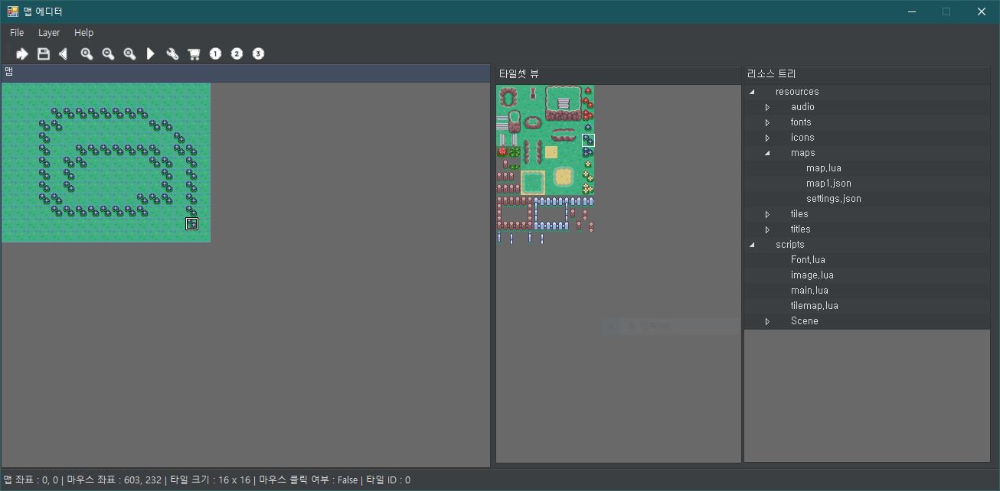
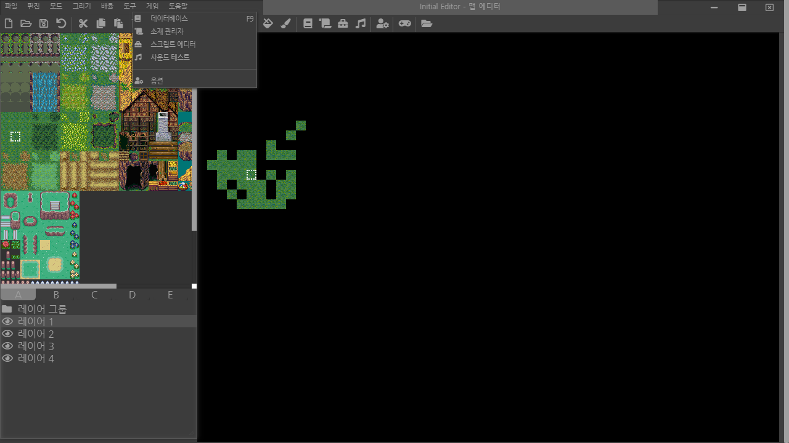

# 소개

개인적인 용도로 만든 C++ 기반 게임 엔진입니다. Windows에서는 GDI, macOS와 Android에서는 SDL2 백엔드로 렌더링합니다.

|      구분      |                    내용                     |
| :------------: | :-----------------------------------------: |
|    Version     |                    Beta                     |
|    Platform    |           Windows, macOS, Android           |
|   사용 언어    |                  C++, Lua                   |
|  Engine Type   |               자체 개발 엔진                |
|    Graphics    | Windows GDI / SDL2 Renderer (macOS, Android) |
|  이미지 포맷   |  PNG, BMP (GDI는 libpng, SDL2는 SDL2_image)  |
|  오디오 재생   |        OGG, WAV 등 (SDL2_mixer 사용)        |
| Script Engine  |                 Lua v5.3.5                  |
|  하드웨어 가속 |       SDL2 백엔드 지원 (GDI는 미지원)       |
|  Bitmap Font   |        지원 (BMFont, 한글 렌더링 포함)        |
| 동적 폰트 묘화 |       지원 (GetGlyphOutline, Windows 전용)       |
|   핫 리로드    |     지원 (실행 중인 게임에 Lua 스크립트 push)     |
|     테스트     | C++/Lua 단위 테스트, 픽셀 검증, GitHub Actions CI |
|   Map Editor   | [InitialEditor](https://github.com/biud436/InitialEditor) (웹 기반, 별도 저장소) |
|   Data Type    |      \*.json (Game Data), \*.sqlite (DB)      |
|     타일맵     |    지원 (JSON 맵 포맷 v1, 다층, 컬링)     |
|  동영상 재생   |                   미지원                    |
|     암호화     |                   미지원                    |

# 개발 히스토리

엔진과 에디터의 발전 과정을 시간 순으로 정리합니다. 초기의 엔진과 에디터는 전부 손수 개발했으며, 최근의 포팅과 검수 자동화부터는 AI와의 협업으로 진행하고 있습니다.

## Windows GDI 엔진 (원형, 2018~)

Win32 GDI로 렌더링하는 엔진 원형입니다. Lua 스크립트로 게임 로직을 작성하는 구조, 비트맵 폰트 한글 렌더링, GetGlyphOutline 기반 동적 폰트, SDL2_mixer 오디오 등 핵심 구조가 이 시기에 만들어졌습니다. 전부 직접 설계하고 구현했습니다.

## C# Winform 맵 에디터 (초안, 개발 중단)

1차원 배열로 되어있는 타일맵을 편집하고 테스트 플레이를 하면 자체 개발된 게임 엔진에 그대로 반영되는 간단한 툴로 시작하였습니다만 스크립트 에디터까지 추가하면서 차차 발전을 하였습니다. 그러나 타일맵을 직접 페인트 이벤트로 그리기에는 다양한 문제가 있는데다가 윈폼은 크로스 플랫폼도 아니기 때문에 현재는 중단되었습니다.

|          구분           |    내용     |
| :---------------------: | :---------: |
|          버전           |  개발 중단  |
|       레이어 갯수       |     1개     |
| 오브젝트 배치 가능 여부 | 아직 불가능 |
| 오브젝트 속성 변경 가능 | 아직 불가능 |
|     스크립트 에디터     |    있음     |
|      맵 파일 생성       |    가능     |
|   테스트 플레이 기능    |    있음     |
|    다중 타일셋 처리     |   불가능    |



## 웹 맵 에디터 InitialEditor (개발 중)

C# Winform 초안에 비해 상당한 UI 개선과 설계 개선이 있으며 자체 개발되었습니다. 크로스 플랫폼 에디터를 목표로 TypeScript와 PIXI.js 기반으로 개발하고 있습니다. 저장소는 [InitialEditor](https://github.com/biud436/InitialEditor)입니다.

|          구분           |    내용     |
| :---------------------: | :---------: |
|          버전           |   개발 중   |
|       레이어 갯수       |     4개     |
| 오브젝트 배치 가능 여부 | 아직 불가능 |
| 오브젝트 속성 변경 가능 | 아직 불가능 |
|     스크립트 에디터     |    없음     |
|      맵 파일 생성       |    가능     |
|   테스트 플레이 기능    |    없음     |
|    다중 타일셋 처리     |    가능     |



## macOS 포팅 (SDL2, 2026)

Windows GDI 전용이던 엔진을 SDL2 백엔드로 포팅하여 macOS에서 구동됩니다. 이 작업부터는 AI(Claude)와의 협업으로 진행하였으며, 게임 로직과 Lua 스크립트는 손대지 않고 플랫폼 차이를 어댑터 계층에서 흡수하는 원칙을 지켰습니다. GDI 원형은 `archive/windows-gdi` 브랜치에 그대로 보존되어 있습니다.

## Android 포팅 (SDL2, 2026)

macOS 포팅을 기반으로 Android까지 확장하였습니다. 역시 AI와의 협업으로 진행하였고, 실기(Galaxy S24)에서 풀 스크린 구동, 터치 입력, 오디오 재생을 확인했습니다. APK를 다시 설치하지 않고 Lua 스크립트를 실행 중인 게임에 밀어 넣는 핫 리로드(HMR)도 이때 추가되었습니다. 이후 검수 자동화(단위 테스트, 픽셀 검증, CI)도 같은 방식으로 구축하고 있습니다.

# 앞으로의 계획

롤플레잉 게임 제작이 가능한 수준까지 엔진을 확장하는 것이 다음 목표입니다. 단계별 계획과 진행 상황은 [docs/plans](./docs/plans/index.md)에서 관리합니다.

- 타일맵 시스템과 맵 파일 포맷 정리 — 완료 (2026-08)
- InitialEditor 연동: 로컬 브리지 서버를 통한 맵 저장과 스크립트 편집 — 완료 (2026-08)
- 리소스 파이프라인: RPG Maker 2003 RTP 변환과 규격 데이터 — 완료 (2026-08)
- Lua로 작성하는 RPG 프레임워크: 캐릭터 이동, 이벤트, 대화창
- 위 요소를 모두 사용하는 데모 게임 제작

# 스크립트 예제

C++ 에선 내부적으로 WinMain을 Entry Point로 삼고 초기화를 거치고, 상태 머신을 통해 순서대로 initialize, update, render 등의 메소드를 자동으로 호출할 수 있습니다.

Initialize 함수가 유일한 Entry Point 입니다. 다음으로 중요한 함수는 Update 함수와 Render 함수로 매 프레임마다 호출되며 마지막으로 Destroy 함수에서 메모리 해제를 합니다.

```lua
local Font = require("scripts/Font")
local Image = require("scripts/image")

function Initialize()

	-- -- Create background image
	-- background = Image("./resources/titles/title.png", 0, 0, 640, 480, 1, "Title")

	-- -- Create button text
	buttonText = Image("./resources/titles/start_button.png" , 0, 0, 256, 30, 1, "buttonText")

	-- -- Create Image
	mx = WindowWidth() / 2 - buttonText.getWidth() / 2
	my = WindowHeight() / 2 - buttonText.getHeight() + WindowHeight() / 4
	buttonText.setPosition(mx, my)
	buttonText.setAngle(0.0)
	buttonText.setScale(1.0)
	buttonText.setLoop(false)

	-- Play background music
	Audio.PlayMusic("./resources/audio/bless.ogg", "mainBGM", true)

	isValid = PreparaFont("./resources/fonts/hangul.fnt")

	myElapsed = 0.0
	tt = 0

	print("hi...",  "안녕하십니까")

	tilemap = Tilemap.Load("./resources/maps/sample.json")

	local res = GetResourcesFiles()
	for k, v in ipairs(res) do
		print(v)
	end

end

function Update(elapsed)
	-- background.update(elapsed)

	buttonText.setAngle(Input.GetMouseY())
	buttonText.update(elapsed)

	tt = tt + 1
	if tt > WindowWidth() then
		tt = 0
	end

	myElapsed = elapsed
end

function DrawTempText()
	-- Create a text
	local text = "2020년입니다~ 하하"
	myFont = Font("나눔고딕", 32, 400, 440)
	myFont.setText(text)

	-- myFont.setPosition(WindowWidth() - myFont.getTextWidth(text), 0)
	myFont.setTextColor(math.floor(math.random() * 255), math.floor(math.random() * 255), math.floor(math.random() * 255))
	myFont.setOpacity( 200 )
	myFont.setAngle(tt % 360)
	myFont.setPosition(WindowWidth() / 2 - myFont.getTextWidth(text) / 2, WindowHeight() / 4)

	myFont.update(myElapsed)

	myFont.draw()
	myFont.dispose()
end

function Render()
	-- background.draw()
	buttonText.draw()

	-- 두 레이어를 카메라 오프셋과 함께 그립니다 (오른쪽으로 흐르는 스크롤)
	Tilemap.Draw(tilemap, 1, 2, tt, 0)

	DrawTempText()

	if isValid then
		DrawText(100, 0, "테스트")
		frameCount = GetFrameCount()
		DrawText(0, 0, tostring(frameCount))
	end

end

function Destroy()
	-- background.dispose()
	buttonText.dispose()

	Tilemap.Dispose(tilemap)

	Audio.ReleaseMusic("mainBGM")
end
```

# Image

Image 객체는 Sprite Sheet를 사용하여 Character Animation을 표현하기 위한 객체입니다.
또한 Sprite class의 Wrapper입니다.
루아의 GC 대상이 아니므로 비트맵 메모리 해제를 명시적으로 호출해줘야 할 필요성이 있습니다.

```lua
	image = Image(path, x, y, width, height, max_frames, id)
	image.update(elapsed) -- 프레임 업데이트
	image.draw() -- 렌더링
	image.dispose() -- 메모리 해제
	image.getPosition() -- 위치
	image.getScale() -- 스케일
	image.getWidth() -- 가로 크기
	image.getHeight() -- 세로 크기
	image.getRadians() -- 각도를 라디안으로 반환
	image.getAngle() -- 각도 반환
	image.getVisible() -- Visible 값 반환
	image.getOpacity() -- 투명도
	image.getFrameDelay() -- 프레임 딜레이
	image.getStartFrame() -- 시작 프레임
	image.getEndFrame() -- 종료 프레임
	image.getAnimComplete() -- 애니메이션 완료
	image.getRect() -- Rect Table 반환
	image.setPosition(x, y)
	image.setScale(n)
	image.setAngle(degree)
	image.setRadians(rotation)
	image.setVisible(visible)
	image.setOpacity(n)
	image.setFrameDelay(delay)
	image.setFrames(s, e)
	image.setCurrentFrame(currentFrame)
	image.setSheetGrid(cols, rows) -- 시트 분할 (기본 4x4, 가로 한 줄 시트는 (frames, 1))
	image.setRect(x, y, width, height)
	image.setLoop(isLooping)
	image.setAnimComplete(isCompletedAnimation)
```

저수준 `Sprite.*` API로는 다음 기능도 사용할 수 있습니다.

```lua
	-- 스프라이트 시트의 분할을 지정합니다. 기본값은 4x4입니다.
	Sprite.SetSheetGrid(spriteId, cols, rows)
	-- 스프라이트 메모리를 해제합니다. 텍스처는 TextureManager.Remove로 따로 해제합니다.
	Sprite.Dispose(spriteId)
```

# TextureManager

이미지 파일(_.png, _.bmp)을 로드하여 DIB로 변환합니다. DIB는 GDI 기반으로 렌더링 시 이용됩니다.
PNG 파일의 경우, 내부적으로 libpng를 이용하여 색상 RAW 값을 얻은 후 DIB로 디코딩하였습니다.

Image 객체에서 내부적으로 호출하므로 굳이 수동으로 사용할 필요는 없습니다.

```lua
	-- id는 문자열이어야 합니다.
	-- "my_character"와 같은 식으로 지정하십시오.
	TextureManager.Load(filename, id)
	TextureManager.Remove(id)
	local isValid = TextureManager.IsValid(id)
```

# Audio

OGG 파일 또는 WAV 파일, 미디 파일 등 여러가지 포맷의 오디오 파일을 재생할 수 있습니다.

```lua
	-- loop: true = 무한 반복, false = 한 번 재생
	-- 숫자를 주면 SDL_mixer의 루프 값을 그대로 사용합니다.
	Audio.PlayMusic(path, id, loop) -- BGM 재생
	Audio.PlaySound(path, id, loop) -- SE 재생
	Audio.SetVolume(vol) -- BGM 볼륨 설정
	Audio.GetVolume() -- BGM 볼륨 획득
	Audio.InsertNextMusic(path, id, loop) -- 다음 BGM 추가
	Audio.PauseMusic() -- BGM 일시 정지
	Audio.StopMusic() -- BGM 정지
	Audio.ResumeMusic() -- BGM 재개
	Audio.IsPlayingMusic() -- BGM 재생 여부
	Audio.FadeOutMusic(ms) -- BGM 페이드아웃
	Audio.SetMusicPosition(position) -- BGM 재생 위치 설정
	Audio.ReleaseMusic(id) -- 메모리 해제
```

음악 재생 시 오디오 파일을 자동으로 로드합니다. 하지만 메모리는 반드시 수동으로 해제해야 합니다.

# Input

키보드 및 마우스 입력을 처리합니다.

```lua

	-- vKey는 가상 키 값입니다.
	Input.IsKeyDown(vKey)
	Input.IsKeyUp(vKey)
	Input.IsKeyPress(vKey)
	Input.IsAnyKeyDown()
	Input.GetMouseX()
	Input.GetMouseY()

	-- 마우스에서의 가상 키는 다음과 같습니다.
	-- 0 : 마우스 왼쪽
	-- 1 : 마우스 오른쪽
	-- 2 : 마우스 중앙
	Input.IsMouseDown(vKey)
	Input.IsMouseUp(vKey)
	Input.IsMousePress(vKey)
	Input.IsAnyMouseDown()

	-- 마우스 휠 처리는 메시지 콜백 함수에서 수신합니다.
	-- 마우스 휠 올림 내림 판단을 -1과 1로 처리합니다.
	Input.GetMouseZ()
	Input.SetMouseZ(wheel)

	-- Enter 키를 누르고 있는가?
	local vKey = string.byte("\r\n") -- 13
	if Input.IsKeyPress(vKey) then
		-- 처리
	end

	-- A 키를 눌렀는가?
	local vKey = string.byte("A") --65
	if Input.IsKeyDown(vKey) then
		-- 처리
	end

```

# Bitmap Text

텍스트를 화면에 그립니다. Bitmap Text(비트맵 텍스트)로 되어있으나 \n과 같은 개행 문자(Line Break)도 처리합니다. **한글**과 **영어**를 사용할 수 있습니다. BMFont로 만든 **PNG 파일**과 **XML 규격**으로 된 **FNT 파일**이 리소스 폴더에 있어야 합니다.

동적 할당이 아닌 고정적으로 수 만자에 대한 텍스트 메모리를 한 번에 할당합니다. 이렇게 하는 이유는 동적 할당으로 인한 캐시 문제 때문입니다.

```lua
	-- FNT 파일 준비 (TinyXml을 이용하여 읽습니다)
	PreparaFont(fontFilePath)
	--텍스트 묘화 (Bitmap Text 기반입니다.)
	DrawText(x, y, text)
	-- 텍스트를 그리지 않고 픽셀 단위 폭을 반환합니다.
	local width = GetTextWidth(text)
```

# Json

JSON 파일을 읽어서 Lua 테이블로 변환합니다. 배열은 1부터 시작하는 테이블이 되고, null은 nil이 됩니다. 로드에 실패하면 nil과 오류 메시지를 반환합니다.

```lua
	local data, err = Json.Load("./resources/maps/sample.json")
	if data then
		print(data.name, #data.layers)
	end
```

# Tilemap

맵 포맷 v1(JSON)을 로드해 그리는 다층 타일맵입니다. 화면에 보이는 타일만 그리므로(컬링) 화면보다 큰 맵을 카메라 오프셋으로 스크롤할 수 있습니다. 포맷 명세는 `docs/plans/02-tilemap.md`, 샘플 맵은 `resources/maps/sample.json`에 있으며, 게임 메뉴의 **타일맵 데모**(`scripts/games/tilemap_demo.lua`)가 사용 예제입니다.

좌표 규약: `x`, `y`는 0부터 시작하는 타일 좌표, `layer`는 1부터 시작하는 레이어 번호, `camX`, `camY`는 월드 픽셀 단위 카메라 좌상단입니다.

```lua
	-- 로드. 실패하면 nil과 오류 메시지를 반환합니다.
	local map, err = Tilemap.Load("./resources/maps/sample.json")

	-- 크기 조회
	local w, h, tileW, tileH, layerCount = Tilemap.GetSize(map)

	-- 그리기: 레이어 범위(양 끝 포함)와 카메라 오프셋.
	-- 범위를 나눠 부르면 캐릭터를 층 사이에 끼워 그릴 수 있습니다.
	Tilemap.Draw(map, 1, 1, camX, camY)   -- 바닥층
	-- (여기서 캐릭터 스프라이트를 그린다)
	Tilemap.Draw(map, 2, layerCount, camX, camY)   -- 장식층

	-- 타일 조회와 변경 (gid, 0은 빈 칸. 범위 밖 조회는 0)
	local gid = Tilemap.GetTileId(map, x, y, 1)
	Tilemap.SetTileId(map, x, y, 2, 56)

	-- 충돌 레이어 조회 (맵 범위 밖은 항상 false)
	if Tilemap.IsPassable(map, x, y) then --[[ 이동 ]] end

	-- 해제. 타일셋 텍스처는 TextureManager 캐시에 남아 재사용됩니다.
	Tilemap.Dispose(map)
```

# Font

동적으로 폰트 텍스쳐를 생성하고 화면에 텍스트를 그립니다.
사용자의 시스템 폰트 폴더에 있는 어떤 폰트도 사용할 수 있습니다.

```lua
	nanumFont = Font("나눔고딕", 72)
	nanumFont.setText("안녕하세요?")
	nanumFont.setPosition(100, 100)
	nanumFont.setTextColor(255, 0, 0)
	nanumFont.setOpacity(128)

	-- 업데이트 함수입니다만 아직 아무 기능도 하지 않습니다.
	nanumFont.update(elapsed)

	-- 렌더링 함수입니다. 반드시 호출해야 합니다.
	nanumFont.draw()
	nanumFont.dispose()

```

다만 폰트가 시스템에 설치되어있는 지 여부는 따로 검색하지 않습니다.

# Utils

```lua
	-- 메시지 박스를 띄웁니다.
	MessageBox(title, caption)

	-- 루아 스크립트 파일을 로드합니다.
	LoadScript(luaFile)

	-- 창 가로 크기
	WindowWidth()

	-- 창 세로 크기
	WindowHeight()

	-- 평균 FPS
	-- SDL2 백엔드는 고정 16ms 스텝과 vsync를 사용하므로 보통 60이 나옵니다.
	GetFrameCount()


	-- 현재 경로를 유닉스/리눅스 스타일로 출력합니다. (경로 구분자 = /)
	GetCurrentDirectory(True)

	-- 현재 경로를 윈도우즈 스타일로 출력합니다. (경로 구분자 = \\)
	GetCurrentDirectory()

	-- 리소스 파일 목록을 반환합니다 (암호화 X)
	GetResourcesFiles()

	-- 실행 중인 플랫폼 이름: "windows", "macos", "linux", "android", "ios"
	-- 터치 조작 UI 표시 여부 등을 스크립트에서 결정할 때 씁니다.
	GetPlatform()
```

# 가상 패드 (터치 조작)

키보드가 없는 플랫폼에서 방향 입력을 화면 위 D-패드로 받는 공용 Lua 모듈입니다 (`scripts/ui/vpad.lua`). 엔진의 마우스 API를 그대로 쓰므로 별도 터치 API 없이 동작하며, Android와 iOS에서는 자동으로 표시하고 데스크톱에서는 `INITIAL2D_VPAD=1` 환경 변수로 띄워 확인할 수 있습니다. 타일맵 데모가 사용 예제입니다. Android 뒤로가기 버튼은 ESC(키 코드 27)로 전달됩니다.

```lua
	local VirtualPad = require("scripts/ui/vpad")

	if VirtualPad.shouldShow() then
		pad = VirtualPad.new{ x = 24, y = WindowHeight() - 184, size = 160 }
	end

	-- 매 프레임 (Input 갱신 뒤)
	pad.update()
	if pad.isPressed("left") then --[[ 왼쪽 ]] end   -- "up", "down", "left", "right"

	-- 게임 쪽 탭 처리에서 패드 위 터치를 제외할 때
	if not pad.contains(Input.GetMouseX(), Input.GetMouseY()) then --[[ 탭 처리 ]] end

	pad.draw()      -- HUD 위에 마지막으로 그립니다
	pad.dispose()
```

패드 이미지(`resources/ui/dpad.png`)와 버튼 이미지는 `python3 tools/generate_ui_assets.py`로 다시 만들 수 있습니다.

# 게임 설정

프로젝트 루트에 `game.json` 파일을 두면 게임별 설정을 지정할 수 있습니다. 파일이 없으면 기본 해상도(768x896)를 사용합니다.

```json
{ "windowWidth": 320, "windowHeight": 240 }
```

개발 중에는 `INITIAL2D_WINDOW=320x240` 환경 변수로 해상도를 임시로 바꿀 수 있습니다. 환경 변수가 `game.json`보다 우선합니다. (SDL2 백엔드 전용)

# 브랜치 구조

|         브랜치         | 용도                                         |
| :--------------------: | :------------------------------------------- |
|        `master`        | 안정 브랜치                                  |
|         `dev`          | 개발 통합 브랜치 (macOS 포팅 병합됨)         |
|  `feature/macos-port`  | macOS SDL2 포팅 작업 브랜치                  |
| `feature/android-port` | Android SDL2 포팅 준비 브랜치 (dev에서 파생) |
| `archive/windows-gdi`  | Windows GDI 원형 보존 브랜치 (수정 금지)     |

# 빌드 방법 (플랫폼별)

## Windows (GDI 백엔드, Visual Studio)

Visual Studio에서 `Initial2D.sln`을 열고 빌드합니다. 실행 시 필요한 DLL은 저장소 루트에 포함되어 있습니다.

빌드 시 다음 라이브러리 파일과 DLL 파일이 필요합니다.

- zlib
  - libzlib.lib
  - zlib1.dll
  - libpng16.lib

- Msimg32.lib

- SDL2 (zlib license)
  - SDL2.dll
  - SDL2.lib

- SDL2 Mixer (zlib license)
  - SDL2_mixer.dll
  - SDL2_mixer.lib
  - native_midi.lib
  - playmus.lib
  - playwave.lib
  - timidity.lib
  - libFLAC-8.dll
  - libmodplug-1.dll
  - libmpg123-0.dll
  - libogg-0.dll
  - libvorbis-0.dll
  - libvorbisfile-3.dll

- TinyXML (zlib license)
  - tinyxml.lib
  - OpenAL32.lib

## macOS (SDL2 백엔드, CMake)

Homebrew로 의존성을 설치한 뒤 CMake로 빌드합니다.

```bash
brew install cmake sdl2 sdl2_image sdl2_mixer

cmake -B build
cmake --build build

# 게임 실행
./build/Initial2D

# 단계별 검증 실행 파일
./build/phase0_sanity   # lua/sqlite/json 동작 검증
./build/phase1_sanity   # 엔진 코어 검증

```

`scripts/main.lua`가 참조하는 일부 이미지 에셋은 저장소에 포함되어 있지 않습니다.
로컬 테스트용 플레이스홀더는 `python3 tools/generate_placeholder_assets.py`로 생성할 수 있습니다.

포팅 상세 내역은 `docs/porting/phase0-inventory.md`를 참조하십시오.

## Android (SDL2 백엔드, Gradle + NDK)

Android 포팅은 dev와 master에 병합되어 있으며, 실기(Galaxy S24 / Android 16)에서 풀 스크린 게임 구동, 터치 입력, 오디오 재생이 확인되었습니다. `android/` 디렉터리에 Gradle 프로젝트가 있습니다.

```bash
# 1. SDL2/SDL2_image/SDL2_mixer 소스 다운로드 (최초 1회)
./android/download_sdl.sh

# 2. 게임 에셋(scripts/, resources/ 등)을 assets로 스테이징
./android/prepare_assets.sh

# 3. 빌드 (Android Studio로 android/ 디렉터리를 열거나 CLI 사용)
cd android
gradle wrapper --gradle-version 8.6   # 최초 1회
./gradlew :app:assembleDebug
```

요구 사항: JDK 17, Android SDK (API 34), NDK r27 이상, CMake 3.22 이상.
에셋은 최초 실행 시 APK assets에서 내부 저장소로 추출된 뒤 사용됩니다. `prepare_assets.sh`는 `resources/RTP.zip`(런타임 미사용, 재배포 불가)과 닷파일을 APK에서 제외합니다.

무선 디버깅으로 연결한 기기에 설치하고 실행하는 예입니다.

```bash
adb connect 192.168.0.10:33319          # 기기의 무선 디버깅 화면에 표시된 주소
adb install -r app/build/outputs/apk/debug/app-debug.apk
adb shell am start -n com.biud436.initial2d/.Initial2DActivity
adb logcat -s SDL/APP                    # 엔진 로그만 보기
```

남은 포팅 작업은 다음과 같으며, 상세는 `docs/porting/android-plan.md`를 참조하십시오.

- 수명주기 처리: 백그라운드 전환 시 BGM 일시정지와 재개, GLES 컨텍스트 유실 시 텍스처 복구 검증
- 세이브 데이터 보존: 에셋 재추출 시 `db.sqlite`를 덮어쓰지 않도록 쓰기 파일 분리
- 고 DPI 환경에서 텍스트 가독성 실기 확인

## 핫 리로드 (HMR)

APK를 다시 빌드하거나 설치하지 않고, 수정한 `scripts/*.lua`를 실행 중인 게임에 밀어 넣어 바로 반영합니다.
HMR 서버는 게임에 내장되어 있습니다. **Android에서는 항상 켜져 있고**(루프백 127.0.0.1:5959),
데스크톱(macOS)에서는 `INITIAL2D_HMR=1` 환경변수로 켭니다.

```bash
# ── Android 기기 ──
adb forward tcp:5959 tcp:5959      # 최초 1회 (기기 연결 후)
python3 tools/hmr_push.py          # scripts/*.lua 전체를 1회 push
python3 tools/hmr_push.py --watch  # 저장할 때마다 자동 push (개발 중 권장)

# ── macOS ──
INITIAL2D_HMR=1 ./build/Initial2D  # HMR 서버를 켜고 게임 실행
python3 tools/hmr_push.py          # 다른 터미널에서 push
```

push가 도착하면 게임이 Lua VM을 재시작하고 `main.lua`부터 다시 로드합니다
(**풀 리스타트** — 점수 등 게임 진행 상태는 초기화됩니다).
동작 로그는 `adb logcat -s SDL/APP`에서 `HotReload:` 태그로 확인할 수 있습니다.
프로토콜과 설계 상세는 `docs/porting/android-hmr-plan.md`를 참조하십시오.

## 에디터 브리지 서버 (InitialEditor 연동)

웹 앱인 [InitialEditor](https://github.com/biud436/InitialEditor)가 이 프로젝트의 `scripts/`와 `resources/`를
직접 읽고 쓰게 하는 작은 Node 서버입니다 (`tools/bridge/`, Node 20 이상, 외부 의존성 없음).
브라우저에서 스크립트를 고쳐 저장하면 브리지가 파일을 쓰고, 이어서 위의 HMR 서버로 push 해
실행 중인 게임이 즉시 다시 뜹니다.

```bash
# 1. 게임을 HMR 켜고 실행 (macOS 예시, Android는 adb forward 후 동일)
INITIAL2D_HMR=1 ./build/Initial2D

# 2. 브리지 서버 실행 (기본: 이 저장소를 프로젝트로, 127.0.0.1:5960)
node tools/bridge/server.js
node tools/bridge/server.js --project ~/mygame --port 5960 --hmr-port 5959

# 3. InitialEditor 실행 (에디터 저장소에서) 후 브라우저에서 스크립트 편집 → Ctrl+S
yarn dev
```

| 메서드와 경로 | 역할 |
|---|---|
| `GET /api/project` | 프로젝트 정보 (스크립트, 맵, 타일셋 목록) |
| `GET /api/files/<path>` | 파일 읽기 (`scripts/`, `resources/` 아래만) |
| `HEAD /api/files/<path>` | 파일 존재 여부와 크기 |
| `PUT /api/files/<path>` | 파일 쓰기 (원자적 쓰기, 상위 폴더 자동 생성) |
| `DELETE /api/files/<path>` | 파일 삭제 |
| `POST /api/reload` | `scripts/**/*.lua`를 게임 HMR 서버로 push |
| WebSocket `/ws` | 파일 변경 알림 (`origin`이 `external`이면 다른 편집기가 고친 것) |

에디터에서 할 수 있는 일은 다음과 같습니다.

| 기능 | 조작 | 결과 |
|---|---|---|
| 스크립트 편집 | Tools → Script Editor | `scripts/**/*.lua`를 열고 Ctrl+S로 저장, 저장 직후 게임 리로드 |
| 맵 내보내기 | Ctrl+E | 맵 포맷 v1로 `resources/maps/<이름>.json` 저장, 필요한 타일셋 이미지도 함께 복사 |
| 맵 열기 | Ctrl+O | `resources/maps/*.json`을 에디터로 불러오기 |
| 맵 저장 | Ctrl+S | 열려 있는 맵을 같은 경로에 다시 저장 (경로가 없으면 내보내기 대화상자) |
| 새 맵 | Ctrl+N | 이름, ID, 크기를 정해 빈 맵 만들기 |

- 127.0.0.1에만 바인드하며, 브라우저 origin은 루프백(`localhost`, `127.0.0.1`)만 허용합니다 (`--allow-origin`으로 추가 가능).
- 화이트리스트 밖 경로와 `..` 탈출은 403으로 거부합니다.
- 테스트: `node --test tools/bridge/test/*.test.js` (전체 검수 `tests/run_all.sh`에도 포함).

에디터가 내보낸 맵은 다음과 같이 확인합니다. 시작 씬과 맵 파일을 환경 변수로 지정할 수 있습니다.

```bash
# 타일맵 데모를 바로 열고, 에디터가 내보낸 맵을 그리게 합니다 (헤드리스 + 스크린샷)
SDL_VIDEODRIVER=dummy INITIAL2D_SCENE=tilemap INITIAL2D_MAP=./resources/maps/my_map.json \
  INITIAL2D_SCREENSHOT=/tmp/shot_%04ld.bmp INITIAL2D_SCREENSHOT_FRAME=40 \
  INITIAL2D_EXIT_AFTER=60 ./build/Initial2D
```

# RTP 리소스 변환 (RPG Maker 2003)

RPG Maker 2003의 RTP 소재를 엔진이 바로 읽는 형태로 바꾸는 도구입니다 (`tools/rtp_import.py`, Pillow 필요).
8비트 팔레트 PNG를 32비트 RGBA로 바꾸면서 R2K3의 관례인 "팔레트 0번은 투명"을 강제하고, WAV는 그대로 가져옵니다.
tRNS 청크가 파일마다 들쭉날쭉해서 엔진 로더를 고치는 대신 변환 단계에서 정리하는 쪽을 택했습니다.

> 라이선스: RTP 소재는 RPG Maker 2003 정품 보유자만 다른 엔진의 게임에 쓸 수 있고, 소재 자체의 재배포는 금지입니다.
> 그래서 `resources/RTP.zip`과 변환 결과인 `resources/rtp/`는 gitignore로 막아 두었습니다. 저장소에 커밋하지 마십시오.

```bash
# 기본: PNG 변환과 WAV 복사 (resources/RTP.zip → resources/rtp/)
python3 tools/rtp_import.py

# 일부 카테고리만, 파일명의 공백을 언더스코어로, WAV도 OGG로
python3 tools/rtp_import.py --only CharSet,ChipSet --normalize-names --ogg

# MIDI를 OGG로 미리 렌더링 (fluidsynth 필요 — 엔진에는 MIDI 재생기를 넣지 않습니다)
python3 tools/rtp_import.py --soundfont ~/soundfonts/GeneralUser.sf2

# 변환 결과 검증 (규격 크기, 투명 픽셀, 원본 대조, gitignore)
python3 tests/verify_rtp.py
```

- 투명 처리는 카테고리마다 다릅니다. CharSet, ChipSet, Monster, System 같은 키 컬러 배경만 뚫고, 배경 그림(Backdrop, Panorama, Title, GameOver)은 팔레트 0번이 실제 그림 색이라 건드리지 않습니다. 판단 근거는 `tools/rtp_import.py`의 `CATEGORIES` 표에 실측값과 함께 적어 두었습니다.
- MIDI 141개는 기본적으로 건너뜁니다. macOS에는 `/System/Library/Components/CoreAudio.component/Contents/Resources/gs_instruments.dls`가 있어 동작 확인용으로 쓸 수 있지만, 배포할 음원은 자유 라이선스 사운드폰트로 만드십시오.
- 파일명의 공백("Mountain Road.png")은 그대로 둡니다. 엔진 로더가 공백 경로를 문제없이 읽는 것을 확인했습니다.
- 변환 결과의 명세는 `resources/rtp/manifest.json`에 남고, `tests/verify_rtp.py`가 이 파일을 계약 삼아 검증합니다. `resources/rtp/`가 없는 환경(CI 등)에서는 스스로 건너뜁니다.

시트 분할과 방향 행 순서 같은 R2K3 규격은 엔진이 아니라 `scripts/rpg/specs.lua`에 Lua 데이터로 둡니다.
엔진(C++)은 PNG와 OGG만 알면 되고, "CharSet 한 장에 8명이 들어 있다"는 지식은 스크립트 쪽 몫입니다.

```lua
local Specs = require("scripts/rpg/specs")
local c = Specs.charset

local actor = Image("./resources/rtp/CharSet/Actor1.png", 0, 0,
    c.frameW, c.frameH, c.gridCols * c.gridRows, "actor")
actor.setSheetGrid(c.gridCols, c.gridRows)
actor.setCurrentFrame(Specs.charsetFrameIndex(0, "down", 1))  -- 0번 캐릭터, 정면, 서기
actor.setPosition(100, 200)
```

| 리소스 | 규격 | 한 장에 들어 있는 것 |
|---|---|---|
| CharSet | 288x256 | 캐릭터 8명 (한 명 72x128, 24x32 프레임 3개 x 4방향) |
| FaceSet | 192x192 | 얼굴 16개 (48x48) |
| ChipSet | 480x256 | 16x16 타일 30열 16행 |
| System | 160x80 | 창 바탕, 테두리, 커서, 화살표, 숫자, 글자색 20개 |

방향 행 순서는 위(0), 오른쪽(1), 아래(2), 왼쪽(3)이며 실제 이미지를 확대해 확인한 값입니다.
걷기는 왼발, 서기, 오른발 세 프레임을 `0, 1, 2, 1` 순서로 돕니다.

# 테스트

전체 검수는 스크립트 하나로 실행합니다. C++ 단위 테스트, Lua 단위 테스트, 픽셀 검증, 골든 스크린샷 비교, 브리지 서버 테스트, RTP 변환 검증이 순서대로 수행됩니다.

```bash
# 빌드부터 전체 테스트까지 한 번에 실행 (기본은 헤드리스 — 창을 띄우지 않습니다. CI와 동일)
tests/run_all.sh

# 실제 창을 띄워 실행하고 싶을 때
SDL_VIDEODRIVER= tests/run_all.sh

# 렌더링 결과를 의도적으로 바꾼 경우 골든 스크린샷을 갱신합니다.
# 갱신된 tests/golden/*.png 파일을 눈으로 확인한 뒤 커밋하십시오.
tests/run_all.sh --update-golden
```

테스트를 추가하는 방법은 다음과 같습니다.

- C++ 단위 테스트는 `tests/unit/`에 파일을 만들고 `CMakeLists.txt`의 `engine_unit_tests` 목록에 추가합니다.
- Lua 단위 테스트는 `tests/lua/cases/`에 파일을 만들고 `tests/lua/manifest.lua` 목록에 추가합니다. 엔진에 내장된 Lua VM에서 실행됩니다.

푸시할 때마다 GitHub Actions(macOS 러너)가 같은 검수를 헤드리스로 실행합니다.

# 코딩 스타일

- 함수는 소문자로 시작되어야 하며, 단어마다 대문자를 사용해야 합니다.

# 리소스 출처

tuxemon-tileset - https://opengameart.org/content/tuxemon-tileset
