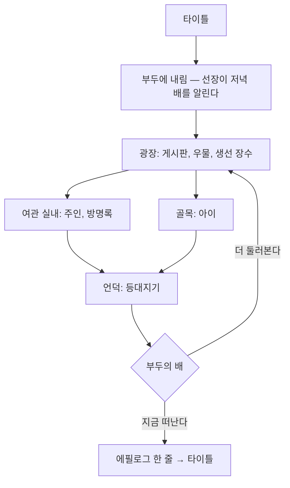

# 게임 기획서: 항구 마을 (가제 「떠나기 전에」)

> 작성일: 2026-08-19. 이 문서는 **무엇을 만들 것인가**를 정한다. 어떻게 만들 것인가는
> [docs/plans/10-demo-v2.md](../plans/10-demo-v2.md)에 있다.
> 이슈 24("기술 데모용 의미 없는 대사와 맵 배치는 적절하지 않다")에 대한 답이다.

## 1. 한 줄 컨셉

**배를 기다리는 반나절.** 여행자가 항구 마을에 내려, 저녁 배가 뜨기 전까지 마을을 둘러보고,
떠날지 하루 더 머물지 스스로 정한다.

| 항목 | 값 |
|---|---|
| 분량 | 처음부터 끝까지 5분에서 8분. 서두르면 3분에 끝낼 수 있고, 전부 보면 10분 |
| 플랫폼 | PC(키보드)와 모바일(터치) 양쪽에서 **끝까지 플레이 가능해야 한다** |
| 화면 | 768x896 세로. 맵은 렌더 배율 2로 논리 384x448 (24x28 타일) |
| 맵 | 항구 마을(32x48) 한 장과 여관 1층(20x14) 한 장 |
| 등장인물 | 5명 (선장, 여관 주인, 생선 장수, 아이, 등대지기) |
| 끝 | 부두의 배에 말을 걸어 "떠난다"를 고르면 에필로그 한 줄과 함께 타이틀로 |

기술 시연이 목적이 아니다. **작은 이야기 하나가 끝까지 이어지는 것**이 목적이고, 엔진의
기능은 그 이야기가 필요로 하는 만큼만 쓴다.

## 2. 세계관 — 저자의 자작곡에서 가져온다

이 마을과 그 바깥은 전부 저자가 2011년부터 2014년까지 만든 곡들의 제목과 컨셉에서
왔다 ([docs/music](../music/README.md)). 곡이 배경음악으로 깔리는 것이 아니라, **곡이
먼저 있고 그 곡의 장소를 게임이 짓는다.**

| 곡 / 앨범 | 코멘트 태그와 분석의 요지 | 게임에서의 장소와 쓰임 |
|---|---|---|
| Inn 《Port》 (2013) | "여관" 컨셉에 음향이 정확히 부합. 따뜻한 중저역, 좁은 스테레오, 반박자 느린 체감 | **여관 실내**의 BGM. 마을 이름 "항구(Port)"의 출처 |
| Bless 《Bless》 (2013 원곡, 2014 어레인지) | "행복을 빕니다..." 어둠에서 축복으로 가는 단일 여정 | **항구 마을**의 BGM. 떠나는 사람을 배웅하는 마을의 정서 |
| Sad Birthday to me 《요정의 숲》 (2013) | "아무도 없는 숲에 홀로 있는 나". 장조와 단조의 전면 혼합 | 마을 **북쪽 문 너머의 숲**. 이번 범위 밖이며, 아이와 등대지기의 대사로만 존재한다 |
| 피눈물의 제단 《천공의 끝》 (2011) | 대형 홀 잔향 3.7초. 클라이맥스까지 아꼈다가 한 번에 지불하는 도미넌트 | 바다 건너 **천공의 끝**. 등대지기가 딱 한 번 입에 올린다 |
| 오아시스 / 선인장은 죽었다 (2013) | 사막 이인극 — 고사하는 선인장과 닿을 수 없는 신기루 | 배가 향하는 **남쪽 사막 항로**. 선장의 대사에 나온다 |
| Insatiable desires 《끝 없는 욕망》 (2013) | 해소의 영구 거부 | 창고 주인의 부재. 잠긴 창고 문의 사연 |

세계관의 규칙은 하나다. **이번 데모에서 갈 수 있는 곳은 항구 마을과 여관뿐이고, 나머지
장소는 사람들의 말 속에만 있다.** 말로만 존재하는 장소가 다음 로드맵에서 실제 맵이 된다.

## 3. 플레이 흐름



- **막힘 없이 5분**: 부두에서 배에 바로 말을 걸어도 끝낼 수 있다. 다만 선장이 "아직 해가
  높다"며 한 번 만류하므로, 처음 도착한 플레이어는 자연히 마을 쪽으로 돈다.
- **본 만큼 달라진다**: 등대지기의 이야기를 들었으면 마지막 선택지의 문구가 바뀌고,
  에필로그 한 줄도 달라진다 (`ctx.state`로 이미 되는 것 — 맵을 넘는 상태 공유).
- **길을 잃지 않는다**: 큰길은 남북 한 줄이고, 갈 수 있는 곳은 전부 그 길에 붙어 있다.

## 4. 맵 구성

### 4.1 항구 마을 (32x48, 세로로 긴 마을)

세로 화면(24x28 타일)에 맞춘 세로 배치다. 카메라는 플레이어를 따라 위아래로만 크게
움직이고, 좌우로는 거의 움직이지 않는다 — 세로 화면에서 가장 읽기 쉬운 구성이다.

```
 y
 2~9    [북쪽 문]  숲으로 가는 길. 나무 울타리로 막혀 있다 (범위 밖의 경계)
10~17   [언덕]     등대와 등대지기. 계단 두 칸, 난간
18~25   [주택가]   좁은 골목, 빨래줄, 아이가 배회하는 구역
26~33   [큰길]     여관(문, 간판), 창고(잠긴 문), 가로등 두 개
34~39   [광장]     게시판, 우물, 생선 좌판, 나무 벤치
40~47   [부두]     선착장 두 갈래, 배 한 척, 밧줄 말뚝, 나무 상자, 갈매기
```

- 큰길은 x = 15, 16 두 칸이며 y 4에서 44까지 곧게 이어진다. **모든 목적지는 이 길에 접한다.**
- 바다는 y 44 아래 전부이며 통행 불가. 부두 판자만 통행 가능하다.
- 마을의 좌우 끝(x 0..2, x 29..31)은 바위와 나무로 막는다.
- 시작 위치는 부두 판자 위 (16, 43), 방향은 위쪽 — **배에서 막 내린 자세**다.

### 4.2 여관 1층 (20x14)

```
  벽                     벽
  ┌──────────────────┐
  │ 주방  주인 카운터  방명록 │   y 2~4
  │                       │
  │ 난로   탁자 둘   창가   │   y 5~9
  │                       │
  │        출입구         │   y 13
  └──────────────────┘
```

- 출입구는 (10, 13). 밟으면 마을 여관 문 앞으로 돌아간다.
- 2층 계단은 그려만 두고 오르면 "아직 방을 잡지 않았다"고 막는다 (범위의 경계를 대사로 표시).

### 4.3 오브젝트 배치

좌표는 항구 마을 기준이며, 전부 손으로 정한 자리다. **난수로 뿌리지 않는다.**

| 좌표 | 오브젝트 | 트리거 | 반응 |
|---|---|---|---|
| (16, 45) | 배 | action | 최종 선택 (떠난다 / 더 둘러본다) |
| (14, 43) | 나무 상자 더미 | action | "누군가의 짐이다. 남쪽으로 간다는 표가 붙어 있다." |
| (18, 42) | 밧줄 말뚝 | action | "굵은 밧줄이 단단히 매여 있다." |
| (13, 37) | 게시판 | action | 마을 공지 두 쪽 (배 시간표, 숲 출입 금지) |
| (18, 36) | 우물 | action | "물이 차다. 두레박은 비어 있다." |
| (12, 35) | 생선 좌판 | action | 생선 장수와 대화 (인물) |
| (19, 34) | 벤치 | action | "앉아 쉴 수 있을 것 같다." (앉는 연출은 범위 밖) |
| (14, 30) | 여관 문 | touch | 여관 1층으로 전환 (페이드, 문 소리) |
| (14, 29) | 여관 간판 | action | "항구 여관. 오늘도 방이 남아 있다." |
| (19, 28) | 창고 문 | action | 잠김. 사연은 생선 장수에게 들으면 대사가 바뀐다 |
| (16, 22) | 빨래줄 | action | "빨래가 바닷바람에 흔들린다." |
| (16, 12) | 등대 문 | action | 잠김. "등대지기가 열쇠를 갖고 있다." |
| (16, 6) | 북쪽 문 | action | 막힘. "숲으로 가는 길은 막혀 있다." |

## 5. 등장인물과 대사

대사의 기준: **모든 대사는 (1) 세계를 넓히거나, (2) 플레이어의 선택에 필요한 정보를 주거나,
(3) 인물을 드러낸다.** 셋 중 어느 것도 아니면 지운다.

### 5.1 선장 — 부두 (16, 44), 고정

첫 만남 (맵 진입 시 자동 실행, 한 번만):

> **선장**: 짐은 다 내렸네. 저녁 물때에 배가 다시 뜨니, 그때까지는 자네 시간이야.
> **선장**: 급할 것 없으면 마을을 좀 둘러보게. 여긴 떠나는 사람을 붙잡지 않는 대신,
> 남는 사람도 서운하게 하지 않거든.

말을 걸었을 때 (등대지기 이야기를 듣기 전):

> **선장**: 남쪽 항로는 사막을 낀 길이라 물을 넉넉히 실어야 하네. 신기루를 오래 보면
> 사람이 이상해진다고들 하지만, 나야 뭐 스무 번은 지나다녔지.

말을 걸었을 때 (등대지기 이야기를 들은 뒤):

> **선장**: 노인이 하늘 끝 이야기를 하던가? ...그 양반은 젊을 때 그쪽 배를 탔었네.
> 돌아온 사람은 그 양반 하나였고.

### 5.2 여관 주인 — 여관 1층 (10, 4), 고정, 얼굴 있음

> **여관 주인**: 어서 오세요. 저녁 배를 기다리는 분이시군요. 얼굴에 그렇게 쓰여 있어요.
> **여관 주인**: 방을 잡으실 건가요? 하루치는 은화 두 닢이에요.

선택지: **묵는다 / 배를 탄다 / 그냥 둘러본다** (취소는 3번)

- 묵는다 → "그럼 짐을 올려 두세요. 저녁 배는 놓치셔도 아침 배가 또 옵니다." (`state.booked = true`)
  이후 최종 선택의 문구가 "묵기로 한 방을 비워 두고 떠난다"로 바뀐다.
- 배를 탄다 → "그러실 것 같았어요. 다들 처음엔 그렇게 말하죠."
- 그냥 둘러본다 → "천천히 보세요. 난로 옆이 제일 따뜻합니다."

방명록 (여관 1층 (13, 3), action):

> 여관 방명록이다. 여러 사람의 필체가 섞여 있다.
> "숲에는 들어가지 말 것. 길이 하나뿐인 줄 알았는데 나올 때는 세 갈래였다."
> "사막 항로, 물 두 통으로는 모자람."
> 마지막 장에는 이름 대신 날짜만 적혀 있다.

### 5.3 생선 장수 — 광장 좌판 (12, 36), 고정, 얼굴 있음

> **생선 장수**: 오늘 물건은 아침에 다 나갔어요. 배가 들어오는 날은 늘 이렇죠.

선택지: **창고가 잠겨 있던데요 / 마을에 볼 것이 있나요** (취소 없음, 둘 다 듣게 된다)

- 창고 → "저 창고요? 주인이 남쪽으로 떠난 지 삼 년째예요. 계약은 아직 살아 있어서
  아무도 손을 못 대고요. 돌아오겠다고는 했다는데." (`state.heardWarehouse = true`)
- 볼 것 → "언덕에 등대가 있어요. 등대지기 노인이 계신데, 말은 별로 없어도
  물어보면 대답은 해 주세요."

### 5.4 아이 — 주택가 (14~19, 19~24) 배회

배회하다가도 말을 걸면 멈추고 대답한다.

> **아이**: 북쪽 문은 어른들이 막아 놨어요. 숲에서 노래가 들린다고요.
> **아이**: 근데 저는 들었어요. 생일 노래 같은 거였는데, 아무도 안 믿어요.

등대지기 이야기를 들은 뒤:

> **아이**: 등대 할아버지도 노래 얘기를 했죠? 할아버지는 저를 안 놀려요.

### 5.5 등대지기 — 언덕 (17, 13), 고정, 얼굴 있음

> **등대지기**: ...배를 기다리나.
> **등대지기**: 저 불은 사람을 부르는 게 아니라, 돌아오는 길을 잊지 말라고 켜 두는 걸세.

선택지: **하늘 끝에 가 보셨습니까 / 등대를 지키신 지 오래되셨나요** (취소 없음)

- 하늘 끝 → "제단이 있었네. 소리가 오래 남는 곳이었지. 그 뒤로는 배를 타지 않았네."
  (`state.heardAltar = true` — 선장과 아이의 대사, 최종 선택지 문구, 에필로그가 바뀐다)
- 등대 → "불을 켜는 일에는 오래고 짧고가 없네. 오늘 켜면 오늘의 일이지."

### 5.6 최종 선택 — 부두의 배 (16, 45)

`state.heardAltar`가 없을 때:

> 저녁 배가 밧줄을 풀 준비를 하고 있다.
> 선택지: **지금 떠난다 / 조금 더 둘러본다**

`state.heardAltar`가 있을 때:

> 저녁 배가 밧줄을 풀 준비를 하고 있다. 등대에는 아직 불이 켜지지 않았다.
> 선택지: **지금 떠난다 / 등대에 불이 켜지는 것을 보고 간다**

에필로그 (떠난다를 고른 뒤, 페이드 아웃 위에 한 줄):

- 기본: "배는 저녁 물때에 항구를 떠났다."
- `heardAltar`: "배가 항구를 떠날 때, 등 뒤에서 등대에 불이 켜졌다."
- `booked`: "여관의 방 하나가 하룻밤 비어 있었다."

에필로그 뒤에는 타이틀로 돌아간다.

## 6. 화면 인터페이스 배치

같은 화면(768x896)을 두 방식으로 쓴다. **모바일에서 손가락이 화면을 가리는 것**과
**PC에서 화면이 비어 보이는 것**이 서로 다른 문제라서, 배치를 따로 정한다.

### 6.1 공통 (맵 씬, 논리 384x448)

| 요소 | 위치와 크기 | 비고 |
|---|---|---|
| 대화창 | x 8, y 336, 폭 368, 높이 104 (3줄, 줄 간격 20) | 화면 아래 1/4을 넘지 않는다 |
| 이름 창 | 대화창 왼쪽 위에 붙음 | 인물이 있을 때만 |
| 얼굴 | 대화창 안 왼쪽 48x48 | 인물이 있을 때만 |
| 선택지 창 | 대화창 오른쪽 위에 붙음 | 항목 최대 4개까지 보이고 그 이상은 스크롤 |
| 장소 이름 | 상단 가운데, 맵 진입 후 2초간 | 새로 추가 (지금은 없다) |

### 6.2 PC

- 키보드: 방향키 이동, Z/Enter/Space 결정, X 취소, ESC 타이틀.
- 조작 안내는 화면 위쪽에 4초간 한 줄. 그 뒤에는 아무것도 겹치지 않는다.
- 가상 패드는 그리지 않는다.

### 6.3 모바일

| 요소 | 위치 (논리 좌표) | 크기 | 근거 |
|---|---|---|---|
| 가상 D-패드 | 좌하단 (12, 356) | 80x80 (실기 160x160) | 엄지가 닿는 자리. 대화창과 겹치므로 **대화 중에는 반투명** |
| 결정 버튼 | 우하단 (312, 384) | 56x56 (실기 112) | 터치 타겟 48dp 이상 |
| 취소 버튼 | 결정 버튼 왼쪽 (248, 396) | 44x44 | 결정보다 작고 낮게 |
| 상단 안전 여백 | y 0..16 | 노치 회피 | 장소 이름은 그 아래 |

**바꿀 것**: 지금은 "패드 밖 아무 데나 탭 = 결정"이라 대화를 넘기려다 걷고, 걸으려다
대화가 넘어간다. 명시적인 결정 버튼과 취소 버튼을 둔다. 선택지 항목은 지금처럼 직접
누를 수 있게 두되(`Choice:indexAt`), 커서 이동은 패드로도 되게 한다.

## 7. 오디오

곡은 전부 저자의 자작곡이며, 원본은 개인 라이브러리에 있다. 저장소에는 `bless.ogg`만
있으므로 **파일이 있으면 그 곡, 없으면 `bless.ogg`** 로 내려앉는 규칙을 쓴다
(리소스 고르기와 같은 방식, `scripts/rpg/assets.lua`).

| 자리 | 곡 | 파일 | 볼륨 |
|---|---|---|---|
| 타이틀 | Bless (Arrange) | `bless.ogg` | 88 |
| 항구 마을 | Bless (Arrange) | `bless.ogg` | 96 |
| 여관 실내 | Inn 《Port》 | `inn.ogg` (없으면 bless) | 80 — 실내는 낮게 |
| 에필로그 | 마을 곡을 그대로 두고 페이드 아웃 | | |

효과음: 커서, 결정, 글자, 문(이미 있음) + **파도**(부두 근처 환경음, 없으면 생략),
**갈매기**(부두, 가끔). 환경음은 없어도 게임이 성립해야 한다.

## 8. 이벤트 목록 (커맨드로 표현할 수 있는가)

기획의 모든 이벤트를 **데이터 커맨드**로 적을 수 있는지 미리 확인했다. 아래가 실제로
필요한 커맨드의 전부다 (설계는 [10-demo-v2.md](../plans/10-demo-v2.md) 3절).

| 이벤트 | 필요한 커맨드 |
|---|---|
| 선장 첫 만남 | `message` x2, `setFlag` |
| 선장 대화 | `if`(heardAltar), `message` |
| 여관 주인 | `message`, `choice` + 분기, `setFlag` |
| 게시판 | `message` (두 쪽) |
| 여관 문 | `playSe`, `transfer` |
| 창고 문 | `if`(heardWarehouse), `message` |
| 아이 (배회) | `if`, `message` — 배회는 이벤트 속성이지 커맨드가 아니다 |
| 등대지기 | `message`, `choice` + 분기, `setFlag` |
| 최종 선택 | `if`, `message`, `choice` + 분기, `fade`, `playBgm`(fade out), `endGame` |
| 장소 이름 표시 | `showLocation` (맵 진입 auto 이벤트) |

**Lua 탈출구가 필요한 곳은 지금 기획에는 없다.** 그래도 남겨 둔다 — 다음 로드맵의
전투나 미니게임은 커맨드로 적을 것이 아니기 때문이다.

## 9. 이번 범위 밖 (다음 로드맵)

- 요정의 숲, 사막 항로, 천공의 끝 — 말로만 존재한다
- 시간대 변화(저녁이 되는 연출), 날씨
- 여관 2층, 방에서 자기, 저장과 로드
- 인벤토리와 은화(주인이 값을 말하지만 실제로 지불하지 않는다)
- 전투

## 10. 정해 둔 것 (저자 확인 대기)

"알아서 진행"(2026-08-19)에 따라 아래 셋은 권장안으로 정하고 만들었다. 바꾸고
싶으면 각각 한 곳만 고치면 된다.

1. **제목은 「떠나기 전에」**. 부제는 "항구 마을의 반나절". 타이틀 그림은
   `tools/generate_title.py`가 만들고, 글자는 그림에 구워져 있다 — 제목을 바꾸려면
   그 파일의 문자열을 고치고 다시 실행한다.
2. **`inn.ogg`는 저장소에 넣지 않았다.** 슬롯만 만들어 두었으므로
   `resources/audio/inn.ogg`에 파일을 두면 여관에서 그 곡이 걸리고, 없으면
   마을 곡(`bless.ogg`)을 볼륨 80으로 쓴다 (`scripts/maps/inn.lua`).
3. **에필로그와 등대지기의 대사는 5절의 초안을 그대로 썼다.** 세 갈래의 에필로그가
   실제로 갈리는지는 인수 시나리오가 확인한다 (`heardAltar` 갈래를 매번 통과시킨다).
