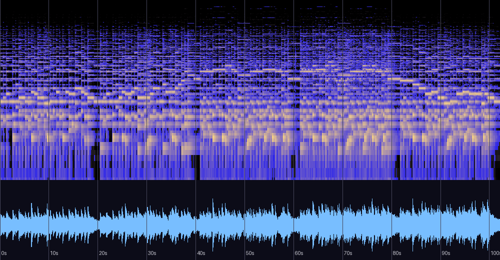

# Bless (Arrange) — BGM 신호 분석

`resources/audio/bless.ogg` (게임 BGM, 자작곡)에 대한 DSP 기반 분석 기록.
측정은 신호 분석이며 청감 평가를 대신하지 않는다. 재현 방법은 문서 하단 참조.

## 기본 정보 (파일 태그)

| 항목 | 값 |
|---|---|
| 제목 | Bless (Arrange) |
| 아티스트 | Regulus Storm |
| 연도 | 2014 |
| 장르 | New Age |
| 제작 도구 | FL Studio |
| 길이 | 1:42 (102.2초) |
| 포맷 | Ogg Vorbis 192kbps, 44.1kHz 스테레오 |

## 스펙트로그램·파형



## 조성

크로마(피치 클래스 에너지) 분석 결과:

```
A:1.00  A#:0.64  F:0.50  G:0.44  C:0.43  E:0.35  D:0.11  (나머지 < 0.05)
```

- 음 재료는 **F장조 음계**(F-G-A-B♭-C-D-E)이지만 중심음은 **A가 압도적** —
  A 에올리안/프리지안 색채로 부유하는 구성이다. 최상위 두 음 A와 B♭이
  반음 관계라는 점이 프리지안적 색채의 근원.
- Krumhansl-Kessler 프로파일 상관: **A단조 0.691 vs F장조 0.678** (근소한 차이 = 조성적 모호함).
- 구간별 판정: 처음 3/4은 F장조(0.64~0.76), **마지막 1/4(76초~)은 A단조(0.76)** —
  장조의 온기에서 시작해 관계단조의 정서로 수렴하며 끝나는 설계.

## 구조 (1초 RMS 곡선 + 파형 기준)

| 구간 | 내용 |
|---|---|
| 0:00–0:20 | 도입 — -17~-19dB에서 6~8초 주기의 프레이즈 스웰 반복 |
| 0:20–0:40 | 2절 — 0:20, 0:40 부근의 딥(종지) 후 약간 두터워진 재제시 |
| 0:41–1:03 | 전개 — 성부가 쌓이며 레벨 점진 상승 |
| 1:03–1:39 | 클라이맥스 — 최고 레벨 -13.6~-14.5dB 유지, 중저역 최대 밀도 |
| 1:40–1:42 | 짧은 페이드아웃 |

## 다이내믹스·믹싱

| 측정 | 값 | 해석 |
|---|---|---|
| 피크 | -0.16 dBFS | 풀스케일 근접 노멀라이즈, **클리핑 0샘플** |
| RMS | -16.5 dBFS | 스트리밍 기준(-14LUFS)보다 조용함 — 게임 BGM에 이상적(효과음 헤드룸) |
| 크레스트 팩터 | 16.3 dB | 컴프레션을 아낀, 다이내믹스가 살아 있는 마스터 |
| 스테레오 상관 | 0.654 | 위상 문제 없음, 모노 합산 안전 |
| Side/Mid 비 | 0.457 | 리버브 기반의 넓은 공간감 |

대역 분포: 에너지의 **83%가 800Hz 이하**(60–250Hz 33.6%, 250–800Hz 49.3%),
2.5kHz 이상 0.1%. 스펙트로그램상 인코딩 컷오프는 없으며 배음이 자연 감쇠하는
부드러운 음원 선택의 결과다. 원본 프로젝트가 있다면 8kHz 이상을 여는 셸프 EQ로
공기감을 더할 여지는 있다 (취향의 영역).

## 템포·리듬

자기상관 추정 **~96 BPM** (신뢰도 0.62, 후보 63/184 존재). 낮은 신뢰도 자체가
정보다 — 타악 펄스가 없는 루바토성 흐름이며, 시간 조직은 BPM보다
6~8초 단위의 호흡(스웰)이 지배한다.

## 게임 BGM 활용 노트

1. 엔진이 `Mix_OpenAudio(22050Hz)`로 재생하지만 이 곡은 고역 에너지가 원래 적어
   다운샘플 손실이 사실상 없다. 이 곡에 관해서는 샘플레이트를 올릴 필요가 없다.
2. 루프 재생 시 1:40 페이드아웃 → 조용한 도입부 복귀라 이음새가 자연스러운 편.
   완벽한 무한 루프를 원하면 1:39 부근에서 도입부로 넘어가는 루프 포인트 편집이 이상적.

## 평가

측정과 이론 근거에 기반한 평가이며 청감 선호를 대신하지 않는다.

| 기준 | 평점 | 근거 |
|---|---|---|
| 작곡·구조 | ★★★★☆ | 장·단조 모호함을 유지하다 말미에 A단조로 수렴시키는 방향성 있는 설계. 다만 절정 고원(1:03~1:39)이 전체 1:42 대비 길어 대비가 완만 |
| 편곡·사운드 | ★★★☆☆ | 중저역 집중(800Hz 이하 83%)의 따뜻함은 의도로 읽히나, 공기감 부재로 풀레인지 시스템에서 위쪽이 비어 들릴 수 있음 |
| 믹싱 | ★★★★☆ | 위상 문제 없음, 모노 안전, 공간감 적절 |
| 마스터링 | ★★★★★ | 넷 중 유일하게 클리핑 0, 트루 피크 -0.2 — 가장 깨끗한 마스터 |
| 목적 적합성(BGM) | ★★★★★ | 낮은 라우드니스·부유하는 조성·페이드 엔딩 모두 배경 기능에 최적 |

**총평**: 기능 음악으로서 넷 중 가장 완성된 마스터를 가진 곡. 감상용 기준으로는
LRA 3.5 LU(넷 중 최저)의 평탄한 다이내믹 곡선과 고역 설계가 아쉬움으로 남지만,
게임 배경이라는 목적 안에서는 그 평탄함이 미덕이 된다. 리마스터 우선순위는 낮다.

## 재현 방법

```bash
brew install ffmpeg            # 최초 1회
python3 tools/analyze_audio.py resources/audio/bless.ogg
```

레벨/대역/조성/템포/구간 RMS를 출력하고 `/tmp/bless_analysis.png`에
스펙트로그램을 저장한다. 분석일: 2026-08-13.
관련 문서: [blood-tears-altar-analysis.md](blood-tears-altar-analysis.md) (피눈물의 제단, 2011 — 비교 분석 포함)
