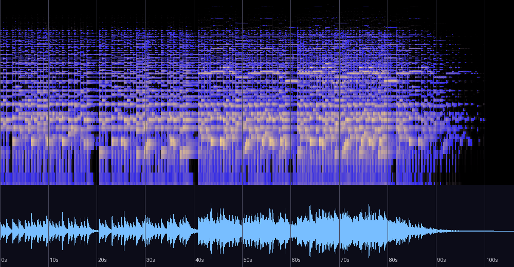

# Bless (원곡) — 신호 분석과 실용 노트

《Bless》 앨범의 원곡(자작곡, 2013, New Age, 태그 BPM 47, FL Studio 10)에 대한 분석 기록.
게임 BGM으로 쓰인 [Bless (Arrange)](bless-analysis.md)(2014)의 원형이다.
코멘트 태그: **"행복을 빕니다..."** 원본 파일은 저장소 외부 소장. 분석일: 2026-08-13.

## 한 줄 진단

두 가지 큰 발견을 담은 곡 — **튜닝 -19.5센트(사막 연작과 동일한 연주 악기)**, 그리고
편곡판과 **같은 재료를 반대 방향으로 걷는 조성 여정**(원곡: 어둠→축복 / 편곡: 빛→그늘).

## 스펙트로그램·파형



## 기본 정보

| 항목 | 값 |
|---|---|
| 제목 / 앨범 | Bless / Bless |
| 작곡 | 어진석, 2013, FL Studio 10 |
| 길이 | 1:46 (106.0초) |
| 포맷 | MP3 320kbps (콘텐츠 상한 ~12.2kHz) |
| 태그 BPM | 47 |
| 코멘트 태그 | "행복을 빕니다..." |

## 발견 1 — 연주 시기의 세 번째(그리고 네 번째) 곡

| 곡 | 튜닝 편차 | 의미 |
|---|---|---|
| 선인장은 죽었다 (2013, Rock) | -19.5센트 | 귀로 조율한 실물 악기 |
| 오아시스 (2013, Rock) | -19.5센트 | 〃 (동일 조율 상태) |
| **Bless 원곡 (2013, New Age)** | **-19.5센트** | **〃 — 연주 시기는 록만이 아니었다** |
| **Bless (Arrange) (2014, 게임 BGM)** | **-17.6센트** | **원곡의 연주 재료를 보존한 재편곡** |

가상악기 곡들(±7센트 이내)과 달리, 이 곡은 사막 연작과 정확히 같은 편차의 악기로
연주되었다. 더 중요한 것: **편곡판도 같은 편차를 유지**한다 — 2014년의 Arrange는
가상악기 리메이크가 아니라 2013년의 연주 녹음을 재료로 다시 쌓은 것이다.
즉 **Initial2D 게임에 들어 있는 bless.ogg 안에는 저자가 손으로 연주한 악기가 그대로
살아 있다.**

## 발견 2 — 원곡과 편곡, 같은 길의 왕복

크로마 최상위는 두 버전이 동일하다(A 1.00, B♭ 0.69/0.64 — 반음 쌍 지문의 원점이
이 원곡이다). 그러나 구간별 조성 판정이 정확히 반대로 걷는다:

| | 전반 | 후반 | 엔딩 |
|---|---|---|---|
| **원곡 (2013)** | A단조 (0.65/0.67) | **F장조** (0.68/**0.82**) | 20초 자연 감쇠 — **축복으로 끝남** |
| **편곡 (2014)** | F장조 (0.76/0.64/0.68) | **A단조** (0.76) | 페이드아웃 — **그늘로 끝남** |

원곡은 어둠에서 출발해 밝음("행복을 빕니다")으로 도착하고 — 코멘트 태그의 구조적 구현,
여섯 번째 사례다 — 편곡은 같은 재료를 뒤집어 빛에서 그늘로 걷는다. 게임 BGM(루프,
정서적 부유)이라는 용도에 맞춘 재설계로 읽힌다. 화음 어휘도 F–Am–B♭–C의 찬가적
순환으로 동일 계열이다(여기서도 도미넌트 C는 종지 어휘로만 스치듯 검출).

## 마스터링 소견

| 측정 | 값 | 소견 |
|---|---|---|
| 통합 라우드니스 | -14.6 LUFS | 스트리밍 표준 근접 |
| LRA / 크레스트 | 8.0 LU / 18.9dB | 편곡판(3.5 LU)보다 다이내믹 — 프레이즈 호흡이 마스터에 살아 있음 |
| 트루 피크 / 클리핑 | -0.2 dBTP / **0샘플** | 클린 — **2013년에도 조용한 곡은 깨끗하게 찍었다는 증거** |
| 대역 | 중역(0.8~2.5k) 27.0% | 편곡판(16.9%)보다 선율 성부가 앞에 있는 밝은 보이싱 |

이 곡의 존재로 "클린 마스터는 2014년부터"라는 앞선 추정은 **"조용한 곡에서는 2013년부터
시작되어, 2014년에 전 장르(록 포함)로 확립"**으로 수정된다.

## 평가

측정과 이론 근거에 기반한 평가이며 청감 선호를 대신하지 않는다.
(저자는 정규 음악 교육 없이 직관으로 작곡 — 이론 용어는 사후적 기술이다)

| 기준 | 평점 | 근거 |
|---|---|---|
| 작곡·구조 | ★★★★★ | 어둠→축복의 단일 여정을 1:46에 완결, 코멘트 태그의 구조적 구현. 반음 쌍 지문의 원점 |
| 편곡·사운드 | ★★★★☆ | 연주 악기의 중역 중심 보이싱 — 편곡판보다 밝고 직접적 |
| 믹싱 | ★★★★☆ | 넓은 공간(side/mid 0.54), 위상 문제 없음 |
| 마스터링 | ★★★★★ | 클리핑 0, TP -0.2, 다이내믹 보존 — 2013년의 클린 마스터 |
| 목적 적합성(감상) | ★★★★☆ | 축복의 소품으로 완결. 편곡판과의 왕복 청취가 특히 가치 있음 |

**총평**: 컬렉션의 두 계보 — 연주 시기(-19.5센트 악기)와 반음 쌍 지문 — 가 모두 이 곡에서
합류한다. 원곡과 편곡을 나란히 들으면 같은 재료로 축복과 그늘을 오가는 왕복이 완성되며,
그 편곡판이 지금도 게임 안에서 재생되고 있다는 사실이 이 곡의 현재성이다.

## 재현 방법

```bash
python3 tools/analyze_audio.py "<파일 경로>"
ffmpeg -i "<파일>" -af ebur128=peak=true -f null -   # LUFS/트루 피크
```

관련 문서: [bless-analysis.md](bless-analysis.md) (편곡판) ·
[cactus-analysis.md](cactus-analysis.md) · [oasis-analysis.md](oasis-analysis.md) ·
[README.md](README.md)
