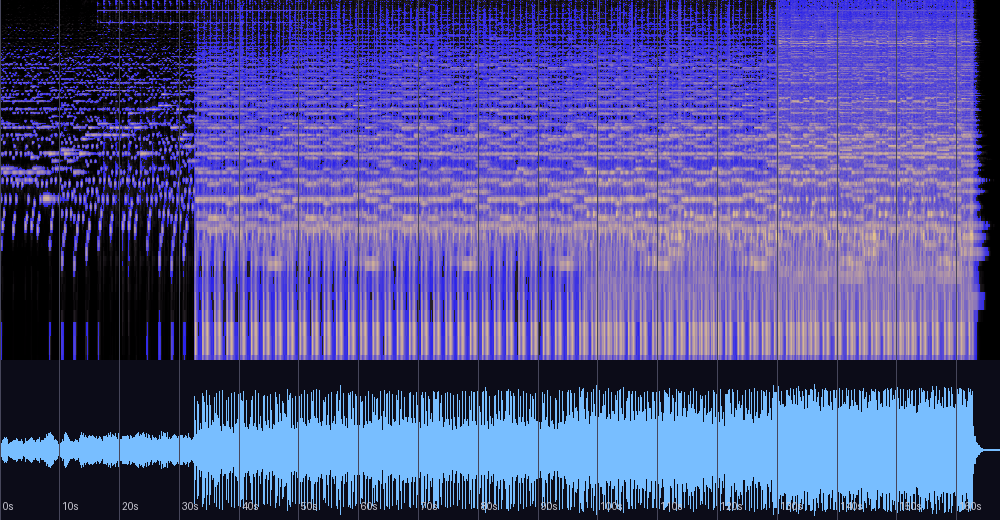

# 피눈물의 제단 — 신호 분석

《천공의 끝》 앨범 수록곡(자작곡)에 대한 DSP 기반 분석 기록.
원본 파일은 저장소에 포함되어 있지 않다(개인 음악 라이브러리 소장).
측정은 신호 분석이며 청감 평가를 대신하지 않는다. 재현 방법은 문서 하단 참조.

## 기본 정보 (파일 태그)

| 항목 | 값 |
|---|---|
| 제목 | 피눈물의 제단 |
| 아티스트 | 어진석 |
| 앨범 | 천공의 끝 |
| 연도 | 2011 |
| 장르 | Game |
| 제작 도구 | FL Studio 9 (LAME 인코딩) |
| 태그 BPM | 118 |
| 길이 | 2:47 (167.3초) |
| 포맷 | MP3 192kbps, 44.1kHz 스테레오 |

## 스펙트로그램·파형



0:32의 본편 진입(수직 경계선)과 118BPM의 규칙적 세로 줄무늬(타격)가 뚜렷하다.

## 템포

자기상관 추정 **117.5 BPM, 신뢰도 0.84** — 태그에 기록된 118과 거의 정확히 일치한다.
타악 펄스가 곡 전체를 지배하는 그리드 시퀀싱으로, 루바토성인 Bless(신뢰도 0.62)와 대조적.

## 조성

크로마 분석:

```
F#:1.00  A:0.98  G#:0.79  B:0.67  A#:0.57  D:0.56  C#:0.56  (나머지 < 0.5)
```

- **F#단조 0.744**로 판정 — 2위(F#장조 0.422)와 압도적 격차.
  최상위 음들이 F#단조 3화음(F#-A-C#)과 2·4도 보조음(G#, B) 그대로다.
- 4분할 전 구간 F#단조(0.84 / 0.73 / 0.81 / 0.56) — 단일 조성을 단단히 유지.
  장·단조 사이를 부유하도록 설계된 Bless와 정반대의 접근.
- 3구간(1:24~2:05)에서 D(VI도)가 부상해 화성적 확장.
  마지막 구간의 신뢰도 하락(0.56)은 클라이맥스의 반음계적 추가음(A# 등) 때문.

## 구조 (1초 RMS 곡선 + 스펙트로그램 기준)

| 구간 | 내용 |
|---|---|
| 0:00–0:31 | 인트로 — -26→-21dB, 성긴 텍스처. 분위기 조성 |
| **0:32** | **본편 진입** — 풀 밴드 일괄 투입, -15dB로 점프 |
| 0:35–1:35 | 주부 — -14~-16dB 유지, 118BPM 구동 리듬 |
| 1:35–2:10 | 점층 — -13~-12dB로 상승 |
| 2:10–2:43 | 클라이맥스 — 최고 -11.1dB, 고역 밀도 증가(심벌류 추가로 추정) |
| 2:43–끝 | 급정지 — 페이드 없이 끊고 약 3초 잔향 꼬리(-28→-73dB) |

게임 BGM으로 루프시킨다면 **0:32를 루프 복귀점**으로 쓰는 것이 자연스럽다
(인트로는 첫 재생만).

## 다이내믹스·믹싱

| 측정 | 값 | 해석 |
|---|---|---|
| 디코딩 피크 | +0.98 dBFS | 풀스케일 마스터 → MP3 디코딩 시 인터샘플 오버 |
| 클리핑 | 2,512샘플 | 청감상 문제는 미미하나, 리마스터 시 -1dB 트림 권장 |
| RMS | -14.7 dBFS | 소리가 큰 곡인데도 |
| 크레스트 팩터 | 15.7 dB | 다이내믹스는 살아 있음 |
| 스테레오 상관 | 0.492 | 위상 문제 없음 |
| Side/Mid 비 | 0.584 | Bless보다도 넓은 확산(신스 패드/딜레이) |

대역 분포: 서브(<60Hz) 9.9% — 킥/베이스 기초가 실재. 저역 32.4%, 중저역 31.4%,
중역 19.9%, 고역(2.5–8k) 5.5%, 공기(>8k) 0.7% — **풀레인지 편곡**이다.

## Bless (2014)와의 비교 — 같은 작곡가의 두 지문

| | 피눈물의 제단 (2011) | Bless (2014) |
|---|---|---|
| 성격 | 118BPM 구동, 배틀/던전 | 루바토, 뉴에이지 |
| 조성 | F#단조 고정 | F장조↔A단조 부유 |
| 저역/고역 | 풀레인지 (서브 9.9%) | 중저역 집중 (서브 0%) |
| 엔딩 | 급정지 + 잔향 | 페이드아웃 |
| 마스터 | 풀스케일 (클리핑 2,512) | 클리핑 0 |
| 템포 확신도 | 0.84 (그리드) | 0.62 (루바토) |

공통점: 명확한 조성 중심, 30초 안팎의 점층 도입부, FL Studio + 192kbps 워크플로.
3년 사이 마스터링 습관이 클리핑 없는 쪽으로 개선된 흔적이 보인다.

## 심화 분석 (실용)

### 게임에서 쓸 때

- **루프 포인트**: 인트로가 118BPM 4/4 기준 정확히 16마디, 본편이 64마디 순환:
  ```
  인트로: 0:00.000 ~ 0:32.542   /   루프: 0:32.542 ~ 2:42.712
  ```
  `Audio.InsertNextMusic`으로 "인트로 1회 → 루프 무한" 구현 가능.
- **레벨 정합**: 통합 라우드니스 -10.5 LUFS (LRA 9.8 LU). Bless(-13.3)와 함께 쓰면
  이 곡만 약 3dB 크게 들리므로 -2.8dB 보정 권장.

### 다시 마스터한다면 (처방)

1. **클리핑이 클라이맥스에 집중**되어 있다 — 10초 구간별 클리핑 수를 세면 도입부는 0,
   **1:30~2:43에 전체 2,512개 중 약 2,300개**가 몰려 있다. 원인은 피크를 0dBFS에 붙인 것:
   MP3 인코딩이 **트루 피크 +1.0dBTP** 오버를 만든다.
   **처방: 리미터 실링 -1.0dBTP** (FL Studio Maximus/Limiter의 실링 값 하나).
2. 현재 -10.5 LUFS — 유튜브/스포티파이는 -14로 재생하므로 어차피 3.5dB 깎인다.
   재발매 목표는 **-14 LUFS / -1dBTP**.
3. 손댈 필요 없는 것: 저음 모노(<120Hz side/mid 0.069 — 교과서적), 튜닝(A440 +4.8센트),
   인코딩 컷오프 18.7kHz(192kbps 표준). 원본 프로젝트에서 WAV 보관 권장.

### 코드 진행 (마디 단위 추정, 본편 0:32~)

```
bar  1- 8:  D    F#m  F#m  F#m | D    D    F#m  E
bar  9-16:  Bm   F#m  F#m  F#m | D    (G#°) F#m  E
bar 17-48:  위 순환의 변형 (Bm/F# 교차 증가)
bar 49-64:  D    C#   Bm   C#  | D    …    — 클라이맥스에서 C#(V) 최초 도입
```

본편은 **F#m–D–Bm–E (i–VI–iv–VII)** 계열의 8마디 순환이고, **마지막 16마디(약 2:11~)에서
C#장화음(V)이 처음 등장**한다. 자연단음계 순환에 도미넌트 견인력을 아껴뒀다가 절정에서
푸는 설계 — 형식(마지막 16마디)과 화성적 절정이 정확히 맞물린다. 재사용 가치가 있는
검증된 패턴이다. (일부 "Gm/A#" 검출은 템플릿 오차 가능성 있음)

### 기타 측정

- 엔딩 잔향 감쇠 RT60 ≈ **3.7초** — 대형 홀 설정. "제단" 컨셉과 부합하며,
  급정지+긴 잔향은 보스전 종료 연출에 유용.
- 세 곡 레벨 비교표는 [inn-analysis.md](inn-analysis.md) 참조.

## 재현 방법

```bash
python3 tools/analyze_audio.py "<파일 경로>"
ffmpeg -i "<파일>" -af ebur128=peak=true -f null -   # LUFS/트루 피크
```

분석일: 2026-08-13. 관련 문서: [bless-analysis.md](bless-analysis.md) ·
[inn-analysis.md](inn-analysis.md)
