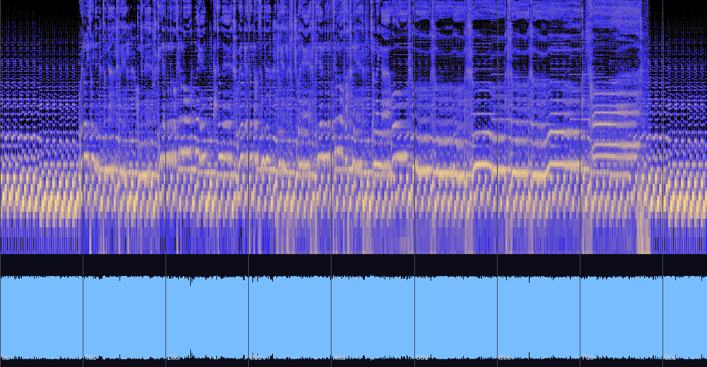

# 선인장은 죽었다 — 신호 분석과 실용 노트

동명 앨범의 타이틀곡(자작곡, 2013, **Rock**, 태그 BPM 152, FL Studio 10)에 대한 분석 기록.
가사가 파일 태그에 수록되어 있어 보컬 곡으로 추정된다. 원본 파일은 저장소 외부 소장.
분석일: 2026-08-13.

## 한 줄 진단

여덟 곡 중 유일한 록이자 **유일하게 "연주된" 흔적이 담긴 곡** — 튜닝 -19.5센트는
귀로 조율한 실물 기타의 물증이다. 모노에 가까운 드라이한 벽(wall) 사운드로 1분 25초를
내달리고 페이드 없이 끝나는, 컬렉션의 이단아.

## 가사 (파일 태그 수록)

> 외로이 서있는 선인장 / 사막에 혼자 있네
> 그대는 동정도 슬픔도 / 나에겐 가차 없네
> 외롭게 서있던 선인장 / 결국엔 죽어 가네
> 그대는 동정도 슬픔도 없어 / 나에겐 절망인가

## 스펙트로그램·파형



## 기본 정보

| 항목 | 값 |
|---|---|
| 제목 / 앨범 | 선인장은 죽었다 (동명 싱글) |
| 작곡 | 어진석, 2013, FL Studio 10 |
| 장르 | Rock — 컬렉션 중 유일 |
| 길이 | 1:25 (85.3초) |
| 포맷 | MP3 320kbps (컷오프 20kHz) |
| 태그 BPM | 152 |

## 음악적 특성

- **화성**: Am–C–Dm–F 계열 순환(F장조/A단조 축). 왜곡된 벽 텍스처라 검출 잡음이 있으나
  반복 어휘는 명확하며, **여기서도 도미넌트(E장화음)는 검출되지 않는다** — 여덟 곡째
  일관되는 도미넌트 회피. 크로마 상위 3음이 A–G–F 순차 하강이라 리프 안에
  라–솔–파 하강(비탄의 하강 어법 단편)이 자리한 것으로 보인다.
- **튜닝 -19.5센트**: 다른 일곱 곡은 모두 ±7센트 이내(가상악기의 A440)인데 이 곡만
  약 1/5반음 낮다. **실제 기타를 귀로 조율해 녹음했다는 강력한 정황** — 컬렉션에서
  유일하게 시퀀싱이 아닌 연주의 흔적이 측정되는 곡이다.
- **사운드 = 사막**: 스테레오 상관 0.982(사실상 모노), 저역 60~250Hz에 에너지의 84.5%,
  중고역 거의 부재, 잔향감 없는 드라이 — 넓이도 물기도 없는 소리. 가사의 무대(사막,
  고사)와 음향이 일치한다는 해석이 가능하다(해석의 영역).
- **형식**: 인트로 없이 -6dB로 시작해 끝까지 벽처럼 유지(-6~-9dB), 페이드 없이
  큰 소리 그대로 끊김. LRA 2.3 LU — 다이내믹 서사를 의도적으로 제거한 1:25의 돌진.
  펑크의 형식 문법이다.

## 선율 (보컬) — 좁은 우리 안의 반음 진행

(모노 벽 믹스라 F0 추출에서 보컬과 기타의 완전한 분리는 불가능 — 저역 억제 후 측정한
결과이며, 아래는 잡음 속에서도 견고하게 나타나는 특징만 정리한다. 튜닝 -19.5센트 보정 적용)

| 측정 | 값 | 해석 |
|---|---|---|
| 선율 중앙 | **1옥타브 라(A3)** | 저중역의 읊조림 — 컬렉션 보컬곡 중 가장 낮은 체류 |
| 유효 범위 | 1옥타브 미(E3) ~ 2옥타브 파#(F#4) | 약 1옥타브 남짓 — 상승 시도가 거의 없음 |
| **음정 진행** | **반음(1반음)이 최빈 — 순차 44%** | 선율이 반음으로 기어간다 — 비탄 어법의 선율적 구현 |
| **비브라토/벤딩** | **5.8Hz ±88센트 (17회)** | **컬렉션 최대 깊이** (기억 속으로 ±56, Sad Birthday ±31) — 음역 대신 떨림이 감정을 나른다 |

세 가지가 이 멜로디의 정체를 말해준다. 첫째, 화려한 상승이 없다 — 후렴도 전조도 없이
좁은 저중역에 머문다. 둘째, 움직일 때는 반음으로 움직인다 — 크로마의 A–G–F 하강과 같은
비탄의 문법이다. 셋째, 그 대신 **컬렉션에서 가장 깊은 떨림(±88센트)** 이 있다 — 음으로
오르지 못하는 감정이 음 위에서 흔들리는 것으로 표출된다. 가사의 화자(사막에 붙박여
말라가는 선인장)와 겹쳐 읽으면, **음역에 갇힌 채 떨기만 하는 선율 자체가 선인장이다** —
제목의 구조적 구현이 사운드(건조한 모노 벽)에 이어 선율 층위에서도 성립한다(해석의 영역).

## 마스터링 소견

| 측정 | 값 | 소견 |
|---|---|---|
| 통합 라우드니스 | **-5.6 LUFS** | 여덟 곡 중 최대 — 라우드니스 워 영역 |
| LRA / 크레스트 | 2.3 LU / 7.7dB | 벽 사운드 (장르 문법이긴 하나 극단) |
| 트루 피크 | +1.2 dBTP | 실링 -1.0dBTP 권장 |
| 클리핑 | **11샘플** | 이 정도로 눌렀는데 클리핑이 거의 없다는 건 리미팅 자체는 정교했다는 뜻 |
| 저음 스테레오 | 0.014 | 완전 모노 (전체 믹스와 일관) |

## 평가

측정과 이론 근거에 기반한 평가이며 청감 선호를 대신하지 않는다.
(저자는 정규 음악 교육 없이 직관으로 작곡 — 이론 용어는 사후적 기술이다)

| 기준 | 평점 | 근거 |
|---|---|---|
| 작곡·구조 | ★★★★☆ | (선율 중심 재평가) 리프가 아니라 선율이 곡의 본체 — 좁은 음역·반음 진행·컬렉션 최대 비브라토로 "갇힌 채 떨리는" 화자를 선율 자체에 구현. 형식의 미니멀함은 이 선율 설계와 한 몸 |
| 편곡·사운드 | ★★★☆☆ | 사막처럼 건조한 모노 벽 — 개성은 뚜렷하나 대역 협소(저역 84.5%)가 극단적 |
| 믹싱 | ★★★☆☆ | 모노·드라이는 미학적 선택으로 읽히나 중고역 부재로 리프 윤곽이 묻힐 소지 |
| 마스터링 | ★★☆☆☆ | -5.6 LUFS의 극단적 음압. 단, 클리핑 11샘플 — 부수지 않고 누른 솜씨는 인정 |
| 목적 적합성(감상) | ★★★☆☆ | 1:25의 날것 선언으로서 완결. 컬렉션 맥락에서는 희소가치 |

**총평**: 정제도는 컬렉션 최하위권이지만, 대체 불가능한 것을 하나 갖고 있다 —
**사람 손의 흔적**. 튜닝이 어긋난 기타, 모노의 벽, 태그에 눌러 담은 가사. 다른 곡들이
설계의 증거라면 이 곡은 충동의 증거이고, 디스코그래피에 둘 다 있다는 것이 이 컬렉션을
입체적으로 만든다.

## 재현 방법

```bash
python3 tools/analyze_audio.py "<파일 경로>"
ffmpeg -i "<파일>" -af ebur128=peak=true -f null -   # LUFS/트루 피크
```

관련 문서: [README.md](README.md) (전체 비교표)
