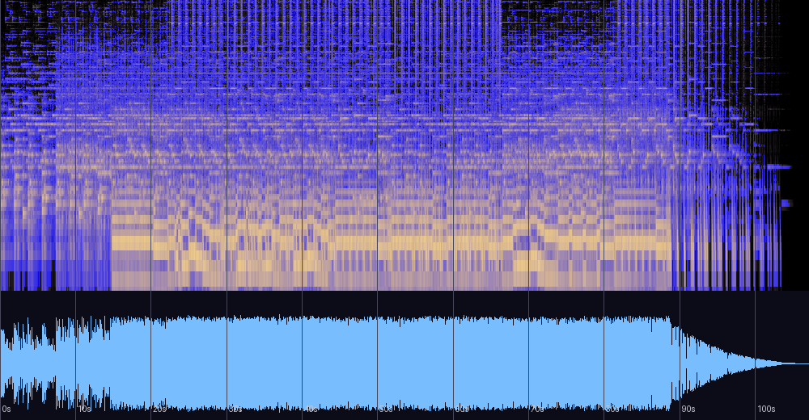

# Inn — 신호 분석과 실용 노트

《Port》 앨범 1번 트랙(자작곡, 2013, New Age, 태그 BPM 130)에 대한 분석 기록.
원본 파일은 저장소 외부 소장(개인 음악 라이브러리). 분석일: 2026-08-13.

## 한 줄 진단

"여관"이라는 컨셉에 음향 설계가 정확히 부합하는 곡 — 따뜻한 중저역 중심,
좁은 스테레오(친밀한 실내감), 반박자 느린 체감 템포. 마스터가 셋 중 가장 크게
찍혀 있어(-8.2 LUFS) 다른 곡과 함께 쓸 때 레벨 정합만 신경 쓰면 된다.

## 스펙트로그램·파형



## 기본 정보

| 항목 | 값 |
|---|---|
| 제목 / 앨범 | Inn / Port (track 1) |
| 작곡 | 어진석, 2013 |
| 길이 | 1:47 (107.1초) |
| 포맷 | MP3 ~320kbps, 인코딩 컷오프 20kHz (전작보다 높은 품질 설정) |
| 태그 BPM | 130 (체감 펄스는 절반인 ~65 — 측정 64.6, 신뢰도 0.82) |

## 게임에서 쓸 때 (바로 적용)

- **루프 포인트가 그리드에 정확히 떨어진다.** 130BPM 4/4 기준 인트로가 **정확히 8마디(14.77초)**,
  본편이 **40마디(73.85초)**:
  ```
  인트로: 0:00.000 ~ 0:14.769   /   루프: 0:14.769 ~ 1:28.615   /   이후 아웃트로(페이드)
  ```
  `Audio.InsertNextMusic`으로 "인트로 1회 → 루프 무한" 구현 가능.
- **레벨 정합**: 통합 라우드니스 -8.2 LUFS로 세 곡 중 가장 크다.
  같은 게임에서 함께 쓰려면 이 곡을 기준 대비 낮춰야 한다 (하단 비교표 참조).

## 음악적 특성

- **조성**: D단조(0.853)와 F장조(0.808)의 관계조 축. 크로마 상위 4음이 D-F-A-C —
  **그대로 Dm7 화음**이다. 구간별로 F장조(2구간)와 D단조(1·3·4구간)를 오간다.
- **코드 진행(마디 단위 추정)**: F↔Dm 축의 순환에 A/Am(D단조의 V)이 주기적으로 끼어들어
  견인력을 만들고, 간헐적인 D장화음(픽카디)이 온기를 더한다. 8마디 단위 프레이즈.
- **A/Am이 "끼어드는" 이유** — 검출 위치가 답을 준다. A/Am은 8마디 프레이즈의 6~7마디째,
  즉 프레이즈가 닫히기 직전에만 나타난다(마디 6-7, 30-31). F와 Dm은 두 음을 공유하는
  관계조 쌍이라 둘 사이의 왕복은 같은 음향 필드(D-F-A-C = Dm7) 위의 색 전환일 뿐,
  이끎음이 없어 어디로도 가지 않는다. A장화음은 이 필드에 없는 유일한 음 C#(D의 이끎음)을
  들여와 프레이즈 끝에 "귀가" 신호를 만든다 — 즉 종지 표지다. V(A)→v(Am)로 곧바로
  이끎음을 되무르는 것은 정격 종지의 격식을 피하면서 인력만 빌리는 부드러운 마침이며,
  루프 음악에서 8마디 호흡 단위를 분절해 주는 실용 장치이기도 하다.
- **형식**: 8마디 인트로 → 40마디 본편(레벨 -9.5dB 부근에서 안정적 유지) →
  약 17초의 긴 아웃트로 감쇠(1:28→끝). 급정지였던 "피눈물의 제단"과 대조적인,
  자연 감쇠형 엔딩.
- **음향 설계**: 에너지의 67.5%가 60–250Hz — 셋 중 가장 저역 중심의 따뜻한 보이싱.
  스테레오 상관 0.865(좁음) — 넓은 홀이었던 전작들과 달리 실내의 친밀감.
  컨셉(여관)과 측정치가 일치한다.

## 마스터링 소견

| 측정 | 값 | 소견 |
|---|---|---|
| 통합 라우드니스 | **-8.2 LUFS** | 셋 중 최대 음량. 스트리밍(-14)에서는 6dB 깎임 — 더 크게 만들 이유 없음 |
| LRA | 5.2 LU | 크레스트 11.3dB — 셋 중 가장 눌린 마스터 |
| 트루 피크 | +1.1 dBTP | 리미터 실링 -1.0dBTP 권장 (재발매 시) |
| 클리핑 | 92샘플 | 본편 중반에 소량 분산 — 경미 |
| 저음 모노(<120Hz) | 0.058 | 교과서적 — 유지할 습관 |
| 튜닝 | -6.6센트 | A440 기준 허용 범위 내 (약간 낮은 쪽) |

## 세 곡 비교 (레벨 정합표)

같은 게임에서 함께 사용할 경우의 상대 볼륨 보정값:

| 곡 | 연도 | 통합 라우드니스 | 트루 피크 | 성격 | Bless 기준 보정 |
|---|---|---|---|---|---|
| Inn | 2013 | -8.2 LUFS | +1.1 dBTP | 실내·친밀 | **-5.1 dB** |
| 피눈물의 제단 | 2011 | -10.5 LUFS | +1.0 dBTP | 구동·전투 | **-2.8 dB** |
| Insatiable desires | 2013 | -14.4 LUFS | +0.1 dBTP | 드론·심연 | **+1.1 dB** |
| Bless (Arrange) | 2014 | -13.3 LUFS | -0.2 dBTP | 부유·서정 | 기준 |

마스터 강도는 연도가 아니라 곡의 성격을 따라 선택되어 왔다(같은 2013년에 -8.2와 -14.4가
공존). 일관되게 남아 있던 트루 피크 오버 습관은 2014 Bless에서 사라진다.

## 평가

측정과 이론 근거에 기반한 평가이며 청감 선호를 대신하지 않는다.

| 기준 | 평점 | 근거 |
|---|---|---|
| 작곡·구조 | ★★★★☆ | 관계조 축 위에서 V를 프레이즈 구두점으로만 배급하는 절제된 기능 화성. 8마디/40마디 그리드의 루프 설계 |
| 편곡·사운드 | ★★★★☆ | 좁은 스테레오·저역 온기·반박자 체감 — "여관"을 음향 파라미터로 정확히 번역. 다만 60~250Hz 67.5%는 온기를 넘어 혼잡의 경계이고, 중역 4.3%는 선율 존재감을 가릴 수 있음 |
| 믹싱 | ★★★★☆ | 저음 모노 모범적(0.058), 의도된 좁음 |
| 마스터링 | ★★☆☆☆ | **컨셉과 마스터 강도의 충돌** — 휴식의 곡이 넷 중 가장 크게(-8.2 LUFS), 가장 눌려(크레스트 11.3) 찍혀 있다. 본편 70초가 -9.5dB에 고정되어 호흡이 마스터 단계에서 소거됨. 트루 피크 +1.1 |
| 목적 적합성(BGM) | ★★★★★ | 그리드 정밀 루프 포인트, 자연 감쇠 엔딩 — 루프 사용성은 넷 중 최고 |

**총평**: 작곡·편곡은 컨셉을 정확히 구현했는데 마스터링이 그 정서를 배반한 경우.
조용한 곡을 조용하게 다시 찍는 것(-14 LUFS 목표)만으로 곡이 본래 의도대로 돌아온다.
리마스터 가치 2순위.

## 재현 방법

```bash
python3 tools/analyze_audio.py "<파일 경로>"
ffmpeg -i "<파일>" -af ebur128=peak=true -f null -   # LUFS/트루 피크
```

관련 문서: [bless-analysis.md](bless-analysis.md) ·
[blood-tears-altar-analysis.md](blood-tears-altar-analysis.md)
