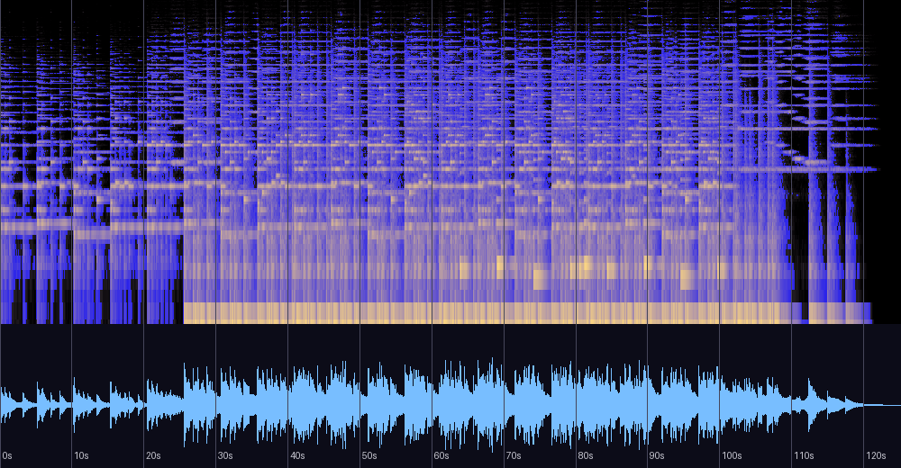

# Insatiable desires — 신호 분석과 실용 노트

《끝 없는 욕망》 앨범 1번 트랙(자작곡, 2013, New Age, 태그 BPM 47)에 대한 분석 기록.
원본 파일은 저장소 외부 소장(개인 음악 라이브러리). 분석일: 2026-08-13.

## 한 줄 진단

네 곡 중 **현대 스트리밍 기준에 가장 근접한 마스터**(-14.4 LUFS)를 가진 초저속 서브 드론
앰비언트. 에너지의 절반 이상이 60Hz 이하라 **재생 환경을 심하게 타는 것**이 유일한 실용 이슈다.

## 스펙트로그램·파형



## 기본 정보

| 항목 | 값 |
|---|---|
| 제목 / 앨범 | Insatiable desires / 끝 없는 욕망 (track 1) |
| 작곡 | 어진석, 2013 |
| 길이 | 2:05 (125.2초) |
| 포맷 | MP3 320kbps |
| 태그 BPM | **47** (측정 92.3은 8분음표 층위 — 47의 정확히 2배) |

## 게임에서 쓸 때 (바로 적용)

- **루프 포인트**: 47BPM 4/4에서 1마디 = 5.106초. 인트로가 5마디, 본편이 16마디:
  ```
  인트로: 0:00.000 ~ 0:25.532   /   루프: 0:25.532 ~ 1:47.234   /   이후 자연 감쇠(~10초)
  ```
- **레벨 정합**: -14.4 LUFS — Bless(-13.3)와 1dB 차이로 사실상 정합 상태.
  넷 중 이 두 곡은 보정 없이 함께 쓸 수 있다.
- **재생 환경 주의**: 에너지의 **54.5%가 60Hz 이하** — 노트북/폰 스피커에서는 곡의
  절반이 물리적으로 사라진다. 헤드폰·우퍼 환경 전제의 곡. 소형 스피커 대응이
  필요하면 60–120Hz 배음을 살짝 더하는 새추레이션이 처방이다.

## 음악적 특성

- **조성**: A단조 궤도(전역 0.606). 크로마 최상위가 **E(1.00)–F(0.72)** 반음 쌍 —
  Bless의 A–B♭과 동일한 **프리지안 반음 색채**로, 두 곡에서 반복되는 작곡가의 지문이다.
  구간별로 E 중심(전반) → D단조 색채(후반, 0.76)로 서서히 이동한다.
- **코드 진행(마디당 1화음 — 극도로 느린 화성 리듬)**:
  ```
  bar  1- 8:  Am  Am  C   Em | Am  Am  Am  Em
  bar  9-16:  F   Am  Dm  A  | F   Am  Am  (Am)
  ```
  **Am–C(III)–Em(v)–F(VI)–Dm(iv)** — 도미넌트(E장화음)를 쓰지 않는 자연단음계 순환으로
  해결감을 계속 유예한다. "끝없는 욕망"이라는 제목과 화성 설계가 정확히 일치한다.
  12마디째의 A장화음 한 번이 유일한 장조 빛이다.
- **"해결감의 유예"가 작동하는 원리** — A단조의 귀결 엔진은 도미넌트 E장화음(E-G#-B)의
  G#, 즉 자연단음계 밖의 이끎음이다(G#→A 반음). 이 곡은 5도 자리에 E장화음 대신
  Em(E-G♮-B)을 쓰고(소문자 v — 도미넌트 기능의 포기 선언), 순환 전체를 에올리안 음만으로
  구성해 그 음을 한 번도 쓰지 않는다. 이끎음이 없으면 어떤 화음도 다음을 요구하지 않아
  화음은 화살표가 아닌 장소가 되고, 진행은 여정이 아닌 색의 회전이 된다. 해소를 거부하는
  것이 아니라 애초에 약속하지 않는 구조 — 그래서 순환이 영원히 돌아도 어색하지 않다.
  유일한 예외인 A장화음도 도미넌트가 아니라 으뜸화음을 밝힌 픽카디 색채라,
  빛은 주되 출구는 주지 않는다. 후속작에서 "마침내 해소되는" 순간이 필요하다면
  곡 끝의 E장화음(G# 한 음) 하나로 극적 장치가 완성된다 — 도구가 아껴져 있는 상태다.
- **형식**: 5마디 인트로(숨쉬는 스웰, 프레이즈 사이 거의 무음) → 16마디 본편 →
  약 10초 자연 감쇠. 마디 단위(5.1초)의 호흡 주기가 RMS 곡선의 5초 딥과 일치 —
  초저속이지만 그리드 위에서 작곡되었다.

## 마스터링 소견

| 측정 | 값 | 소견 |
|---|---|---|
| 통합 라우드니스 | **-14.4 LUFS** | 스트리밍 목표(-14)와 사실상 일치 — 넷 중 최적 |
| LRA / 크레스트 | 9.2 LU / 17.9dB | 넷 중 가장 다이내믹한 마스터 |
| 트루 피크 | +0.1 dBTP | 경미한 오버 — 재발매 시 -1dBTP 실링이면 충분 |
| 클리핑 | 88샘플 (40~80초 구간에 국한) | 경미 |
| **저음 스테레오(<120Hz)** | **0.466** | 다른 곡들(0.06대)과 달리 서브가 넓게 퍼져 있음 — 헤드폰 몰입감엔 유리하나 **모노 합산 시 저역이 감쇠**한다. 재마스터 시 100Hz 이하 모노화 권장 |
| 튜닝 | -3.5센트 | 정상 |
| 고역 콘텐츠 | ~12.4kHz에서 끝 | 320kbps인데도 낮음 — 인코딩이 아니라 악기 선택(심벌류 부재)의 결과로 보임 |

## 네 곡 관점에서

이 곡(-14.4)의 존재로 "연도순 마스터링 개선" 서사는 수정이 필요하다 — 같은 2013년에
Inn은 -8.2로 크게, 이 곡은 -14.4로 여유 있게 찍혀 있다. 즉 **곡의 성격에 따라 마스터
강도를 다르게 선택**해 온 것이고, 일관되게 남아 있던 트루 피크 오버 습관만 2014 Bless에서
사라진다. 전체 비교표는 [README.md](README.md) 참조.

## 평가

측정과 이론 근거에 기반한 평가이며 청감 선호를 대신하지 않는다.

| 기준 | 평점 | 근거 |
|---|---|---|
| 작곡·구조 | ★★★★★ | 제목의 명제(해소 없는 갈망)를 화성 구조(V의 부재)로 구현 — 넷 중 개념적 완결성이 가장 높다. 초저속 그리드(마디 5.1초) 위의 정밀한 형식 |
| 편곡·사운드 | ★★★★☆ | 서브 54.5%의 과감한 정체성. 단, 재생 환경 의존이 크고 12.4kHz 위 콘텐츠 부재로 어느 시스템에서든 어둡게 들림 — 의도된 협소함 |
| 믹싱 | ★★★☆☆ | 서브가 넓게 퍼진 것(side/mid 0.466)은 헤드폰 몰입엔 유리하나 모노 합산 시 저역 감쇠 — 넷 중 유일한 기술적 결함 |
| 마스터링 | ★★★★☆ | -14.4 LUFS로 현대 표준과 사실상 일치, 넷 중 가장 다이내믹(크레스트 17.9). 트루 피크 +0.1의 경미한 오버만 남음 |
| 목적 적합성 | ★★★★☆ | 심연·긴장 상황의 BGM으로 강력. 범용성은 낮음(환경 의존) — 이는 결함이 아니라 선택 |

**총평**: 넷 중 가장 예술적 야심이 크고 그 야심을 구조 수준에서 달성한 곡.
동시에 가장 청취 환경을 가리는 곡이기도 하다. 유일한 실제 결함은 와이드 서브의
모노 호환성 — 재마스터 시 100Hz 이하 모노화 한 가지면 기술적으로도 완결된다.

## 재현 방법

```bash
python3 tools/analyze_audio.py "<파일 경로>"
ffmpeg -i "<파일>" -af ebur128=peak=true -f null -   # LUFS/트루 피크
```

관련 문서: [bless-analysis.md](bless-analysis.md) ·
[blood-tears-altar-analysis.md](blood-tears-altar-analysis.md) ·
[inn-analysis.md](inn-analysis.md)
