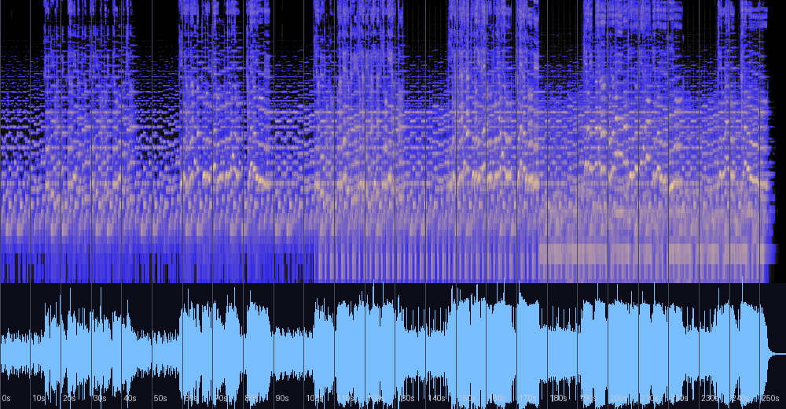

# 기억 속으로 — 신호 분석과 실용 노트

자작곡 발라드(장르 태그 Ballad, 앨범 미지정)에 대한 분석 기록. **게임 음악이 아닌
감상용 곡**이므로 루프 포인트 등 BGM 실용 항목은 다루지 않는다.
원본 파일은 저장소 외부 소장. 분석일: 2026-08-13.

## 한 줄 진단

다섯 곡 중 **작곡 야심이 가장 큰 곡**(유일한 풀 송폼 발라드, 전조와 회상 코다까지 완주)이자,
**현존 파일의 상태가 가장 나쁜 곡**. 클리핑 12만 8천 샘플이 후렴에 집중되어 감정의 절정이
가장 손상된 구간이 되어 있다 — 곡은 살아 있고 파일이 아프다. 원본 복구가 최우선 과제.

## 스펙트로그램·파형



중역(300~800Hz)의 물결치는 밝은 궤적은 **보컬**이다(저자 확인 — 다섯 곡 중 유일한 보컬 곡).
스펙트로그램의 비브라토 궤적과 250~800Hz 대역 우세(47.5%)가 보컬 중심 믹스와 일치한다.
파형의 후렴 구간은 윗면이 잘려나간 사각형 — 브릭월 클리핑의 전형적 형태다.

## 기본 정보

| 항목 | 값 |
|---|---|
| 제목 | 기억 속으로 |
| 작곡 | 어진석 (연도 태그 없음) |
| 장르 | Ballad (감상용 — 게임 음악 아님, **보컬 곡**) |
| 길이 | 4:19 (258.6초) — 다섯 곡 중 유일한 풀 송폼 |
| 포맷 | MP3 **128kbps** (컷오프 15.4kHz) — 다섯 곡 중 최저 품질 |
| 체감 템포 | ~65 BPM (발라드, 측정 신뢰도 낮음 — 루바토 성격) |

## 형식 — 발라드 극작의 완주

RMS 곡선이 벌스-후렴 구조를 그대로 그린다:

| 구간 | 내용 |
|---|---|
| 0:00–0:14 | 인트로 (조용) |
| 0:15–0:44 | 벌스 1 |
| 0:45–0:58 | 조용한 연결부 |
| 0:59–1:28 | **후렴 1** (-8~-11dB) |
| 1:29–1:42 | 벌스 2 |
| 1:43–2:13 | **후렴 2** |
| 2:14–2:27 | 간주/C멜로 (조용) |
| 2:28–2:57 | **큰 후렴** (-5~-7dB — 최대 음량) |
| 2:58–3:11 | 브레이크다운 (조용) |
| 3:12–3:44 | **마지막 후렴 — 전조** (하단 참조) |
| 3:45–3:55 | 조용한 아웃트로 벌스 |
| 3:56–4:10 | 마지막 스웰(회상 코다) 후 페이드 |

조용한 구간과 후렴의 대비(LRA 10.7 LU), 브레이크다운 후 전조 후렴, 그리고 끝나는 척하다
한 번 더 차오르는 회상 코다까지 — 대중 발라드의 극작 문법을 끝까지 밟는다.

## 화성·선율 분석

(클리핑과 루바토 탓에 코드 검출에 잡음이 있어, 아래는 반복 검출된 골격 위주로 정리한 추정이다)

**읽기 전에**: 저자는 정규 음악 교육을 받은 적이 없으며 자신만의 기준으로 작곡했다고
밝혔다(2026-08-13). 따라서 아래의 이론 용어(도리안, 피벗 전조 등)는 의도의 재구성이
아니라 **결과물에 대한 사후적 기술**이다. 관찰되는 장치들이 학습된 기법이 아니라 직관적
선택이라는 사실은, 다섯 곡 전체에서 일관된 개인 문법이 검출되는 이유를 설명해 준다 —
배운 규칙이 아니라 몸에 밴 취향은 어디서나 같은 방식으로 작동하기 때문이다.

### 선법 — A 도리안의 향수 어법

A 기준 크로마에서 **6음이 F#(0.34) > F♮(0.17)로 장6도가 우세**하고, 7음은 G♮(0.38) >
G#(0.28)로 이끎음 없는 서브토닉이다. 즉 단3도(C 0.81 ≫ C# 0.26) + 장6도 + 단7도 —
**A 도리안**이 기본 팔레트다. 에올리안보다 반 뼘 밝은 도리안 단조는 "어둡되 따뜻한"
회고의 정서에 관용적으로 쓰이는 선법으로, 제목과 정합한다.

### 6음의 명암 교차 — 이 곡의 화성적 지문

코드 검출에서 **D장화음(도리안 IV: D-F#-A)과 Dm(에올리안 iv: D-F-A)이 같은 자리에
번갈아** 나타난다(벌스1: F D Am **Dm** Am … **D** Am **D** Am G). 6음이 F#과 F♮ 사이에서
깜빡이는 것 — 같은 화음 자리가 밝아졌다 어두워졌다 하는 **명암 교차**가 이 곡의
화성적 지문이다. 벌스는 Am–D(–G) 순환으로 도리안 쪽에, 후렴은 Am–F–G(에올리안 VI
등장)로 어두운 쪽에 기운다: 절이 회상하고 후렴이 아파하는 배치다.

### 전조의 메커니즘 — 기억하던 화음 속으로

마지막 후렴(3:12~)의 검출은 **A–D–A–D–G** — D장조에서의 V–I 교대다. 전조 경로는
Am(구조성 i) → **A장화음**(새 조의 V로 재해석되는 피벗) → D장조로 추정된다.
주목할 지점: 곡 내내 벌스에서 깜빡이던 **도리안 IV(D장화음)가 마지막에 으뜸화음이
된다.** 즉 곡이 계속 곁눈질하던 "기억의 화음" 속으로 걸어 들어가며 끝나는 설계 —
제목 "기억 속으로"가 화성 구조로 구현된 것이다. 상투적인 "마지막 후렴 반음 올리기"가
아니라, 곡 자신의 재료에서 논리적으로 도출된 전조라는 점이 이 곡의 백미다.

### 선율 — 상승을 전조로 얻는 설계

보컬 F0 추적(신뢰 프레임 기준) 결과:

| 구간 | 선율 중앙 (한국식 옥타브) | 관찰 |
|---|---|---|
| 벌스 1·2 | **1옥타브 라** (A3) | 낮게 읊조리는 테시투라 |
| 후렴 1·큰후렴 | **1옥타브 시** (B3, +2반음) | 완만한 상승 |
| 마지막 후렴(전조) | **2옥타브 레** (D4, +5반음) | 최종 상승 — 새 으뜸음 위에 안착 |

음역은 대략 **1옥타브 도 ~ 2옥타브 라**(C3~A4, 약 1.5옥타브). 후렴에서 가수를 위로
몰아붙이는 대신 **최종 상승분을 전조에서 얻는** 설계라, 목소리의 무리 없이 누적
상승감을 만든다.

**최고음 (0.2초 이상 지속 검출 기준)**:

| 음 | 검출 | 위치 |
|---|---|---|
| **2옥타브 라 (A4)** | 1회 (0.3초) | 1:36 — **곡의 최고음** |
| **2옥타브 솔 (G4)** | 4회 | 2:45, 3:23~24 — **상용 최고음** (전조된 마지막 후렴에 집중) |
| 2옥타브 파# (F#4) | 3회 (최장 0.6초) | 1:16, 3:32, 3:59 |
| 2옥타브 미 (E4) | 11회 | 후렴 전반의 주력 고음 |

3옥타브 레(D5)가 1:06에 1회 잡히지만 지속 임계 턱걸이 단발이라 배음/기악 오검출로
보고 보컬 상한에서 제외한다. (앞서 언급한 3옥타브 솔(G5) 검출도 동일하게 판단)

**비브라토: 평균 5.4Hz, 깊이 ±56센트 (49회 검출)** — 가창에서 자연스럽게 관찰되는
전형 범위(5~7Hz)에 들고, ±56센트는 표정이 풍부한 편이다. 지속음 끝에서 규칙적으로
검출되는 것으로 보아 프레이즈 말미를 비브라토로 여미는 습관이 있다.

## 마스터링 소견 — 심각한 손상

| 측정 | 값 | 소견 |
|---|---|---|
| 트루 피크 | **+5.0 dBTP** | 다른 곡들(+0.1~+1.1)과 차원이 다른 오버 |
| 클리핑 | **127,817샘플 (전체의 ~1.1%)** | 가청 왜곡 수준 |
| 통합 라우드니스 | -7.1 LUFS | 다섯 곡 중 최대 음량 |
| 비트레이트 | 128kbps | 다섯 곡 중 최저 — 컷오프 15.4kHz |
| 저역 스테레오(<120Hz) | 0.621 | 게임곡들(0.06대)과 달리 저역이 넓게 퍼짐 — 모노 합산 시 감쇠 |
| 튜닝 | +4.8센트 | 정상 |

**클리핑의 분포가 문제의 핵심이다.** 10초 구간별로 세면 벌스는 수십 개 수준인데
**큰 후렴(2:28~2:58)에만 약 4만 5천 개, 마지막 후렴(3:12~3:40)에 약 3만 9천 개** —
곡이 가장 감정적으로 차오르는 순간마다 왜곡이 가장 심하다. 마스터 단계에서 게인을
한계 너머로 올린 상태로 128kbps 인코딩까지 겹친 결과로 보인다.

보컬 곡이라는 점이 손상의 체감을 더 키운다: 클리핑 왜곡은 하필 귀가 가장 민감한
중역 — 보컬이 사는 대역 — 에 배음을 흩뿌리므로, 같은 양의 클리핑이라도 기악곡보다
보컬 후렴에서 훨씬 거슬리게 들린다. 복구 시에도 보컬 구간의 디클리핑은 인공물이
드러나기 쉬워 세심한 파라미터 조정이 필요하다.

### 복구 처방 (우선순위순)

1. **원본 프로젝트 또는 클리핑 이전 WAV를 찾는 것이 정답.** 재수출 시 -14 LUFS /
   -1dBTP, 320kbps 이상(권장: 무손실 보관 + 필요 시 변환).
2. 이 MP3만 남았다면 **디클리핑 복원**(iZotope RX De-clip 등)으로 잘린 파형 꼭대기를
   보간해 부분 복구가 가능하다. 이후 -14 LUFS로 재마스터. 완전 복원은 아니어도
   후렴의 왜곡감은 크게 줄일 수 있다.
3. 저역 스테레오는 취향의 영역이나, 복원 시 100Hz 이하 모노화를 함께 권장.

## 평가

측정과 이론 근거에 기반한 평가이며 청감 선호를 대신하지 않는다.

| 기준 | 평점 | 근거 |
|---|---|---|
| 작곡·구조 | ★★★★★ | 완전한 송폼 극작에 더해, 화성이 서사를 실어 나른다: 벌스에서 깜빡이던 도리안 IV(D)가 마지막에 으뜸화음이 되는 전조 — 상투적 "후렴 올리기"가 아니라 곡 자신의 재료에서 도출된 결말. 6음(F#/F♮)의 명암 교차, 상승을 전조로 얻는 선율 설계까지 서로 맞물려 있음 |
| 편곡·사운드 | ★★★★☆ | 조용한 구간과 후렴의 뚜렷한 성부·밀도 대비(LRA 10.7), 보컬을 중심에 둔 대역 설계(중역 우세) |
| 믹싱 | ★★★☆☆ | 구간 대비는 좋으나 저역이 넓게 퍼져 모노 호환성 약함 |
| 마스터링 | ★☆☆☆☆ | 다섯 곡 중 최악 — 감정 절정이 가장 손상된 구간이 되는 역설. 파일 자체가 배포 가능 상태가 아님 |
| 목적 적합성(감상) | 판정 유보 | 곡의 설계는 감상용으로 강하나, 현존 파일의 왜곡이 청취를 방해할 수준 — 복구 후 재평가가 온당 |

**총평**: 작곡 역량의 상한을 보여주는 곡이 가장 나쁜 그릇에 담겨 있다.
게임곡 네 편의 마스터링 이슈가 "실링 조정" 수준의 처방이었다면, 이 곡은 **원본 발굴이
필요한 복구 대상**이다. 원본이 있다면 다섯 곡 중 재발매 효과가 가장 클 곡.

특기할 점: 저자가 정규 교육 없이 직관으로 작곡했다는 사실을 감안하면, "재료에서 도출된
전조"나 "6음의 명암 교차" 같은 장치는 이론을 적용한 결과가 아니라 **귀가 옳다고 판단한
것을 따라간 결과가 이론적으로도 정합했던 경우**다. 분석자가 보기에 이는 학습된 세련됨보다
드문 종류의 증거다 — 이 곡들의 일관성은 규칙이 아니라 취향의 일관성이다.

## 재현 방법

```bash
python3 tools/analyze_audio.py "<파일 경로>"
ffmpeg -i "<파일>" -af ebur128=peak=true -f null -   # LUFS/트루 피크
```

관련 문서: [README.md](README.md) (전체 비교표)
