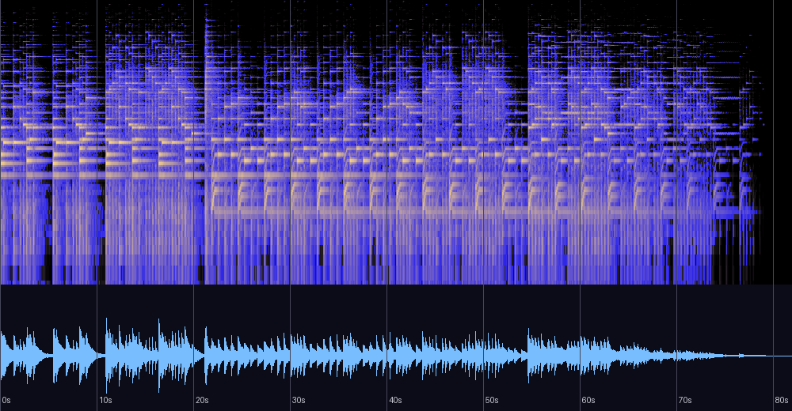

# Monotonous — 신호 분석과 실용 노트

《Monologue》 앨범 수록곡(자작곡, 2014, New Age, 태그 BPM 44, Jinseok Eo 명의)에 대한
분석 기록. 원본 파일은 저장소 외부 소장. 분석일: 2026-08-13.

## 한 줄 진단

여섯 곡 중 **가장 작은 재료로 가장 깨끗하게 만든 곡**. 제목(단조로움)을 다이내믹과
화성 구조로 그대로 구현한 미니멀 소품이며, 마스터는 전 곡 중 최고 품질이다(클리핑 0,
크레스트 21.7dB).

## 스펙트로그램·파형



## 기본 정보

| 항목 | 값 |
|---|---|
| 제목 / 앨범 | Monotonous / Monologue |
| 작곡 | 어진석 (Jinseok Eo 명의), 2014 |
| 길이 | 1:22 (81.9초) — 여섯 곡 중 최단 |
| 포맷 | MP3 192kbps |
| 태그 BPM | **44** (측정 89.1은 8분음표 층위 — 1마디 = 5.455초) |

## 음악적 특성 — 제목의 구조적 구현

- **화성 (마디당 1화음)**:
  ```
  bar 1-4:  Em  Em  Em  Em     (0:00~0:22)
  bar 5-11: F   C   C   F   F   C   C     (0:22~1:00, 이후 페이드)
  ```
  도입 4마디는 Em 하나로 버티고, 본편은 **F–C의 플라갈(IV–I) 회전**뿐이다.
  여기서도 도미넌트(G장화음)는 검출되지 않는다 — 게임곡·앰비언트 전반에서 반복되는
  "도미넌트 회피" 문법의 여섯 번째 사례.
- **Em ↔ F: 반음 이웃 화음의 교차.** 크로마 최상위가 **F(1.00)–E(0.97)** 반음 쌍 —
  Bless(A–B♭), Insatiable desires(E–F)에 이어 **세 번째로 검출되는 반음 쌍 지문**이며,
  이 곡에서는 그 반음 관계가 음이 아니라 **화음 단위**(Em과 F, 근음이 반음 이웃)로
  구현되어 있다. 프리지안 색채의 가장 골격적인 형태다.
- **다이내믹이 곧 제목이다.** RMS 곡선은 -17~-24dB 사이에서 기복 없이 유지되다
  1:00부터 20초에 걸쳐 서서히 사라진다. 클라이맥스 없음, 전조 없음, 점층 없음 —
  "Monotonous"를 다이내믹 설계로 선언한 곡. Insatiable desires(해소의 거부),
  기억 속으로(기억의 화음으로 귀결)에 이어 **제목을 구조로 구현하는 세 번째 사례**.
- **음색**: 에너지의 91.5%가 250Hz~2.5kHz — 여섯 곡 중 가장 중역 집중적(0.8~2.5kHz
  32.4%는 압도적 1위). 서브(0.1%)와 공기(0%)가 거의 없는, 노출된 솔로 성부 중심의
  "독백(Monologue)"다운 음향 설계. 고역 콘텐츠는 11.4kHz에서 끝난다(악기 선택의 결과).
- **공간**: 스테레오 상관 0.319, Side/Mid 0.719 — Insatiable desires와 함께 가장 넓은 축.

## 마스터링 소견 — 여섯 곡 중 최고

| 측정 | 값 | 소견 |
|---|---|---|
| 통합 라우드니스 | -16.7 LUFS | 여유 있는 레벨 — 앰비언트에 적절 |
| 크레스트 팩터 | **21.7 dB** | 전 곡 중 가장 다이내믹 |
| 피크 / 클리핑 | -0.46 dBFS / **0샘플** | 트루 피크 오버 없음 — 유일하게 처방이 필요 없는 마스터 |
| 튜닝 | +4.3센트 | 정상 |
| LRA | 8.9 LU | 페이드 포함 |

2014년작 두 편(Bless, Monotonous)이 모두 클리핑 0이라는 사실은 **2014년을 기점으로
마스터링 습관이 확립되었다**는 추정을 강화한다(2011~2013: 트루 피크 +1.0~+5.0).

## BGM으로 쓸 경우

44BPM 그리드 기준 본편 회전(F–C)은 5~11마디:
```
인트로(Em): 0:00.000 ~ 0:21.818   /   루프 후보: 0:21.818 ~ 1:00.000   /   이후 페이드
```
Bless(-13.3 LUFS)와 함께 쓰려면 이 곡을 +3dB 보정하거나 그대로 두고 "더 조용한 장면"에
배치하는 편이 자연스럽다.

## 평가

측정과 이론 근거에 기반한 평가이며 청감 선호를 대신하지 않는다.
(저자는 정규 음악 교육 없이 직관으로 작곡 — 이론 용어는 사후적 기술이다)

| 기준 | 평점 | 근거 |
|---|---|---|
| 작곡·구조 | ★★★★☆ | 화음 3개·마디 11개로 제목의 명제를 완결 — 미니멀리즘의 절제. 다만 의도된 단조로움과 전개 부재의 경계는 청자에 따라 갈릴 지점 |
| 편곡·사운드 | ★★★★☆ | 독백 컨셉에 부합하는 노출된 중역 솔로 설계. 대역 협소는 선택이나 11.4kHz 상한은 질감 여지를 남김 |
| 믹싱 | ★★★★☆ | 넓고 깨끗한 공간, 위상 문제 없음 |
| 마스터링 | ★★★★★ | 여섯 곡 중 유일하게 처방 불요 — 클리핑 0, 최대 다이내믹 |
| 목적 적합성(앰비언트) | ★★★★☆ | 조용한 장면·독백·에필로그용으로 강력. 범용성은 낮음(의도) |

**총평**: 선언문 같은 소품. "가장 적게 말하는 곡을 가장 깨끗하게 담았다"는 점에서
2014년의 제작 성숙도를 보여주는 물증이며, Em↔F 반음 이웃 화음이라는 지문의 가장
증류된 형태가 여기 있다.

## 재현 방법

```bash
python3 tools/analyze_audio.py "<파일 경로>"
ffmpeg -i "<파일>" -af ebur128=peak=true -f null -   # LUFS/트루 피크
```

관련 문서: [README.md](README.md) (전체 비교표)
