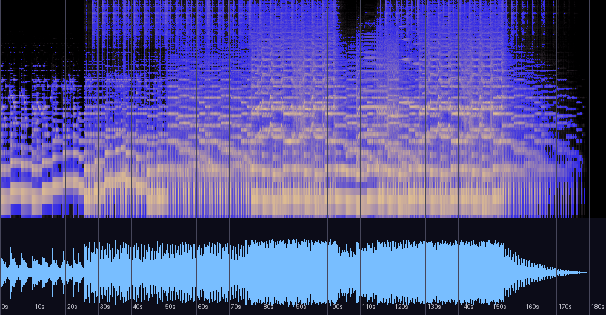

# Neuron — 신호 분석과 실용 노트

앨범 미지정 트랙(자작곡, 2014, **Rock**, 태그 BPM 75)에 대한 분석 기록.
원본 파일은 저장소 외부 소장. 분석일: 2026-08-13.

## 한 줄 진단

**2013년 록(연주·벽·클리핑)과 2014년 제작 성숙이 만난 곡** — 튜닝은 A440으로 복귀했고
(시퀀싱/정조율), 클리핑 0에 뚜렷한 다이내믹 아치(LRA 9.8)를 갖췄다. 사막 연작이 충동의
기록이라면 Neuron은 같은 장르를 설계의 언어로 다시 쓴 결과다.

## 스펙트로그램·파형



## 기본 정보

| 항목 | 값 |
|---|---|
| 제목 | Neuron (앨범 미지정) |
| 작곡 | 어진석, 2014 |
| 장르 | Rock |
| 길이 | 3:05 (185.1초) |
| 포맷 | MP3 ~320kbps (컷오프 19.8kHz) |
| 태그 BPM | 75 (측정 76.0, 신뢰도 0.68 — 일치) |

## 2013 록과의 대조 — 제작 방식의 회귀와 진화

| 측정 | 사막 연작 (2013) | **Neuron (2014)** |
|---|---|---|
| 튜닝 | -19.5센트 (귀 조율 기타) | **+3.4센트 (A440 — 시퀀싱/정조율)** |
| 클리핑 | 11~22샘플, TP +1.2~1.9 | **0샘플, TP +0.2** |
| 다이내믹 | LRA 1.6~2.3 (벽) | **LRA 9.8 (아치)** |
| 스테레오 | 모노~좁음 | 정상 스테레오 (corr 0.677) |
| 형식 | 즉시 시작, 급정지 | 24초 인트로 → 점층 → 정점 유지 → 30초 페이드 |

같은 장르를 1년 사이에 완전히 다른 공정으로 만들었다. 2014년 클린 마스터 사례가
이 곡으로 셋(Bless·Monotonous·Neuron)이 되었고, **가장 눌러 찍기 쉬운 장르(록)에서도
클리핑 0을 지켰다**는 점이 "2014년 마스터링 습관 확립" 추정의 가장 강한 증거다.

## 음악적 특성

- **조성**: A단조(구간 상관 0.85~0.89 — 컬렉션 최고 수준의 확신도). 도입부만 F장조
  색채(0.73)로 시작해 A단조로 정착한다.
- **화성 (마디 3.2초 단위)**:
  ```
  도입 순환:  Dm  F   F   Dm  | F   Dm  F   F
  전개 순환:  Am  F   (Fm) Dm | Am  G   G   Dm/Am
  ```
  Dm–F 축으로 열고 Am–G–Dm(i–VII–iv 에올리안 순환)으로 구동한다. 여기서도
  도미넌트(E장화음)는 검출되지 않는다 — **열 곡째의 도미넌트 회피**.
  같은 마디 위치에서 **F → Fm 하강 색채가 2회 반복 검출**되는데(11·15마디),
  사실이라면 장화음이 단화음으로 어두워지는 고전적 정서 장치다(검출 잡음 가능성 병기).
- **형식**: 성긴 24초 인트로 → 0:25 본편 → 1:17 상승 → 1:52~2:33 정점 유지 →
  **30초 페이드**. 2013년 록의 "벽"과 달리 기승전결의 아치가 있다.
- **음색**: 저역 중심(250Hz 이하 59%)이지만 중역(32.1%)이 살아 있어 사막 연작의
  침수 상태(90.1%)와는 다르다. 저음 모노(0.128) 안정.

## 마스터링 소견

| 측정 | 값 | 소견 |
|---|---|---|
| 통합 라우드니스 | -10.9 LUFS | 록으로서 절제된 레벨 |
| LRA / 크레스트 | 9.8 LU / 14.3dB | 다이내믹 보존 |
| 트루 피크 / 클리핑 | +0.2 dBTP / **0샘플** | 사실상 처방 불요 (완벽주의라면 실링 -1.0) |
| 튜닝 | +3.4센트 | A440 정상 |

## 평가

측정과 이론 근거에 기반한 평가이며 청감 선호를 대신하지 않는다.
(저자는 정규 음악 교육 없이 직관으로 작곡 — 이론 용어는 사후적 기술이다)

| 기준 | 평점 | 근거 |
|---|---|---|
| 작곡·구조 | ★★★★☆ | 에올리안 순환 위의 명확한 아치, F→Fm 색채(추정) 같은 세부. 순환 자체의 다양성은 제한적 |
| 편곡·사운드 | ★★★★☆ | 2013 록의 침수를 벗어난 대역 균형, 정상 스테레오 이미지 |
| 믹싱 | ★★★★☆ | 저음 모노 안정, 위상 문제 없음 |
| 마스터링 | ★★★★★ | 록에서 클리핑 0 — 컬렉션에서 가장 어려운 조건의 클린 마스터 |
| 목적 적합성(감상) | ★★★★☆ | 아치형 기악 록으로 완결. 포스트록적 감상 궤적 |

**총평**: 사막 연작에서 "연주하고 싶은 충동"을 쏟아낸 이듬해, 같은 장르를 게임 음악에서
확립한 규율(그리드·아치·클린 마스터)로 다시 쓴 곡. 컬렉션 안에서 록이라는 장르가
연습에서 작품으로 넘어간 지점을 표시한다.

## 재현 방법

```bash
python3 tools/analyze_audio.py "<파일 경로>"
ffmpeg -i "<파일>" -af ebur128=peak=true -f null -   # LUFS/트루 피크
```

관련 문서: [cactus-analysis.md](cactus-analysis.md) · [oasis-analysis.md](oasis-analysis.md) ·
[README.md](README.md) (전체 비교표)
