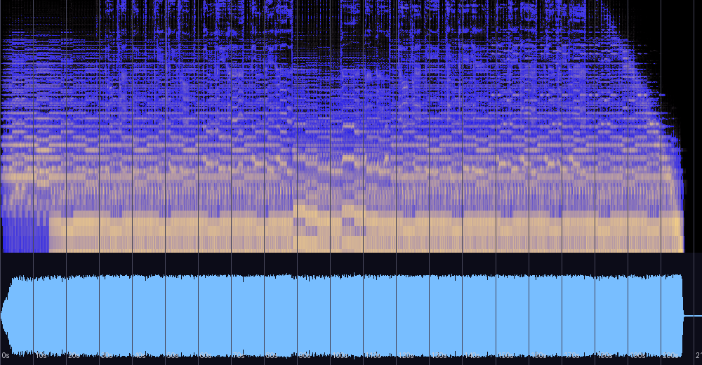

# 오아시스 — 신호 분석과 실용 노트

동명 앨범의 1번 트랙(자작곡, 2013, **Rock**, 태그 BPM 130, FL Studio 10)에 대한 분석 기록.
가사가 태그에 수록되어 있다. 저자는 이 곡을 **연습작으로 기억하며, 선인장은 죽었다와
같은 방식(다른 곡들과 다른 제작 방식)으로 만들었다**고 밝혔다 — 아래 측정이 이 기억을
정확히 뒷받침한다. 원본 파일은 저장소 외부 소장. 분석일: 2026-08-13.

## 한 줄 진단

**선인장은 죽었다와 짝을 이루는 사막 연작의 후편이자, 같은 기타로 녹음된 물증이 남은 곡.**
튜닝 편차가 두 곡 모두 정확히 -19.5센트로 일치한다. 음악적 완성도보다는 "연주하던 시기"의
기록으로서 가치가 있는 연습작이다.

## 가사 (파일 태그 수록)

> 나는 멀리서 지켜본다 너를 / 사람 손길이 닿질 않는 실체 없는 너
> 그 신기루를 그저 가슴에 담아둔다 (×2)
> 재앙 앞에서 지켜본다 우릴 / 살아 있는 한 인간의 이야기를
> 그 슬픔들 그저 가슴에 담아둔다 / 그 귀중함 그저 가슴에 담아둔다

선인장(사막에서 홀로 말라 죽는 나) ↔ 오아시스(닿을 수 없는 신기루인 너) —
두 싱글이 **사막 이인극**을 이룬다.

## 스펙트로그램·파형



## 기본 정보

| 항목 | 값 |
|---|---|
| 제목 / 앨범 | 오아시스 (동명 싱글, track 1) |
| 작곡 | 어진석, 2013, FL Studio 10 |
| 장르 | Rock |
| 길이 | 3:32 (212.5초) |
| 포맷 | MP3 ~320kbps |
| 태그 BPM | 130 (체감 펄스 ~65) |

## 제작 방식의 물증 — 선인장은 죽었다와의 짝

| 측정 | 오아시스 | 선인장은 죽었다 | 다른 일곱 곡 |
|---|---|---|---|
| **튜닝 편차** | **-19.5센트** | **-19.5센트** | 대부분 ±7센트 이내* |
| 스테레오 | 좁음 (corr 0.879) | 사실상 모노 (0.982) | 0.27~0.87 다양 |
| 저역 집중 | **90.1%** (<250Hz) | 85.5% (<250Hz) | 최대 75% |
| 장르 태그 | Rock | Rock | New Age/Game/Ballad |

가상악기는 항상 A440 정확히 맞는다. 같은 값으로 어긋난 튜닝의 공유는 귀로 조율한
동일한 기타(동일한 조율 상태)로, 아마 같은 시기의 세션에서 녹음되었다는 정황이다.
저자가 기억하는 "다른 제작 방식"이 측정치로 재구성된다: **시퀀싱이 아니라 연주를
녹음해 쌓는 방식.**

\* 후속 발견: [Bless 원곡](bless-original-analysis.md)(2013, -19.5센트)과 그 재료를 보존한
[Bless (Arrange)](bless-analysis.md)(-17.6센트)도 같은 악기 계열로 확인되어, "연주 시기"는
록 연작을 넘어 뉴에이지까지 걸친다.

## 음악적 특성

- **조성**: C장조 — 네 구간 전부(0.77~0.85) 흔들림 없음. 화음 어휘는 C–Am–Em(–F) 계열의
  다이어토닉 순환으로, 연작 전편(Am–C–Dm–F)과 같은 음향 세계의 장조 면이다.
  여기서도 도미넌트(G장화음)는 유의미하게 검출되지 않는다 — 아홉 곡째의 일관성.
- **다이내믹: LRA 1.6 LU — 아홉 곡 중 가장 평탄.** 도입 5초의 페이드인 이후 200초 동안
  RMS가 -8~-9.5dB 벽에 고정되고, 3:24의 마지막 악센트(-5.5) 직후 끊긴다.
  다이내믹 설계가 없는 것 자체가 연습작(잼 녹음)의 지표다.
- **믹스 균형: 에너지의 90.1%가 250Hz 이하** — 아홉 곡 중 최다. 저역이 나머지를
  익사시키는 상태로, 믹싱 공정을 거의 거치지 않은 직녹음에 가깝다.

## 마스터링 소견

| 측정 | 값 | 소견 |
|---|---|---|
| 통합 라우드니스 | -8.2 LUFS | 큰 음압 |
| LRA / 크레스트 | **1.6 LU** / 9.3dB | 최평탄 |
| 트루 피크 | +1.9 dBTP | 실링 -1.0dBTP 권장 |
| 클리핑 | 22샘플 | 눌렀지만 부수진 않음 |
| 저음 스테레오(<120Hz) | 0.075 | 모노 — 안정적 |

## 평가

측정과 이론 근거에 기반한 평가이며 청감 선호를 대신하지 않는다.
(저자 스스로 연습작으로 규정한 곡 — 완성작의 잣대와 기록물의 잣대를 함께 적는다)

| 기준 | 평점 | 근거 |
|---|---|---|
| 작곡·구조 | ★★☆☆☆ | 단일 조성·단순 순환·다이내믹 서사 부재 — 곡이라기보다 리프 위의 체류. 다만 가사와 연작 구도(신기루)는 뚜렷한 주제 의식 |
| 편곡·사운드 | ★★☆☆☆ | 저역 90.1%의 침수 상태 — 성부 판별이 어려운 지점까지 뭉침 |
| 믹싱 | ★★☆☆☆ | 사실상 미믹싱 직녹음. 저음 모노(0.075)만 안정적 |
| 마스터링 | ★★☆☆☆ | 평탄한 벽 + TP +1.9. 클리핑 억제만 유효 |
| 기록물로서의 가치 | ★★★★☆ | 선인장과의 튜닝 일치라는 물증, 사막 연작의 완성, "연주하던 시기"의 유일한 장편 기록 |

**총평**: 완성작의 잣대로는 아홉 곡 중 가장 낮은 자리지만, 이 곡을 지우면 컬렉션에서
"기타를 들고 노래하던 어진석"의 3분 32초가 사라진다. 연습작이라는 저자의 기억이 정확했고,
측정은 그 연습이 어떤 도구로 어떻게 이루어졌는지까지 복원했다. 보존 가치는 그 지점에 있다.

## 재현 방법

```bash
python3 tools/analyze_audio.py "<파일 경로>"
ffmpeg -i "<파일>" -af ebur128=peak=true -f null -   # LUFS/트루 피크
```

관련 문서: [cactus-analysis.md](cactus-analysis.md) (사막 연작 전편) ·
[README.md](README.md) (전체 비교표)
