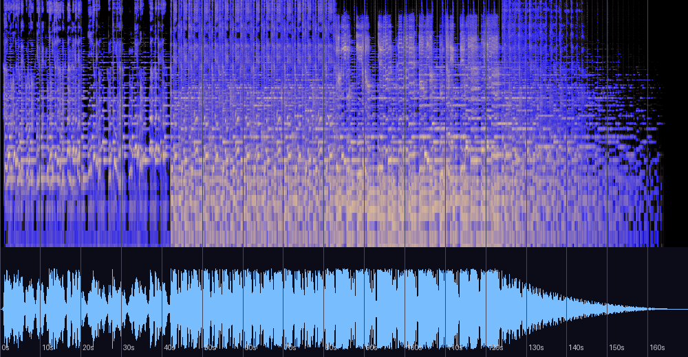

# Sad Birthday to me — 신호 분석과 실용 노트

《요정의 숲》 앨범 1번 트랙(자작 **보컬곡** — 저자 확인, 2013, New Age, 태그 BPM 47)에
대한 분석 기록. 파일 코멘트 태그: **"아무도 없는 숲에 홀로 있는 나."**
원본 파일은 저장소 외부 소장. 분석일: 2026-08-13.

## 한 줄 진단

제목이 곧 화성 설계인 네 번째 사례 — **"Birthday"의 장조 골격 위에 "Sad"의 단조 차용이
전면적으로 섞여**, 3음(C#/C)·6음(F#/F)·화음(D/Dm) 모든 층위에서 명암이 공존한다.
보컬은 일곱 곡 중 가장 높이 올라간다(3옥타브 도#).

## 스펙트로그램·파형



## 기본 정보

| 항목 | 값 |
|---|---|
| 제목 / 앨범 | Sad Birthday to me / 요정의 숲 (track 1) |
| 작곡·보컬 | 어진석 (JinSeok Eo 명의), 2013, FL Studio 10 |
| 길이 | 2:50 (169.9초) |
| 포맷 | MP3 320kbps |
| 태그 BPM | 47 (1마디 = 5.106초 — Insatiable desires와 같은 그리드) |
| 코멘트 태그 | "아무도 없는 숲에 홀로 있는 나." |

## 화성 — 장조와 단조의 전면 혼합

크로마에서 **장3도 C#(0.60)과 단3도 C(0.69)가 거의 같은 세기로 공존**하고, 6음도
F#(0.56)/F(0.53)이 나란하다. 코드 검출로 층위를 내리면:

- **전반**: A–Bm–F#m–D 순환 — **A장조**의 I–ii–vi–IV 골격 (사이에 Am이 한 번 스침)
- **절정(85~125초)**: F, Dm, G(A단조 차용화음)가 D, F#m(A장조 고유화음)과 뒤섞임 —
  **♭VI(F)·iv(Dm)·♭VII(G)의 단조 차용**이 장조 진행에 침투

구간 판정도 전반 A장조(0.57) → 이후 A단조(0.75~0.76)로 이동한다. 즉 생일 축하(장조)로
시작해 슬픔(단조)이 점점 스며드는 — 제목의 형용사와 명사가 각각 조성을 담당하는 설계다.
기억 속으로의 D/Dm 깜빡임이 여기서는 곡 전체의 원리로 확장되어 있다.

## 선율·보컬

| 측정 | 값 |
|---|---|
| 선율 중앙 | 1옥타브 라(A3) 부근 전 구간 유지 |
| **최고음 (지속 ≥0.2초)** | **3옥타브 도# (C#5)** — 1:38(0.3s), 2:00(0.4s) 2회 |
| 상용 고음 | 2옥타브 시(B4) 5회, 2옥타브 라(A4) 10회 — 0:42~0:52에 집중 클러스터 |
| 비브라토 | 평균 5.3Hz, ±31센트 (12회) — 기억 속으로(±56센트)보다 절제된 표정 |

일곱 곡 중 가장 높은 보컬 상한이며, 최고음 C#5가 **A장조의 장3도**라는 점이 곱씹을
만하다 — 곡에서 가장 높이 떠오르는 음이 "생일(장조)의 음"이고, 그 직후 곡은 단조로
가라앉으며 40초의 페이드로 사라진다.

## 형식·다이내믹

- 인트로 없이 사실상 즉시 시작 → 125초까지 점진적 상승(절정 -10dB 부근) →
  **2:07부터 약 40초에 걸친 초장기 페이드아웃** — 일곱 곡 중 가장 긴 소멸.
  코멘트 태그("아무도 없는 숲에 홀로")를 그대로 소리로 옮긴 듯한, 멀어지는 엔딩이다.
- 대역: 고역(2.5~8kHz) 10.8% + 공기(>8kHz) 3.9% — **일곱 곡 중 가장 밝은 상단**.
  "요정의 숲"다운 반짝임(벨/뮤직박스 계열로 추정)이 측정에 잡힌다.

## 마스터링 소견

| 측정 | 값 | 소견 |
|---|---|---|
| 통합 라우드니스 | -9.8 LUFS | 큰 마스터 (2013년 경향) |
| 트루 피크 | +1.2 dBTP | 실링 -1.0dBTP 권장 (재발매 시) |
| 클리핑 | **33샘플** | 큰 마스터인데도 사실상 깨끗 — 같은 해의 기억 속으로(12.8만)와 대조적 |
| LRA | 10.9 LU | 페이드 포함, 다이내믹 살아 있음 |
| 저음 스테레오(<120Hz) | (측정 생략) | — |

## 평가

측정과 이론 근거에 기반한 평가이며 청감 선호를 대신하지 않는다.
(저자는 정규 음악 교육 없이 직관으로 작곡 — 이론 용어는 사후적 기술이다)

| 기준 | 평점 | 근거 |
|---|---|---|
| 작곡·구조 | ★★★★★ | 제목의 두 단어에 조성을 하나씩 배당하고(장조 골격/단조 차용), 최고음을 장3도에 두고, 40초 페이드로 코멘트 태그를 구현 — 텍스트·화성·형식이 한 몸 |
| 편곡·사운드 | ★★★★☆ | 일곱 곡 중 가장 밝은 상단, 보컬 중심의 명확한 설계 |
| 믹싱 | ★★★★☆ | 위상 문제 없음, 적절한 공간감 |
| 마스터링 | ★★★☆☆ | 크게 찍었으나(트루 피크 +1.2) 클리핑 33샘플로 절제 — 같은 시기 대비 양호 |
| 목적 적합성(감상) | ★★★★☆ | 보컬 서사곡으로 완결. 앨범 오프너로서 컨셉 제시 명확 |

**총평**: "제목의 구조적 구현" 계보(Insatiable desires·Monotonous·기억 속으로)의
네 번째이자 가장 다층적인 사례. 형용사(Sad)와 명사(Birthday)가 각각 단조와 장조를
맡는 설계는 직관의 산물이라기엔 정교하고, 직관이라서 가능했던 것일 수도 있다.

## 재현 방법

```bash
python3 tools/analyze_audio.py "<파일 경로>"
ffmpeg -i "<파일>" -af ebur128=peak=true -f null -   # LUFS/트루 피크
```

관련 문서: [README.md](README.md) (전체 비교표)
