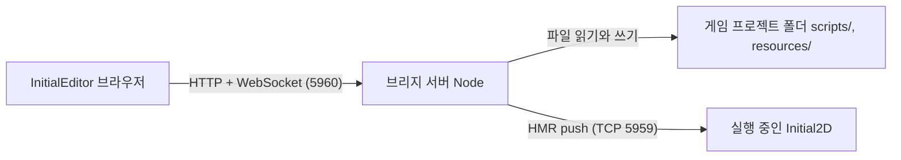

# 3단계: 에디터 브리지 — InitialEditor와 로컬 파일 연결

**권장 모델**: Claude Fable 5 (최소 Opus 5) — 두 저장소에 걸친 프로토콜 설계이고, 에디터 쪽은 882줄 갓 클래스(`tilemap.ts`)를 안전하게 수정해야 한다. 마일스톤 1(파일 API와 스크립트 편집 연결)만 떼어서 진행한다면 Opus 5로 충분하다.

> 목표: 웹 앱인 InitialEditor가 로컬 게임 프로젝트의 파일(스크립트, 맵)을 읽고 쓰게 한다.
> 방식은 **작은 Node 브리지 서버**다 (2026-08-15 결정). 저장하는 순간 실행 중인 게임에 핫 리로드까지 이어지는 루프를 만든다.
> 이 단계에서 가장 중요한 것은 맵보다 **스크립트 작성 워크플로우**다.

## 왜 이 방식인가

웹 앱이 로컬 파일을 다루는 선택지는 셋이다.

| 방식 | 장점 | 단점 |
|---|---|---|
| File System Access API | 서버 불필요 | Chromium 전용, 폴더 권한을 매번 다시 요청, 파일 변경 감시가 어려움 |
| **Node 브리지 서버 (채택)** | 모든 브라우저, 변경 감시 가능, **엔진 HMR 서버(127.0.0.1:5959)와 연계 가능** | 서버를 하나 띄워야 함 |
| Electron 전환 | 완전한 파일 접근 | 에디터 저장소의 Electron 경로는 이미 폐기된 상태, 전환 비용 큼 |

브리지 서버가 좋은 결정인 이유는 엔진에 이미 절반이 있기 때문이다. Initial2D에는 HMR 서버(`src/platform/HotReloadServer.cpp`, TCP 5959)와 push 클라이언트(`tools/hmr_push.py`)가 있다. 브리지 서버가 파일을 저장한 뒤 같은 프로토콜로 push하면 **"브라우저에서 저장 → 실행 중인 게임이 즉시 다시 뜸"**이 완성된다.

## 구조

- 위치: Initial2D 저장소의 `tools/bridge/` (게임 프로젝트를 서빙하는 도구이므로 엔진 쪽에 둔다)
- 실행: `node tools/bridge/server.js --project .` (Node 20 이상, 의존성은 최소로: 내장 http와 ws 정도)
- 보안: 127.0.0.1에만 바인드. 파일 API는 프로젝트 루트 안의 화이트리스트 경로(`scripts/`, `resources/`)만 허용하고 `..` 경로 탈출을 차단한다.

### API 초안

| 메서드와 경로 | 역할 |
|---|---|
| `GET /api/project` | 프로젝트 정보 (이름, 맵 목록, 스크립트 목록, 타일셋 목록) |
| `GET /api/files/*path` | 파일 읽기 (텍스트와 바이너리) |
| `PUT /api/files/*path` | 파일 쓰기 (화이트리스트 검사 후) |
| `POST /api/reload` | 엔진 HMR push 실행 (`tools/hmr_push.py`의 프로토콜을 Node로 재구현) |
| WebSocket `/ws` | 파일 변경 알림 (외부에서 파일이 바뀌면 에디터에 통지) |

## 작업 항목

### 마일스톤 1: 스크립트 편집 (가장 먼저, 가장 중요)

InitialEditor에는 Ace 기반 Lua 에디터가 이미 있다 (`packages/renderer/src/components/CodeEditor.tsx`, mode-lua 로드됨). 지금은 빈 문자열이 하드코딩되어 있고 저장 기능이 없다. 이것을 브리지에 연결하는 것만으로 에디터의 첫 실용 가치가 나온다.

- [x] 브리지 서버 골격: 파일 읽기와 쓰기 API, 화이트리스트, CORS(에디터 dev 서버 origin만 허용) — `tools/bridge/server.js` (의존성 없음, `lib/files.js` 화이트리스트, `lib/hmr.js` I2DH push, `lib/ws.js` 최소 WebSocket). 테스트 `tools/bridge/test/`가 `tests/run_all.sh` 4단계로 편입. 종단 확인: 헤드리스 엔진(`INITIAL2D_HMR=1`)에 PUT 후 `POST /api/reload` → `HotReload: reloaded with 8 files`
- [x] InitialEditor에 `BridgeFileProvider` 추가 — 기존 `FileProvider`(localStorage 심)와 같은 인터페이스로 브리지 HTTP를 호출 — 공통 인터페이스 `IFileProvider`를 뽑고 `Schema`가 그것을 쓰게 했다. HTTP 래퍼는 `bridge/BridgeClient.ts`(fetch 기반, axios 불필요). 동기 메서드는 메모리 캐시로 동작
- [x] Lua 에디터에 파일 목록, 열기, 저장(Ctrl+S) 연결 — `LuaEditor.tsx` 재작성 (Tools → Script Editor). 외부 변경 감지(WebSocket): 미수정이면 자동 재로드, 수정 중이면 배너. 새 스크립트 생성 포함
- [x] 저장 시 자동 HMR push 옵션 (`POST /api/reload`) — 브라우저에서 스크립트를 고치면 실행 중인 게임이 즉시 반영. 2026-08-15 브라우저에서 확인: 편집 → Cmd+S → 브리지 저장 → 헤드리스 엔진 `HotReload: reloaded with 8 files`

### 마일스톤 2: 맵 내보내기와 불러오기

에디터 조사에서 확인된 공백을 메워 맵 포맷 v1(2단계)로 내보낸다. 수정 지점은 이미 마련되어 있다.

- [x] 맵 크기를 편집할 수 있게 한다 — `Tilemap.resize/setRawData`(겹치는 영역 유지)와 "새 맵" 대화상자(Ctrl+N, 이름/ID/가로/세로) 추가. 화면 크기 역산은 초기값으로만 남는다
- [x] ~~`MapSchema`를 맵 포맷 v1 형태로 실구현~~ → **대신 `map/MapFormat.ts`(의존성 없는 순수 변환 함수)와 `map/MapDocumentService.ts`(IO)로 나눴다.** 맵 파일은 Schema/FileProvider 계층이 아니라 브리지로 오가므로 Schema 상속이 맞지 않았다. 미사용 `MapSchema`는 삭제
- [x] 전역 타일 ID → gid 변환기 — `TilesetCanvas.getLayout()`이 합성 배치를 넘기고 `MapFormat`이 변환한다. 부수 수정: 이미지 로드 완료 순서대로 배열에 push 하던 것을 인덱스 대입으로 바꿔 합성 순서를 설정 순서로 고정(순서가 흔들리면 저장된 타일 ID가 어긋난다)
- [x] `FileExportCommand`(Ctrl+E) 구현 → 내보내기 대화상자에서 이름/ID/경로를 정해 브리지로 저장. 맵이 쓰는 타일셋 이미지가 프로젝트에 없으면 함께 업로드한다(엔진은 이미지가 없으면 맵 로드를 거부). `FileSaveCommand`(Ctrl+S)는 경로가 있으면 덮어쓰고 없으면 내보내기 대화상자를 연다
- [x] 불러오기 (`OpenFileCommand`, Ctrl+O): `resources/maps/*.json` 목록에서 골라 복원. 에디터가 편집하지 못하는 데이터(통행 레이어, 레이어 이름)도 들고 있다가 저장할 때 되돌려준다
- [x] 알려진 에디터 버그 중 연동에 물리는 것 수정: `drawTile`과 `collectAutoTileID`가 y좌표에 `getMapX`를 쓰던 문제. 메뉴 단축키가 전부 빈 문자열에 묶이던 `MenuService` 버그도 함께 수정(구현된 명령만 허용 목록으로 묶고, 기본 동작은 막는다)

### 마일스톤 3 (후순위): 이벤트 배치와 통행 편집

- [ ] 통행(collision) 레이어 편집 모드 — `ModeRegionCommand` 스텁 자리를 활용
- [ ] 이벤트 배치 모드 (`ModeEventCommand` 스텁 자리) — 맵 좌표에 이벤트 마커를 놓고, 해당 이벤트의 Lua 핸들러 파일을 Ace 에디터로 바로 여는 흐름 (6단계의 이벤트 정의 방식과 맞물림)

## 완료 기준

- [x] 브라우저에서 `scripts/games/flappy.lua`를 고치고 저장하면 실행 중인 게임이 다시 시작된다 (마일스톤 1). — 2026-08-15 확인 (Chrome, 헤드리스 엔진)
- [x] 에디터에서 그린 맵이 Ctrl+E로 `resources/maps/*.json`(포맷 v1)에 저장되고, 엔진 데모 씬이 그 맵을 그대로 그린다 (마일스톤 2). — 2026-08-15 확인: 브라우저에서 두 타일셋으로 칠한 50x38 맵을 내보내고(`2k_town05.png` 자동 업로드), `INITIAL2D_SCENE=tilemap INITIAL2D_MAP=... INITIAL2D_SCREENSHOT=...`으로 헤드리스 실행해 같은 위치에 타일이 그려짐을 스크린샷으로 확인
- [ ] 사용법이 두 저장소의 README에 정리된다 (브리지 서버 실행법 포함).

## 의존 관계

- 선행: 마일스톤 1은 없음 (즉시 시작 가능). 마일스톤 2는 2단계의 포맷 확정 필요.
- 후행: 8단계(데모 맵 제작에 사용)

## 구현 노트 (2026-08-15)

- **브리지 API 는 파일 단위다.** 맵도 스크립트도 `PUT /api/files/<path>` 하나로 저장한다. 맵 전용 엔드포인트를 두지 않은 이유는, 에디터가 늘어날 때마다 서버를 고치지 않게 하기 위해서다. 서버는 "프로젝트 폴더를 안전하게 열어 주는 창구"까지만 한다.
- **변환은 순수 함수, IO 는 서비스.** `map/MapFormat.ts`는 DOM 도 PIXI 도 모르는 변환 전용 모듈이라 Node 로 그대로 단위 테스트한다(`packages/initial-editor/test/map-format.test.mjs`, `yarn test`). 882줄 `tilemap.ts`를 건드리지 않고 검증할 수 있는 것이 이 분리의 목적이다.
- **에디터가 편집하지 못하는 데이터도 보존한다.** 통행 레이어와 레이어 이름은 불러올 때 들고 있다가 저장할 때 되돌려준다. 처음 구현에서는 이것들이 왕복 시 사라졌고, 엔진 샘플 맵으로 왕복 diff 를 떠서 발견했다.
- **뒤쪽 빈 레이어는 잘라서 내보낸다.** 에디터는 레이어가 늘 4개라 그대로 쓰면 파일의 대부분이 0이다(80x70 기준 253KB → 169KB). 불러올 때 다시 4층으로 채우므로 왕복은 그대로다.
- **알려진 한계: 전역 타일 ID 0 은 "빈 칸"이다.** 그래서 합성 캔버스 좌상단, 즉 첫 타일셋의 첫 타일은 에디터에서 표현할 수 없다. 그 타일을 쓰는 맵을 열면 해당 칸이 비고, 몇 칸이 그렇게 됐는지 알린다(엔진 샘플 맵 기준 5칸). 제대로 고치려면 에디터의 빈 칸 표시를 0이 아닌 값으로 바꿔야 하며(`tilemap.ts`의 `getData`, `draw`, 히스토리, 오토타일이 전부 0을 빈 칸으로 본다) 마일스톤 3 이후 과제로 남긴다.
- **검증 훅.** `INITIAL2D_SCENE=<씬 이름>`으로 시작 씬을, `INITIAL2D_MAP=<경로>`로 타일맵 데모가 열 맵을 지정할 수 있다. `INITIAL2D_SCREENSHOT`, `INITIAL2D_EXIT_AFTER`와 조합해 내보낸 맵을 유한 실행으로 확인한다.
- **에디터 개발 중 주의**: `yarn build:editor`로 `dist`를 다시 만들면 Vite HMR 이 모듈을 갈아끼우면서 열려 있던 창이 닫히고 App 싱글턴이 갈라진다. 코어를 고친 뒤에는 브라우저를 새로고침한다.

## 리스크

- InitialEditor는 별도 저장소이므로 양쪽 버전이 어긋날 수 있다. 포맷에 `version` 필드를 두었으니 엔진 로더는 모르는 버전을 명확한 에러로 거부한다.
- 에디터의 `Tilemap` 클래스는 882줄 갓 클래스라 수정 충돌 위험이 있다. 내보내기는 데이터(`_data`)만 읽는 순수 함수로 작성해 렌더링 코드와 얽히지 않게 한다.
