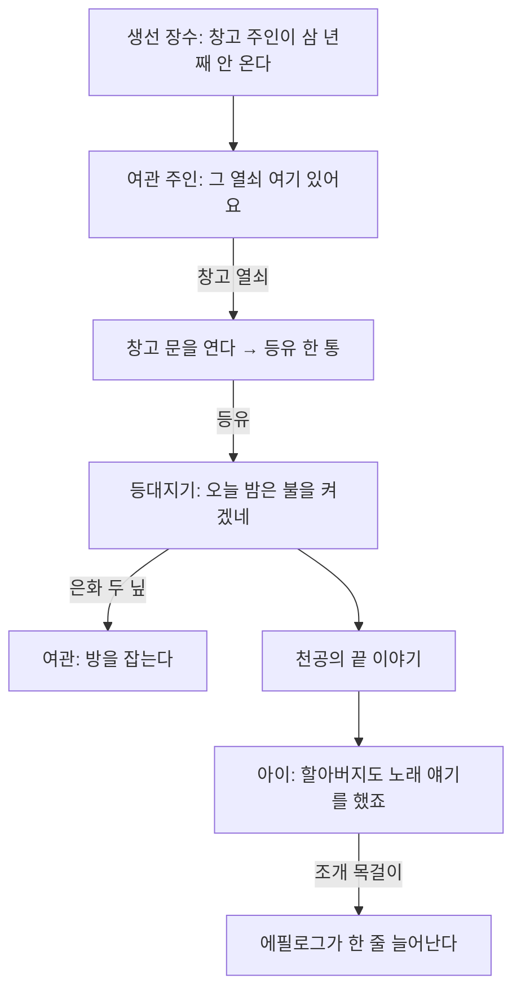

# 10단계: 게임의 살 (아이템, 소지품, 심부름)

> 문서 번호가 11인 이유: 09는 검수 문서, 10은 9단계 문서가 쓰고 있다.
> 로드맵의 단계 번호로는 **10단계**다.

**권장 모델**: Opus 5. 앞 단계에서 정해진 커맨드 구조 위에 얹는 작업이라 새로 정할
아키텍처가 적다. 새 커맨드 둘과 창 하나, 그리고 콘텐츠다.

> 목표: 「떠나기 전에」를 **걸어다니며 읽는 것**에서 **플레이어가 할 일이 있는 것**으로
> 바꾼다.

## 1. 배경: 9단계는 무엇이 부족했는가

9단계는 이슈 24의 지적 셋을 닫았다. 기획서가 생겼고, 대사에 뜻이 생겼고, 이벤트가
데이터가 되었다. 그런데 **플레이어가 하는 일은 여전히 걷기와 결정키 누르기뿐**이다.
막힌 문은 처음부터 끝까지 막혀 있고, 여관 주인이 "은화 두 닢"이라고 말하지만 은화라는
것이 게임 안에 없다. 선택지는 대사만 바꾼다.

| 지금 | 이 단계에서 |
|---|---|
| 창고 문과 등대 문이 영원히 잠겨 있다 | 열쇠를 찾으면 열린다 |
| 은화 두 닢은 대사 속 숫자다 | 가진 것으로 세고, 모자라면 방을 못 잡는다 |
| 가진 것을 볼 창이 없다 | 소지품 창 (취소키 / 모바일 취소 버튼) |
| 선택지가 대사만 바꾼다 | 선택이 물건과 상태를 바꾸고, 그것이 다음 문을 연다 |

## 2. 설계 원칙 (앞 단계와 같다)

1. **C++ 코어는 건드리지 않는다.** 아이템도 소지품도 `scripts/rpg/` Lua 레이어다.
   판단 기준은 그대로 "이 기능이 플래피버드에도 말이 되는가"이며, 아이템은 말이 되지
   않으므로 코어에 넣지 않는다.
2. **아이템 목록은 데이터다.** `scripts/games/rpgdemo/items.lua`는 표 하나이며 코드가
   없다. 프레임워크(`scripts/rpg/inventory.lua`)는 그 표를 주입받는다. 다른 게임은
   다른 표를 넣는다.
3. **소지품은 `ctx.state` 안에 산다.** 맵을 넘는 상태 공유는 6단계에 이미 있다.
   `state.items = { silver = 2 }` 하나를 더 쓰는 것뿐이고, 나중에 저장과 로드가
   생기면 `state`를 통째로 직렬화하는 것으로 함께 저장된다.
4. **커맨드는 둘만 는다.** 9단계가 "v1은 15종으로 못 박는다"고 했고, 새 커맨드는
   "그것 없이는 적을 수 없는 이벤트"가 나올 때만 더한다는 규칙을 세웠다. 아이템을
   주는 것과 뺏는 것이 그 경우다. "가졌는가"는 새 커맨드가 아니라 기존 `if`가 쓰는
   **조건의 새 형태**이므로 제어 구조가 늘지 않는다 (15종 → 17종).

## 3. 마일스톤

| 마일스톤 | 내용 | 산출물 |
|---|---|---|
| 1. 아이템과 소지품 | 소지품 자료구조, 커맨드 셋, 소지품 창 | `inventory.lua`, `menu.lua`, 커맨드 2종과 아이템 조건 |
| 2. 심부름 사슬 | 기획서 5절의 인물들을 잇는 할 일 하나 | 아이템 표, 새 대사와 분기 |
| 3. 검수와 문서 | 인수 시나리오 확장, 골든 갱신, README | 시나리오, 골든, 사용법 |

## 4. 마일스톤 1: 아이템과 소지품

### 4.1 자료구조

소지품은 상태 테이블 안의 표 하나다.

```lua
	state.items = { silver = 2, warehouse_key = 1 }
```

`scripts/rpg/inventory.lua`는 그 표를 다루는 순수 함수 묶음이며 엔진에 닿지 않는다.

| 함수 | 하는 일 |
|---|---|
| `Inventory.count(state, id)` | 몇 개 가졌는가 (없으면 0) |
| `Inventory.has(state, id, n)` | n개 이상 가졌는가 (기본 1) |
| `Inventory.give(state, id, n)` | 더한다. 반환은 더한 뒤의 개수 |
| `Inventory.take(state, id, n)` | 뺀다. 모자라면 아무것도 하지 않고 false |
| `Inventory.list(state, db)` | 창이 그릴 목록 (`{ id, name, desc, count }`) |

`db`(아이템 표)는 이름과 설명, 그리고 목록에서의 순서(`order`)만 들고 있다.
표에 없는 id를 가지고 있으면 목록에 id를 그대로 이름으로 내보낸다. 표를 고치다가
물건이 조용히 사라지는 편보다 눈에 보이는 편이 낫다.

### 4.2 커맨드 둘과 조건 하나

| code | 인자 | 하는 일 |
|---|---|---|
| `giveItem` | `item`, `count`(기본 1) | 소지품에 더한다 |
| `takeItem` | `item`, `count`(기본 1) | 뺀다. 모자라면 아무 일도 없다 |

조건(`cond`)에 형태가 하나 는다. 기존의 `flag`, `var`와 같은 자리에 쓴다.

```lua
	{ item = "warehouse_key" }                      -- 하나라도 가졌는가
	{ item = "silver", op = ">=", value = 2 }       -- 개수 비교
```

`if`, `choice`의 분기 안에서 그대로 쓰이므로 새 제어 구조는 없다.

### 4.3 소지품 창

`scripts/rpg/menu.lua`. 7단계의 `window.lua`와 `choice.lua`가 이미 창과 커서와
스크롤을 알고 있으므로, 그 위에 "목록 + 설명" 두 칸짜리 화면 하나를 얹는다.

- 여는 것은 **취소키**(PC의 X, 모바일의 취소 버튼)다. 같은 키로 닫는다.
- 대화나 이벤트가 도는 중에는 열리지 않는다. 열려 있는 동안 플레이어는 멈춘다.
- 항목은 `이름`과 오른쪽 끝의 개수(2개 이상일 때만), 아래 칸에 고른 항목의 설명.
- 아무것도 없으면 "가진 것이 없다." 한 줄.

씬(`game.lua`)이 창을 들고, 매 프레임 입력을 넘기고, 열려 있으면 플레이어 입력을
잠근다. 대화창과 같은 구조다.

## 5. 마일스톤 2: 심부름 사슬

기획서의 인물 다섯을 **하나의 사슬**로 잇는다. 곁가지 하나를 두어 "전부 보는 길"과
"바로 떠나는 길"이 갈리게 한다. 새 인물도 새 맵도 만들지 않는다. 있는 것을 잇는다.



사슬의 규칙 셋.

1. **막히지 않는다.** 어느 단계에서든 부두로 내려가 배를 타면 게임이 끝난다.
   심부름은 강제가 아니라 "더 볼 것"이다 (기획서 3절의 "막힘 없이 5분").
2. **되돌아가지 않아도 된다.** 다음에 갈 곳을 그 자리의 대사가 말한다.
3. **가진 것이 대사를 바꾼다.** 열쇠를 가진 채 창고 문에 서면 다른 대사가 나온다.

### 5.1 새 아이템

| id | 이름 | 어디서 | 무엇에 |
|---|---|---|---|
| `warehouse_key` | 창고 열쇠 | 여관 주인 (생선 장수 이야기를 들은 뒤) | 창고 문 |
| `lamp_oil` | 등유 한 통 | 창고 안 | 등대지기 |
| `silver` | 은화 | 등대지기 (등유 사례, 두 닢) | 여관 방값 |
| `shell` | 조개 목걸이 | 아이 (천공의 끝 이야기를 전한 뒤) | 에필로그 |

### 5.2 에필로그

지금은 `heardAltar` / `booked` / 기본의 세 갈래다. 갈래를 늘리지 않고 **줄을 더한다**.
본 것마다 한 줄씩 붙어, 전부 본 플레이어는 네 줄을 읽는다. 이쪽이 분기를 늘리는 것보다
"내가 한 만큼 남았다"가 또렷하다.

## 6. 완료 기준 (2026-08-20 전부 충족)

- [x] 소지품 창이 PC(X)와 모바일(취소 버튼) 양쪽에서 열리고 닫힌다
- [x] 열쇠 없이 창고 문을 열 수 없고, 열쇠를 얻으면 열린다
- [x] 은화 두 닢이 없으면 여관 방을 잡을 수 없다
- [x] 심부름 사슬을 끝까지 따라간 플레이어와 바로 떠난 플레이어의 에필로그가 다르다
- [x] 인수 시나리오가 **사슬 전체**를 지나며, 전체 회귀 스위트가 통과한다
- [x] README에 아이템과 소지품 사용법이 있다

### 구현 메모

1. **에필로그는 갈래가 아니라 줄의 쌓임으로 했다.** 처음 설계는 `heardAltar` /
   `booked` / 기본의 세 갈래였는데, 조건이 셋으로 늘자 조합이 여덟이 된다. 대신
   `if` 세 개를 나란히 두고 조건이 맞는 줄만 붙였다. 전부 본 플레이어는 네 줄을 읽고,
   조건이 더 늘어도 조합이 터지지 않는다.
2. **은화는 실제로 받아 간다.** 계획 단계에서는 기획서 9절("주인이 값을 말하지만
   지불하지 않는다")을 지켜 세기만 하려 했는데, 세기만 하면 "가진 것이 바뀌지 않는
   상거래"라 오히려 어색했다. `takeItem`이 이미 있어 비용이 없었으므로 지불하게 했고,
   기획서 9절을 고쳤다.
3. **아이는 인수 시나리오에 넣지 않았다.** 배회하는 NPC라 위치가 틱 수에 따라
   흔들리고, 경로가 통째로 어긋난다. 아이가 주는 조개 목걸이와 그 에필로그 줄은
   커맨드 단위 테스트가 대신 확인한다.
4. **소지품 창은 씬이 아니라 씬 안의 창이다.** 씬 스택이 없어서(다음 로드맵 14단계)
   대화창과 같은 자리에 두었다. 씬이 창을 들고, 열려 있으면 플레이어 입력을 잠근다.
   메뉴 항목이 늘어나면 이 회피가 깨지고, 그때가 씬 스택이 필요해지는 시점이다.

### 사용자 검수에서 나온 버그: 집이 캐릭터의 머리를 덮는다

실행해 보고 처음 나온 지적이다 (2026-08-20). **아래에서 집에 다가가면 집 벽이
캐릭터의 머리를 가린다.**

원인은 그리는 순서였다. 5단계가 "하층 타일 → 캐릭터 → 상층 타일"로 나눠 그리게
해 두었고, 그 덕에 캐릭터가 울타리 뒤로 지나갈 수 있다. 그런데 데모 씬은
`groundLayers = 1`을 **모든 맵에 못 박아** 두어서, 장식 레이어 한 장이 통째로
캐릭터 위에 그려지고 있었다. 캐릭터 프레임(24x32)은 타일(16x16)보다 커서 머리가
윗 칸으로 올라가므로, 집 벽 앞에 서면 그 칸의 벽 타일이 머리를 덮는다.

고친 방법은 **한 장이던 장식을 둘로 나눈 것**이다.

| 층 | 캐릭터와의 순서 | 무엇이 들어가는가 |
|---|---|---|
| `ground` | 아래 | 땅 |
| `deco` | 아래 | **앞에 서는** 것 (집 벽, 울타리, 우물, 게시판, 좌판) |
| `over` | 위 | **밑을 지나가는** 것 (빨래줄) |

그리고 `groundLayers`를 씬이 아니라 **맵 정의 파일**이 정하게 했다 (`port_town`은 2,
`inn`은 2, 6단계의 `village`와 `room`은 1 그대로). 빨래줄은 통행도 열어 실제로 밑을
지나갈 수 있게 했다. 그래야 상층이라는 개념에 쓰임새가 생긴다.

회귀 테스트를 두 겹으로 넣었다.

1. **단위**: 가짜 타일맵으로 `Draw` 호출 구간을 기록해 "하층 먼저, 상층은 캐릭터 뒤"를
   값으로 확인한다 (`rpg_map_scene_test`).
2. **픽셀**: 인수 시나리오에 `INITIAL2D_DEMO_STOP=wall`을 더해 여관 문 바로 아래에
   선 화면을 찍고, 머리색 픽셀 수를 센다.

두 번째를 처음 넣었을 때 **되돌려도 통과했다.** 문 타일의 갈색(108, 74, 50)이 머리색
(96, 56, 32)과 가까워, 기본 허용 오차 24로는 "가려진 머리"까지 머리로 세고 있었다.
오차를 8로 좁혀서 되돌리면 0이 되는 것을 확인한 뒤에야 테스트로 인정했다. **회귀
테스트는 고친 상태에서 통과하는 것만으로는 부족하고, 되돌렸을 때 깨지는 것까지
봐야 한다.**

### 곁들여 고친 타일링 버그

이 단계와 함께 항구 마을의 타일링 버그 셋을 고쳤다. 별개의 작업이지만 같은 맵을
만지므로 한 번에 했다.

1. **바다 타일이 이어지지 않았다.** `sea()`가 타일 맨 위에 어두운 띠를 그려서, 넓은
   바다에 깔면 16px마다 가로줄이 격자로 드러났다. 32x32 한 장에 감아 도는 물결을
   그려 넷으로 자른 **2x2 한 벌**로 바꿨다 (`(x % 2, y % 2)`로 고른다). 부두 널과
   돌계단도 같은 종류의 버그가 있었다. 위와 아래에 모두 어두운 줄이 있어 세로로
   이으면 이음매만 2px로 두꺼워졌다.
2. **gid를 잘못 짚었다.** `TREE_TOP = 26, TREE_BOT = 34`는 나무가 아니라 **바위
   조각과 울타리 기둥**이었다. 이 타일셋에는 나무가 없다. `ROCK = 21`도 "바위
   덩어리의 아랫면"이라 면으로 채우면 바위와 잔디가 번갈아 나오는 줄무늬가 됐다.
   마을 테두리를 **바위 테두리 한 벌**(gid 5/6/7, 13/15, 9/22/10)의 한 칸 두께 링으로
   다시 그렸다.
3. **있는 가장자리 타일을 쓰지 않았다.** 타일셋 gid 53~71에 잔디↔모래 아홉 조각이
   이미 있는데 생성기가 plain 잔디와 plain 모래만 찍어서, 길도 광장도 물가도 각진
   사각형이었다. 맵을 다 그린 뒤 한 번 도는 후처리(`Grid.blend_sand`)를 넣어 잔디
   칸 가운데 모래와 맞닿은 것을 가장자리 타일로 바꾼다. 오토타일이 아니라 후처리인
   까닭은, 그것이 에디터가 할 일이기 때문이다 (roadmap-v2.md 13단계).

## 7. 이 단계가 하지 않는 것

- **저장과 로드.** `state`를 직렬화하면 되지만 쓰기 가능한 경로(안드로이드)와
  `Json.Save` 바인딩이 필요해 크기가 따로 선다. 다음 로드맵의 12단계이며 설계
  메모는 [roadmap-v2.md](roadmap-v2.md)에 있다.
- **아이템을 쓰는 것.** 이 데모의 물건은 전부 열쇠와 증표라 "사용" 커맨드가 없다.
  소모품과 장비는 데이터베이스 개념이 생길 때 함께 온다.
- **장비, 전투.** 기획서 9절의 "이번 범위 밖"을 지킨다.

## 8. 의존 관계

- 선행: 9단계 (커맨드와 `ctx.state`), 7단계 (창과 커서)
- 후속: 저장과 로드, 메뉴 화면(소지품 창을 항목 하나로 품는다)
