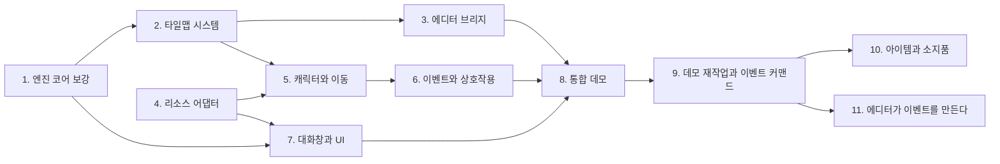

# Initial2D 로드맵: 롤플레잉 게임 제작이 가능한 범용 엔진

> 작성일: 2026-08-15. 이 문서는 전체 계획의 입구이며, 진행 상황 추적표를 겸한다.
> 작업을 시작하기 전에 이 문서의 진행 상황 표를 확인하고, 작업이 끝나면 반드시 갱신한다.

## 1. 비전

Initial2D는 **범용 2D 게임 엔진**이다. 플래피버드 같은 게임(이미 `scripts/games/flappy.lua`로 동작)도, RPG Maker 2003급의 롤플레잉 게임도 만들 수 있어야 한다. 이번 로드맵의 목표는 다음 한 문장이다.

> InitialEditor로 맵을 그리고 스크립트를 작성하면, Initial2D에서 캐릭터가 걸어다니고, NPC에게 말을 걸면 대화창이 뜨는 게임이 실행된다.

이를 위해 세 갈래의 작업이 필요하다.

1. **엔진**: 범용 코어의 빈 곳을 메운다 (타일맵, 텍스트 측정, JSON, 카메라 등).
2. **에디터 연동**: InitialEditor(웹)가 Node 브리지 서버를 통해 로컬 프로젝트 파일을 읽고 쓰게 한다. 맵 편집만큼, 어쩌면 그보다 더 중요한 것이 **스크립트 작성** 워크플로우다.
3. **RPG 프레임워크**: 캐릭터, 이벤트, 대화창을 **Lua 레이어**로 만든다. C++ 코어는 건드리지 않는다.

## 2. 설계 원칙

1. **범용성 우선.** RPG 전용 개념(캐릭터, 이벤트, 대화창)은 C++ 코어에 넣지 않는다. 판단 기준은 "이 기능이 플래피버드에도 말이 되는가?"이다. 말이 되면 코어(C++ 또는 공용 Lua), 안 되면 `scripts/rpg/` 프레임워크.
2. **게임 로직은 Lua.** C++은 엔진과 플랫폼 어댑터만 담당한다 (`docs/prompts/macos-porting-meta-prompt.md`의 원칙과 동일).
3. **데이터 주도.** R2K3 리소스 규격(CharSet 288x256 등)은 엔진이 아는 것이 아니라 Lua 쪽 데이터(어댑터)로 기술한다. R2K3는 여러 리소스 팩 중 하나일 뿐이다.
4. **단계마다 실행 가능한 결과물.** 각 단계는 눈으로 확인 가능한 데모나 테스트로 끝난다.

## 3. 현재 상태 요약 (2026-08-15 조사)

### 엔진 (Initial2D)

| 영역 | 있는 것 | 없는 것 |
|---|---|---|
| 플랫폼 | Windows(GDI, 보존), macOS(SDL2), Android(SDL2) | |
| 렌더링 | 스프라이트(회전, 스케일, 투명도, 프레임 애니메이션), 논리 해상도, 픽셀 확대 배율(5단계 검수로 추가) | z순서, 카메라(Lua 값으로 대신), 배칭, 도형 프리미티브 |
| 텍스트 | BMFont 한글 렌더링(`resources/fonts/hangul.fnt`, 나눔고딕) | 텍스트 폭 측정의 Lua 노출, 자동 줄바꿈. FontEx는 맥에서 무동작 스텁 |
| Lua | 5.3.5, Input, Audio, Sprite, TextureManager 등 약 70개 함수 | 타일맵, JSON, 파일 IO, 씬 스택 바인딩 |
| 타일맵 | 맵 포맷 v1과 v2 (JSON, v2는 `events`를 실어 나른다), 다층 렌더러(컬링, 카메라 오프셋, 레이어 분할), `Tilemap.*` Lua API, 샘플 맵과 데모 씬 (2단계에서 재작성) | 오토타일, 4방향 통행 (v2 로드맵) |
| 오디오 | SDL2_mixer, OGG와 WAV, 페이드와 탐색 | 채널별 볼륨, BGS/ME 구분 |
| RPG 레이어 | `scripts/rpg/`의 캐릭터, 플레이어 입력, 카메라, 맵 씬, 시드 난수(5단계), 이벤트와 코루틴 실행기(6단계), 스킨 창과 대화창, 선택지(7단계), 리소스 고르기(8단계), 이벤트 커맨드(9단계), 소지품과 소지품 창(10단계). 그리드 이동, y정렬 그리기, 트리거 4종, 맵 전환, 타자 효과와 얼굴 | 메뉴 화면과 씬 스택, 저장과 로드 (v2) |
| 도구 | HMR 서버(127.0.0.1:5959, `tools/hmr_push.py`), 에디터 브리지 서버(127.0.0.1:5960, `tools/bridge/`), RTP 변환기(`tools/rtp_import.py`, 4단계), 플레이스홀더 생성기(CharSet `tools/generate_charset.py`, 창 스킨 `tools/generate_windowskin.py`, FaceSet `tools/generate_faceset.py`, 타이틀 배경 `tools/generate_title.py`), 비트맵 폰트 굽기(`tools/generate_bmfont.py`) | |

### 에디터 (InitialEditor, 별도 저장소)

- 바닐라 TS + PIXI 7 코어와 React 18 셸의 모노레포. 순수 웹 앱 (Electron 아님).
- 맵 데이터는 평탄한 `number[]` 하나: `data[z*W*H + y*W + x]`, 16x16 타일, 4레이어.
- (3단계 완료) 저장, 열기, 내보내기와 스크립트 편집이 브리지 서버를 통해 실제로 동작한다. 타일 ID는 내보낼 때 gid로 변환하고, 맵 크기도 편집할 수 있다.
- 남은 것: 이벤트와 엔티티 개념(6단계), 통행 레이어 편집(마일스톤 3), 오토타일.

### 리소스 (resources/RTP.zip, R2K3 2023년 재배포판)

(4단계 완료) `tools/rtp_import.py`로 `resources/rtp/`에 32비트 RGBA PNG와 WAV를 만든다. 규격은 `scripts/rpg/specs.lua`에 Lua 데이터로 있다. 원본은 전부 PNG(8비트 팔레트), MIDI, WAV로 구성이며 자세한 규격은 `04-resources.md` 참고. 주의: 팔레트 0번이 투명색이라는 관례를 로더나 변환기가 강제해야 하며(tRNS 청크가 파일마다 들쭉날쭉), Music은 MIDI라 변환이 필요하다. **라이선스: RPG Maker 2003 정품 보유자만 타 엔진에 사용 가능. RTP.zip은 git에 커밋 금지 (이미 gitignore 처리됨).**

## 4. 단계 개요와 의존 관계

10단계부터는 [roadmap-v2.md](roadmap-v2.md)가 순서와 근거를 담는다.

| 단계 | 문서 | 한 줄 요약 | 핵심 산출물 | 권장 모델 |
|---|---|---|---|---|
| 1 | [01-engine-core.md](01-engine-core.md) | 범용 코어의 빈 곳과 버그를 메운다 | 텍스트 측정, JSON 바인딩, 시트 규격 해제, 해상도 설정 | Opus 5 |
| 2 | [02-tilemap.md](02-tilemap.md) | 타일맵 렌더러와 맵 포맷 v1 | `Tilemap.*` Lua API, 다층 렌더링, 충돌 레이어 | **Fable 5** |
| 3 | [03-editor-bridge.md](03-editor-bridge.md) | Node 브리지 서버로 에디터와 로컬 파일 연결 | 스크립트 편집과 저장, 맵 내보내기, HMR 연계 | **Fable 5** |
| 4 | [04-resources.md](04-resources.md) | R2K3 리소스 변환 파이프라인과 어댑터 | `tools/rtp_import.py`, 규격 데이터(Lua) | Opus 5 |
| 5 | [05-rpg-character.md](05-rpg-character.md) | CharSet 캐릭터가 맵을 걸어다닌다 | `scripts/rpg/character.lua`, 그리드 이동, 카메라 추적 | Opus 5 |
| 6 | [06-rpg-events.md](06-rpg-events.md) | NPC에게 말을 걸 수 있다 | 코루틴 기반 이벤트 시스템, 트리거 | **Fable 5** |
| 7 | [07-rpg-dialogue.md](07-rpg-dialogue.md) | 대화창이 뜬다 | 윈도우 스킨 렌더러, 메시지 창, 선택지 | Opus 5 |
| 8 | [08-demo.md](08-demo.md) | 전부 합쳐 마을 데모 | 걸어다니며 NPC와 대화하는 데모 게임 | Opus 5 |
| 9 | [10-demo-v2.md](10-demo-v2.md) | 기획서대로의 데모와 이벤트 커맨드 | 게임 기획서, 데이터 커맨드 실행기, PC/모바일 조작 | **Fable 5** |
| 10 | [11-game-systems.md](11-game-systems.md) | 아이템과 소지품, 심부름 사슬 | `inventory.lua`, `menu.lua`, 커맨드 2종과 아이템 조건 | Opus 5 |
| 11 | [12-editor-events.md](12-editor-events.md) | 에디터가 이벤트를 만든다 (구상) | 커맨드 스키마, 이벤트 배치와 커맨드 편집 UI | **Fable 5** |
| 검수 | [09-testing.md](09-testing.md) | **모든 단계에 내장되는 교차 절차.** 테스트 전략, 단계별 게이트, AI 자율 검증 루프 | 테스트 인프라 (`tests/run_all.sh`, 골든 스크린샷, 시나리오 재생기) | **Fable 5** (인프라 설계) |
| A1 | [aldebaran-1-core.md](aldebaran-1-core.md) | 알데바란: 횡스크롤 코어 (자산, 스테이지, 플랫포머 물리) | `scripts/games/aldebaran/`, 자산과 맵 생성기 | **Fable 5** |
| A2 | [aldebaran-2-combat.md](aldebaran-2-combat.md) | 알데바란: 전투와 성장 (몬스터 AI, 콤보, HUD) | `combat.lua`, `monster.lua`, 일시 정지 | **Fable 5** |
| A3 | [aldebaran-3-content.md](aldebaran-3-content.md) | 알데바란: 콘텐츠와 인수 (타이틀, 보스, 에필로그) | 인수 시나리오, 골든, README | Opus 5 |
| A4 | [aldebaran-4-pixelart.md](aldebaran-4-pixelart.md) | 알데바란: 도트 다시 그리기 (형태, 명암, 세계) | 실루엣과 걷기, 디더 띠와 팔레트, 타일 변형과 2겹 원경 | Opus 5 |

**알데바란 트랙 (A1~A3)**: 저자의 기획서(`docs/design/Spica_v0.9.docx`, 2026-08-23 반입)를
데모로 만드는 별도 트랙이다. 정돈한 기획서는 [docs/design/aldebaran.md](../design/aldebaran.md).
roadmap-v2의 후보였던 "전투 (장르를 넓히고 싶다)"가 앞당겨진 것이며, 기존 12~14단계
번호(저장, 오토타일, 씬 스택)와 부딪히지 않게 번호 대신 A를 쓴다.

### 모델 선정 기준

- **최소 기준선은 Opus 5다. Sonnet급 이하 모델은 이 로드맵에 사용하지 않는다** (2026-08-15 결정).
- 복잡한 단계는 Fable 5를 쓴다. 기준은 **아키텍처 판단의 비중**이다: 이후 단계의 토대가 되는 설계(2단계 맵 포맷, 3단계 브리지 프로토콜)와 상태 관리 버그가 숨기 쉬운 영역(6단계 코루틴 실행기)이 여기에 해당한다. Fable 5를 쓸 수 없는 환경에서는 Opus 5로 대신한다.
- Opus 5 단계에서 원인이 여러 층에 걸친 문제로 막히면 Fable 5로 승격한다.
- 세부 이유는 각 단계 문서 상단의 "권장 모델" 항목에 있다.

순서에 대한 메모: 1과 4는 서로 독립이라 병행 가능하다. 3(에디터 브리지)의 1차 마일스톤(스크립트 편집)은 2가 없어도 시작할 수 있으며, 사용자 가치가 크므로 일찍 당겨도 좋다.

## 5. 진행 상황

> 상태: ⬜ 대기, 🟡 진행 중, ✅ 완료. 각 단계 문서 안의 체크리스트를 먼저 갱신한 뒤, 이 표의 상태와 메모를 함께 갱신한다.

| 단계 | 상태 | 마지막 갱신 | 메모 |
|---|---|---|---|
| 1. 엔진 코어 보강 | ✅ 완료 | 2026-08-16 | 작업 항목과 완료 기준 전부 충족. Android 실기(Galaxy S24) 확인 완료: 구동, 해상도, 오디오. 부수 수정: prepare_assets.sh 닷파일 문제, JNI 소스 목록의 lua_json.cpp 누락. **2026-08-16 추가**: 5단계 검수에서 확대가 필요해져 렌더 배율(`SetRenderScale`, `game.json`의 renderScale)을 범용 기능으로 넣었다 |
| 2. 타일맵 시스템 | ✅ 완료 | 2026-08-15 | 작업 항목과 완료 기준 전부 충족. Android 실기 확인 완료 (62fps, 터치 꽃 심기, 가상 D-패드 스크롤, 뒤로가기). 실기 검수 결과로 터치 D-패드 공용 모듈 `scripts/ui/vpad.lua` 추가 |
| 3. 에디터 브리지 | ✅ 완료 | 2026-08-15 | 완료 기준 3개 충족(브라우저 편집→게임 재시작, 에디터 맵→엔진 렌더링, 두 저장소 README). 마일스톤 1, 2 완료. 마일스톤 3(이벤트 배치, 통행 편집)은 원래 후순위라 6단계와 함께 진행한다. 검수: 브리지 18건 + 에디터 포맷 23건 + 엔진 전체 스위트, 브라우저 실제 조작으로 왕복 확인. **손맛(편집→반영 체감)은 사용자 확인 필요** |
| 4. 리소스 어댑터 | ✅ 완료 | 2026-08-16 | 완료 기준 3개 충족. `tools/rtp_import.py`(카테고리별 투명 정책, 매니페스트), `scripts/rpg/specs.lua`(실물로 검증한 규격), 검증은 `tests/verify_rtp.py`(원본 zip과 픽셀 대조 포함)와 `rtp_charset_scene`. MIDI는 기본 건너뜀 + `--soundfont` 옵션. 변환 이미지 눈 확인 완료(ChipSet 상위 레이어 투명, Backdrop 구멍 없음, System 창 밖 투명) |
| 5. 캐릭터와 이동 | ✅ 완료 | 2026-08-16 | 완료 기준 4개 충족(방향키 이동과 충돌, 카메라 추적과 클램프, 상층 타일 뒤 통과, C++ diff 0). `scripts/rpg/`에 character, player, camera, map_scene, rng 추가. 데모는 메뉴의 "RPG 캐릭터"(`scripts/games/rpg_demo.lua`). 검수: Lua 단위 160건 추가(전체 615건)와 골든 `rpg_walk_scene`(가림 유무를 머리색 픽셀 수로 비교), 안드로이드 APK 빌드 성공. RTP는 커밋 금지라 플레이스홀더 CharSet(`tools/generate_charset.py`)을 만들어 커밋. 사용자 검수(2026-08-16)에서 "캐릭터가 너무 작다"가 나와 1단계로 되돌아가 렌더 배율을 넣고, 데모는 배율 2와 RTP CharSet 자동 선택으로 바꿨다. **이동 손맛과 안드로이드 실기는 사용자 확인 필요** |
| 6. 이벤트와 상호작용 | ✅ 완료 | 2026-08-17 | 완료 기준 4개 충족. `event.lua`(이벤트와 트리거 4종), `interpreter.lua`(코루틴 실행기, 조작 잠금, 병렬), `ctx` API(message, choice, wait, transfer, moveRoute, turn, state), 이동 루트는 `character.lua`에. 데모 맵 `village.json`과 `room.json`을 새로 만들고 이벤트 정의는 `scripts/maps/*.lua`. 검수: Lua 단위 91건 추가(전체 738건)와 통합 씬 `rpg_event_scene` 25건(진짜 맵과 정의 파일로 말 걸기, 분기, 전환, auto, parallel). 권장 모델은 Fable 5지만 Opus 5로 진행(로드맵의 대체 규칙) |
| 7. 대화창과 UI | ✅ 완료 | 2026-08-18 | 완료 기준 4개 충족. `window.lua`(나인 슬라이스 스킨 창, 여닫기), `message.lua`(타자 효과, 쪽 나눔, 얼굴, 이름 창, 실행기 항구), `choice.lua`(커서, 스크롤, 취소). 데모의 print 스텁을 실물 창으로 교체하고 마을 대사에 얼굴과 이름을 붙였다. RTP 없이도 돌게 플레이스홀더 스킨과 FaceSet, UI 효과음을 만들어 커밋. 검수: Lua 단위 147건 추가(전체 885건), 씬 테스트 `rpg_dialogue_scene`(픽셀 검증 + 골든 1장, 대기 화살표는 두 번째 상태로), 전체 스위트 통과, 안드로이드 APK 빌드 성공. **C++ 한 곳 수정**: `Sprite.SetRect` 바인딩이 처음부터 동작하지 않던 버그(1단계 성격). 07 문서 구현 메모 4번. **손맛(타자 속도, 창 크기)과 안드로이드 실기는 사용자 확인 필요** |
| 8. 통합 데모 | ✅ 완료 | 2026-08-19 | 완료 기준 3개 충족. 데모 게임 "작은 마을": 타이틀 씬(`scripts/games/rpgdemo/title.lua`, 배경과 커서 메뉴)과 맵 씬(`rpgdemo/game.lua`, 5단계 데모를 옮겨 확장), 메뉴 항목은 "작은 마을". 콘텐츠는 상인 NPC와 맵을 넘는 `ctx.state`(약초), 맵별 BGM 슬롯(`scripts/bgm.lua`), 문 효과음, 페이드 인. 공통화: 리소스 고르기 `scripts/rpg/assets.lua`(+`INITIAL2D_NO_RTP`), 터치 선택 `Choice:indexAt`, 입력 재생기의 대화형 예약(`replay:tap/press`). 검수: 인수 시나리오 `rpgdemo_scene`(입력 재생기로 타이틀→마을→대화→선택지 2번→집 출입→복귀, 23건)와 골든 2장(`rpgdemo_title`, `rpgdemo_village`, RTP 없이 캡처해 커밋 가능), 전체 스위트 통과(Lua 단위 952건, 엔진 씬 169건), 안드로이드 APK 빌드 성공. 계획과 달라진 5가지는 08 문서에 기록. **손맛(타이틀 커서, 대사 호흡)과 안드로이드 실기는 사용자 확인 필요**. **2026-08-19 후속**: 이슈 24가 "이것은 기술 데모이며 게임이 아니다"라고 지적했다. 기술적 증명으로서의 8단계는 유효하되, 기획서 기반의 데모는 9단계에서 다시 만든다 |
| 9. 데모 재작업과 이벤트 커맨드 | ✅ 완료 | 2026-08-20 | 이슈 24(기획서 부재, 기술 데모용 대사와 배치, 이벤트 커맨드의 범용성)에 대한 답. 기획서 [docs/design/port-town.md](../design/port-town.md). 저자의 자작곡에서 세계관을 가져와(Inn=여관, Bless=마을, 요정의 숲과 천공의 끝은 대사 속에) 항구 마을의 반나절을 다룬다. 계획은 [10-demo-v2.md](10-demo-v2.md) (문서 번호 09는 검수 문서가 쓰고 있어 10을 쓴다). **마일스톤 1 완료**: `commands.lua`(커맨드 15종, 중첩 분기, 검증, Lua 탈출구), `ctx`에 playSe/playBgm/showLocation/scene 추가, 기존 마을과 오두막을 커맨드로 옮겨 6단계 회귀가 그대로 통과. **마일스톤 2 완료**: 데모를 「떠나기 전에」로 다시 만들었다. 항구 마을(32x48)과 여관(20x14) 맵을 난수 없이 기획서 좌표대로 생성, 항구 타일 39종과 타이틀 그림 신규, 이벤트 17종과 인물 5명의 대사, 장소 이름 표시, 모바일 결정과 취소 버튼(`scripts/ui/buttons.lua`). 검수: 인수 시나리오를 새 콘텐츠로 다시 써 타이틀부터 에필로그까지 통과(엔진 씬 180건), Lua 단위 1005건, 골든 2장 갱신. **마일스톤 3은 엔진 쪽 완료**: 맵 포맷 v2(`events` 배열, C++ 로더는 버전만 허용하고 이벤트는 Lua가 Json.Load로 읽는다), 픽스처 `sample_v2.json`, 맵과 정의 파일의 이벤트를 id로 합치는 `mapdata.lua`, 데모의 짐 상자 이벤트를 맵 파일로 옮겨 실증. **남은 것은 InitialEditor 저장소**. 지금은 v2를 거부하고 저장 시 events를 잃는다. 그 작업은 11단계([12-editor-events.md](12-editor-events.md))로 따로 세웠다. 저자 결정 세 가지는 권장안으로 정해 기획서 10절에 기록 |
| 10. 아이템과 소지품 | ✅ 완료 | 2026-08-20 | 완료 기준 6개 충족. `inventory.lua`(소지품, 순수 함수), `menu.lua`(목록과 설명 두 칸짜리 창, 취소키로 여닫기), 커맨드 `giveItem`/`takeItem`과 `{ item = ... }` 조건(커맨드 15종 → 17종), 데모의 아이템 표 `scripts/games/rpgdemo/items.lua`. 콘텐츠: 인물 다섯을 잇는 심부름 사슬 하나(생선 장수 → 여관 주인의 열쇠 → 창고의 등유 → 등대지기의 은화 → 여관 방 → 배)와 쌓이는 에필로그. **곁들여 타일링 버그 셋을 고쳤다**: 바다 타일의 어두운 윗줄이 16px마다 가로줄 격자로 보이던 것(2x2 이음매 없는 한 벌로 교체), `TREE_TOP=26/TREE_BOT=34`가 실은 바위 조각과 울타리 기둥이라 마을 테두리가 어그러져 있던 것(타일셋에 나무가 없다. 바위 테두리 한 벌로 교체), 그리고 타일셋에 있는 잔디↔모래 가장자리 타일을 쓰지 않아 길과 광장과 물가가 각진 사각형이던 것(생성기의 후처리 `blend_sand`). 검수: Lua 단위 1064건(소지품 24건, 소지품 창 27건, 아이템 커맨드 12건 추가), 인수 시나리오를 사슬 전체로 다시 써 통과(엔진 씬 204건), 골든 3장(`rpgdemo_town` 갱신, `rpgdemo_bag` 신규), 전체 스위트 통과, 안드로이드 APK 빌드 성공. **2026-08-20 사용자 검수**: "아래에서 집에 접근하면 집이 캐릭터 머리를 가린다". 데모 씬이 `groundLayers = 1`을 모든 맵에 못 박아 장식 레이어가 통째로 캐릭터 위에 그려지고 있었다. 장식을 `deco`(앞에 서는 것, 캐릭터 아래)와 `over`(밑을 지나가는 것, 캐릭터 위)로 나누고 `groundLayers`를 맵 정의 파일이 정하게 고쳤다. 회귀 테스트는 단위(Draw 구간 기록)와 픽셀(`INITIAL2D_DEMO_STOP=wall`의 머리색) 두 겹. **손맛(소지품 창 크기, 사슬의 호흡)과 안드로이드 실기는 사용자 확인 필요** |
| 11. 에디터가 이벤트를 만든다 | ⬜ 대기 | 2026-08-20 | 구상 문서만 있다 ([12-editor-events.md](12-editor-events.md)). 핵심은 커맨드 명세를 두 저장소가 함께 읽는 스키마 한 장(`resources/schema/event-commands.json`)으로 못 박고, 에디터의 폼을 그 스키마에서 만드는 것. **마일스톤 1(잃지 않기)이 가장 급하다**. 지금 에디터로 v2 맵을 열어 저장하면 events가 사라진다 |
| 검수 인프라 | ✅ 완료 | 2026-08-15 | 작업 항목 전부 완료. 마지막 항목이던 맵 픽스처(`tests/fixtures/maps/sample_v1.json`)를 2단계 포맷 확정과 함께 추가 |
| A1. 알데바란 코어 | ✅ 완료 | 2026-08-23 | 완료 기준 5개 충족. 기획서([aldebaran.md](../design/aldebaran.md), 원안 스피카를 지시로 개명), 자산과 맵 생성기(도트 지침: 단색 스케치 → 디더 명암 → 테두리), `scripts/games/aldebaran/`의 player(순수 물리)와 game 씬. 검수: 물리 단위 26건(전체 1146건), 인수 씬이 입구부터 공터까지 실제 주파(대쉬, 턱 셋, 다리 구멍 둘), 골든 1장, 전체 스위트 통과, C++ diff 0. 구현 메모: 점프 초속 이산 적분 보정(−330), 단일 터치용 관성 규칙 둘. **실기 손맛은 사용자 확인 필요** |
| A2. 알데바란 전투 | ✅ 완료 | 2026-08-23 | 완료 기준 7개 충족. `combat.lua`(순수 함수로 만든 데미지, 명중 굴림, 레벨 표, 버서커), `monster.lua`(순찰/추적/공격 상태 기계, 늑대 돌격 1회, 비전투 회복), `stage.lua`(종별 표와 배치 일곱), `hud.lua`(막대 셋과 목숨, 골드), 3단 콤보와 피격 무적, 체크포인트와 목숨 2, 일시 정지 창(공용 창 부품 재사용). 검수: 단위 87건 추가(전체 1245건), 인수 씬이 전투까지 주파(첫 거미 처치, 늑대 피격, 버서커, 일부러 낙하해 체크포인트 부활, 일시 정지), 골든 갱신(HUD 포함), 전체 스위트 통과, C++ diff 0. **전투 손맛(콤보 박자, 넉백 세기)은 사용자 확인 필요** |
| A3. 알데바란 콘텐츠 | ✅ 완료 | 2026-08-23 | 완료 기준 6개 충족. 타이틀 씬(공용 창 부품), 도입 컷씬(짐도둑과 나레이션, 첫 진입에만), 표지 글 2, 짐도둑 보스(도망과 돌팔매, 코너 몰이), 배낭과 에필로그 4장, 결과 창, 게임 오버(다시 하기/타이틀로), 미니 게임 목록에 「알데바란」 등록, README 한 장. 검수: 인수 시나리오가 타이틀부터 에필로그까지(게임 오버, 체크포인트 부활, 터치 끝-끝 포함) 통과, 골든 2장, 전체 스위트 통과, C++ diff 0. **2026-08-23 사용자 검수에서 버그 둘**: 도입 컷씬에서 주인공이 (0,0)에 붙어 있던 것(스프라이트 트랜스폼은 `update()`가 커밋하는데 위치를 `render()`에서만 정하고 있었다)과 넘긴 대화창이 화면에 남던 것(`isBusy()`는 즉시 거짓이 되고 창은 그 뒤의 `update()`가 닫는데, 컷씬이 끝나자 갱신을 멈췄다). 둘 다 인수 시나리오가 통과하는 상태에서 살아 있었다. 상태 값만 보고 화면을 안 봤기 때문이다. `dialogueShown` 회귀 검사를 더했다. **2026-08-23 결정**: 미니 게임 선택 화면을 없애고 게임이 알데바란 타이틀로 바로 부팅한다. 다른 데모 셋은 장르 중립의 증거이자 회귀 테스트라 스크립트는 남기고 `INITIAL2D_SCENE`으로만 연다. **손맛(전투 박자, 보스 몰이)과 안드로이드 실기는 사용자 확인 필요** |
| A4. 알데바란 도트 | ✅ 완료 | 2026-08-23 | 완료 기준 10개 충족. **형태**: 실루엣 다각형과 진짜 걷기(몸의 상하, 팔의 반대 흔들림), 몬스터 셋의 재작화. **명암**: 면 전체 체커를 버리고 경계의 밀도 띠로(`shade_band`), 테두리는 그 자리 색을 어둡게 한 것으로, 오른쪽 바깥 가장자리에 역광 1px. **세계**: 땅과 바위 윗면 변형을 좌표 해시로 고르고 바위 턱에 양 끝 타일, 원경 두 겹(0.25배와 0.5배)과 가지 있는 나무, 안개는 해시 잡음으로. 검수: 인수 57건은 손대지 않고 통과, 골든 2장 갱신(6%와 14% 차이로 먼저 깨진 것을 확인한 뒤), 전체 스위트 통과, C++ diff 0 |

### 갱신 규칙

1. 어떤 단계의 작업을 시작하면 상태를 🟡로 바꾸고 날짜를 갱신한다.
2. 작업 단위가 끝날 때마다 해당 단계 문서의 체크리스트(`- [ ]` → `- [x]`)를 갱신한다. 구현 작업은 [09-testing.md](09-testing.md) 10절의 자율 검증 루프를 따른다. 스스로 빌드하고 테스트를 돌려 통과할 때까지 반복한다.
3. 단계의 완료 기준과 [09-testing.md](09-testing.md) 8절의 검수 게이트를 전부 만족해야 ✅로 바꾼다.
4. 계획이 현실과 어긋나면 계획 문서를 고친다. 문서는 계약이 아니라 지도다.

## 6. 로드맵 완료와 다음 로드맵

1차 로드맵의 여덟 단계가 끝났다. 1절의 목표 문장은 데모 게임으로 증명되었고, 그 증명은
사람이 눈으로 보는 것이 아니라 인수 시나리오(`tests/engine/scenes/rpgdemo_scene.lua`)가
매번 다시 확인한다.

그 뒤로 세 단계가 더 섰다.

- **9단계**: 이슈 24("이것은 기술 데모이며 게임이 아니다")에 대한 답. 기획서를 쓰고,
  데모를 그 기획서대로 다시 만들고, 이벤트를 **데이터 커맨드**로 바꿨다.
- **10단계**: "만든 것이 게임인가"에 대한 답의 나머지. 아이템과 소지품, 그리고 인물
  다섯을 잇는 심부름 사슬 하나. 걷고 읽는 것 말고 **할 일**이 생겼다.
- **11단계**: 9단계가 데이터로 만들어 둔 이벤트를 에디터가 실제로 편집하게 한다.
  아직 구상이다.

12단계 이후의 순서와 근거, 그리고 저장과 로드, 오토타일, 씬 스택의 설계 메모는
**[roadmap-v2.md](roadmap-v2.md)** 에 있다. 원칙은 이번 로드맵과 같다.
**"이 기능이 플래피버드에도 말이 되는가"**로 C++ 코어와 `scripts/rpg/`의 경계를 긋고,
단계마다 실행 가능한 결과물과 자동 검증을 남긴다.
