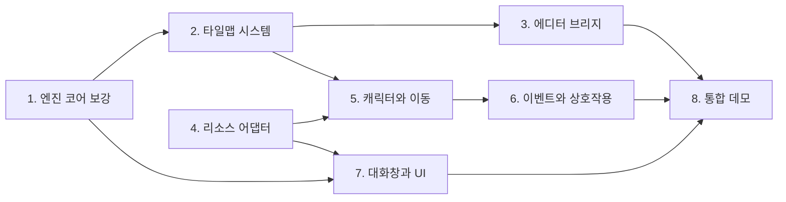

# Initial2D 로드맵: 롤플레잉 게임 제작이 가능한 범용 엔진

> 작성일: 2026-08-15. 이 문서는 전체 계획의 입구이며, 진행 상황 추적표를 겸한다.
> 작업을 시작하기 전에 이 문서의 진행 상황 표를 확인하고, 작업이 끝나면 반드시 갱신한다.

## 1. 비전

Initial2D는 **범용 2D 게임 엔진**이다. 플래피버드 같은 게임(이미 `scripts/games/flappy.lua`로 동작)도, RPG Maker 2003급의 롤플레잉 게임도 만들 수 있어야 한다. 이번 로드맵의 목표는 다음 한 문장이다.

> InitialEditor로 맵을 그리고 스크립트를 작성하면, Initial2D에서 캐릭터가 걸어다니고, NPC에게 말을 걸면 대화창이 뜨는 게임이 실행된다.

이를 위해 세 갈래의 작업이 필요하다.

1. **엔진**: 범용 코어의 빈 곳을 메운다 (타일맵, 텍스트 측정, JSON, 카메라 등).
2. **에디터 연동**: InitialEditor(웹)가 Node 브리지 서버를 통해 로컬 프로젝트 파일을 읽고 쓰게 한다. 맵 편집만큼, 어쩌면 그보다 더 중요한 것이 **스크립트 작성** 워크플로우다.
3. **RPG 프레임워크**: 캐릭터, 이벤트, 대화창을 **Lua 레이어**로 만든다. C++ 코어는 건드리지 않는다.

## 2. 설계 원칙

1. **범용성 우선.** RPG 전용 개념(캐릭터, 이벤트, 대화창)은 C++ 코어에 넣지 않는다. 판단 기준은 "이 기능이 플래피버드에도 말이 되는가?"이다. 말이 되면 코어(C++ 또는 공용 Lua), 안 되면 `scripts/rpg/` 프레임워크.
2. **게임 로직은 Lua.** C++은 엔진과 플랫폼 어댑터만 담당한다 (`docs/prompts/macos-porting-meta-prompt.md`의 원칙과 동일).
3. **데이터 주도.** R2K3 리소스 규격(CharSet 288x256 등)은 엔진이 아는 것이 아니라 Lua 쪽 데이터(어댑터)로 기술한다. R2K3는 여러 리소스 팩 중 하나일 뿐이다.
4. **단계마다 실행 가능한 결과물.** 각 단계는 눈으로 확인 가능한 데모나 테스트로 끝난다.

## 3. 현재 상태 요약 (2026-08-15 조사)

### 엔진 (Initial2D)

| 영역 | 있는 것 | 없는 것 |
|---|---|---|
| 플랫폼 | Windows(GDI, 보존), macOS(SDL2), Android(SDL2) | |
| 렌더링 | 스프라이트(회전, 스케일, 투명도, 프레임 애니메이션), 논리 해상도 | z순서, 카메라, 배칭, 도형 프리미티브 |
| 텍스트 | BMFont 한글 렌더링(`resources/fonts/hangul.fnt`, 나눔고딕) | 텍스트 폭 측정의 Lua 노출, 자동 줄바꿈. FontEx는 맥에서 무동작 스텁 |
| Lua | 5.3.5, Input, Audio, Sprite, TextureManager 등 약 70개 함수 | 타일맵, JSON, 파일 IO, 씬 스택 바인딩 |
| 타일맵 | 맵 포맷 v1 (JSON), 다층 렌더러(컬링, 카메라 오프셋, 레이어 분할), `Tilemap.*` Lua API, 샘플 맵과 데모 씬 (2단계에서 재작성) | 오토타일, 4방향 통행 (v2) |
| 오디오 | SDL2_mixer, OGG와 WAV, 페이드와 탐색 | 채널별 볼륨, BGS/ME 구분 |
| 도구 | HMR 서버(127.0.0.1:5959, `tools/hmr_push.py`) | 에디터 연동, 리소스 파이프라인 |

### 에디터 (InitialEditor, 별도 저장소)

- 바닐라 TS + PIXI 7 코어와 React 18 셸의 모노레포. 순수 웹 앱 (Electron 아님).
- 맵 데이터는 평탄한 `number[]` 하나: `data[z*W*H + y*W + x]`, 16x16 타일, 4레이어.
- **저장, 열기, 내보내기가 전부 스텁**(알림창만 띄움). 파일 IO는 localStorage 심뿐.
- 타일 ID가 합성 캔버스의 전역 인덱스라서 어느 타일셋인지 정보가 없음.
- 이벤트, 엔티티 개념 없음. 맵 크기 편집 불가(50x38 고정).
- 좋은 소식: 미사용 `MapSchema`, Ctrl+E에 연결된 `FileExportCommand` 스텁, 교체 가능한 `FileProvider`, Ace Lua 에디터가 이미 존재. 내보내기와 스크립트 편집을 붙일 자리가 마련되어 있다.

### 리소스 (resources/RTP.zip, R2K3 2023년 재배포판)

전부 PNG(8비트 팔레트), MIDI, WAV로 구성. 규격은 `04-resources.md` 참고. 주의: 팔레트 0번이 투명색이라는 관례를 로더나 변환기가 강제해야 하며(tRNS 청크가 파일마다 들쭉날쭉), Music은 MIDI라 변환이 필요하다. **라이선스: RPG Maker 2003 정품 보유자만 타 엔진에 사용 가능. RTP.zip은 git에 커밋 금지 (이미 gitignore 처리됨).**

## 4. 단계 개요와 의존 관계

| 단계 | 문서 | 한 줄 요약 | 핵심 산출물 | 권장 모델 |
|---|---|---|---|---|
| 1 | [01-engine-core.md](01-engine-core.md) | 범용 코어의 빈 곳과 버그를 메운다 | 텍스트 측정, JSON 바인딩, 시트 규격 해제, 해상도 설정 | Opus 5 |
| 2 | [02-tilemap.md](02-tilemap.md) | 타일맵 렌더러와 맵 포맷 v1 | `Tilemap.*` Lua API, 다층 렌더링, 충돌 레이어 | **Fable 5** |
| 3 | [03-editor-bridge.md](03-editor-bridge.md) | Node 브리지 서버로 에디터와 로컬 파일 연결 | 스크립트 편집과 저장, 맵 내보내기, HMR 연계 | **Fable 5** |
| 4 | [04-resources.md](04-resources.md) | R2K3 리소스 변환 파이프라인과 어댑터 | `tools/rtp_import.py`, 규격 데이터(Lua) | Opus 5 |
| 5 | [05-rpg-character.md](05-rpg-character.md) | CharSet 캐릭터가 맵을 걸어다닌다 | `scripts/rpg/character.lua`, 그리드 이동, 카메라 추적 | Opus 5 |
| 6 | [06-rpg-events.md](06-rpg-events.md) | NPC에게 말을 걸 수 있다 | 코루틴 기반 이벤트 시스템, 트리거 | **Fable 5** |
| 7 | [07-rpg-dialogue.md](07-rpg-dialogue.md) | 대화창이 뜬다 | 윈도우 스킨 렌더러, 메시지 창, 선택지 | Opus 5 |
| 8 | [08-demo.md](08-demo.md) | 전부 합쳐 마을 데모 | 걸어다니며 NPC와 대화하는 데모 게임 | Opus 5 |
| 검수 | [09-testing.md](09-testing.md) | **모든 단계에 내장되는 교차 절차.** 테스트 전략, 단계별 게이트, AI 자율 검증 루프 | 테스트 인프라 (`tests/run_all.sh`, 골든 스크린샷, 시나리오 재생기) | **Fable 5** (인프라 설계) |

### 모델 선정 기준

- **최소 기준선은 Opus 5다. Sonnet급 이하 모델은 이 로드맵에 사용하지 않는다** (2026-08-15 결정).
- 복잡한 단계는 Fable 5를 쓴다. 기준은 **아키텍처 판단의 비중**이다: 이후 단계의 토대가 되는 설계(2단계 맵 포맷, 3단계 브리지 프로토콜)와 상태 관리 버그가 숨기 쉬운 영역(6단계 코루틴 실행기)이 여기에 해당한다. Fable 5를 쓸 수 없는 환경에서는 Opus 5로 대신한다.
- Opus 5 단계에서 원인이 여러 층에 걸친 문제로 막히면 Fable 5로 승격한다.
- 세부 이유는 각 단계 문서 상단의 "권장 모델" 항목에 있다.

순서에 대한 메모: 1과 4는 서로 독립이라 병행 가능하다. 3(에디터 브리지)의 1차 마일스톤(스크립트 편집)은 2가 없어도 시작할 수 있으며, 사용자 가치가 크므로 일찍 당겨도 좋다.

## 5. 진행 상황

> 상태: ⬜ 대기, 🟡 진행 중, ✅ 완료. 각 단계 문서 안의 체크리스트를 먼저 갱신한 뒤, 이 표의 상태와 메모를 함께 갱신한다.

| 단계 | 상태 | 마지막 갱신 | 메모 |
|---|---|---|---|
| 1. 엔진 코어 보강 | ✅ 완료 | 2026-08-15 | 작업 항목과 완료 기준 전부 충족. Android 실기(Galaxy S24) 확인 완료: 구동, 해상도, 오디오. 부수 수정: prepare_assets.sh 닷파일 문제, JNI 소스 목록의 lua_json.cpp 누락 |
| 2. 타일맵 시스템 | ✅ 완료 | 2026-08-15 | 작업 항목과 완료 기준 전부 충족. Android 실기 확인 완료 (62fps, 터치 꽃 심기, 가상 D-패드 스크롤, 뒤로가기). 실기 검수 결과로 터치 D-패드 공용 모듈 `scripts/ui/vpad.lua` 추가 |
| 3. 에디터 브리지 | 🟡 진행 중 | 2026-08-15 | 마일스톤 1(브리지 서버와 스크립트 편집)부터 착수 |
| 4. 리소스 어댑터 | ⬜ 대기 | 2026-08-15 | |
| 5. 캐릭터와 이동 | ⬜ 대기 | 2026-08-15 | |
| 6. 이벤트와 상호작용 | ⬜ 대기 | 2026-08-15 | |
| 7. 대화창과 UI | ⬜ 대기 | 2026-08-15 | |
| 8. 통합 데모 | ⬜ 대기 | 2026-08-15 | |
| 검수 인프라 | ✅ 완료 | 2026-08-15 | 작업 항목 전부 완료. 마지막 항목이던 맵 픽스처(`tests/fixtures/maps/sample_v1.json`)를 2단계 포맷 확정과 함께 추가 |

### 갱신 규칙

1. 어떤 단계의 작업을 시작하면 상태를 🟡로 바꾸고 날짜를 갱신한다.
2. 작업 단위가 끝날 때마다 해당 단계 문서의 체크리스트(`- [ ]` → `- [x]`)를 갱신한다. 구현 작업은 [09-testing.md](09-testing.md) 10절의 자율 검증 루프를 따른다 — 스스로 빌드하고 테스트를 돌려 통과할 때까지 반복한다.
3. 단계의 완료 기준과 [09-testing.md](09-testing.md) 8절의 검수 게이트를 전부 만족해야 ✅로 바꾼다.
4. 계획이 현실과 어긋나면 계획 문서를 고친다. 문서는 계약이 아니라 지도다.
