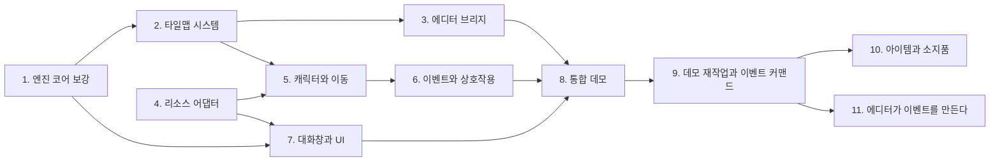

# Initial2D 로드맵: 롤플레잉 게임 제작이 가능한 범용 엔진

> 작성일: 2026-08-15. 이 문서는 전체 계획의 입구이며, 진행 상황 추적표를 겸한다.
> 작업을 시작하기 전에 이 문서의 진행 상황 표를 확인하고, 작업이 끝나면 반드시 갱신한다.

## 1. 비전

Initial2D는 **범용 2D 게임 엔진**이다. 플래피버드 같은 게임(이미 `scripts/lua/games/flappy.lua`로 동작)도, RPG Maker 2003급의 롤플레잉 게임도 만들 수 있어야 한다. 이번 로드맵의 목표는 다음 한 문장이다.

> InitialEditor로 맵을 그리고 스크립트를 작성하면, Initial2D에서 캐릭터가 걸어다니고, NPC에게 말을 걸면 대화창이 뜨는 게임이 실행된다.

이를 위해 세 갈래의 작업이 필요하다.

1. **엔진**: 범용 코어의 빈 곳을 메운다 (타일맵, 텍스트 측정, JSON, 카메라 등).
2. **에디터 연동**: InitialEditor(웹)가 Node 브리지 서버를 통해 로컬 프로젝트 파일을 읽고 쓰게 한다. 맵 편집만큼, 어쩌면 그보다 더 중요한 것이 **스크립트 작성** 워크플로우다.
3. **RPG 프레임워크**: 캐릭터, 이벤트, 대화창을 **Lua 레이어**로 만든다. C++ 코어는 건드리지 않는다.

## 2. 설계 원칙

1. **범용성 우선.** RPG 전용 개념(캐릭터, 이벤트, 대화창)은 C++ 코어에 넣지 않는다. 판단 기준은 "이 기능이 플래피버드에도 말이 되는가?"이다. 말이 되면 코어(C++ 또는 공용 Lua), 안 되면 `scripts/lua/rpg/` 프레임워크.
2. **게임 로직은 Lua.** C++은 엔진과 플랫폼 어댑터만 담당한다 (`docs/prompts/macos-porting-meta-prompt.md`의 원칙과 동일).
3. **데이터 주도.** R2K3 리소스 규격(CharSet 288x256 등)은 엔진이 아는 것이 아니라 Lua 쪽 데이터(어댑터)로 기술한다. R2K3는 여러 리소스 팩 중 하나일 뿐이다.
4. **단계마다 실행 가능한 결과물.** 각 단계는 눈으로 확인 가능한 데모나 테스트로 끝난다.

## 3. 현재 상태 요약 (2026-08-15 조사)

### 엔진 (Initial2D)

| 영역 | 있는 것 | 없는 것 |
|---|---|---|
| 플랫폼 | Windows(GDI, 보존), macOS(SDL2), Android(SDL2), 웹(Emscripten, SDL2 포트. R3) | |
| 렌더링 | 스프라이트(회전, 스케일, 투명도, 프레임 애니메이션), 논리 해상도, 픽셀 확대 배율(5단계 검수로 추가) | z순서, 카메라(Lua 값으로 대신), 배칭, 도형 프리미티브 |
| 텍스트 | BMFont 한글 렌더링(`resources/fonts/hangul.fnt`, 나눔고딕) | 텍스트 폭 측정의 Lua 노출, 자동 줄바꿈. FontEx는 맥에서 무동작 스텁 |
| Lua | 5.3.5, Input, Audio, Sprite, TextureManager 등 약 70개 함수 | 타일맵, JSON, 파일 IO, 씬 스택 바인딩 |
| 타일맵 | 맵 포맷 v1과 v2 (JSON, v2는 `events`를 실어 나른다), 다층 렌더러(컬링, 카메라 오프셋, 레이어 분할), `Tilemap.*` Lua API, 샘플 맵과 데모 씬 (2단계에서 재작성) | 오토타일, 4방향 통행 (v2 로드맵) |
| 오디오 | SDL2_mixer, OGG와 WAV, 페이드와 탐색 | 채널별 볼륨, BGS/ME 구분 |
| RPG 레이어 | `scripts/lua/rpg/`의 캐릭터, 플레이어 입력, 카메라, 맵 씬, 시드 난수(5단계), 이벤트와 코루틴 실행기(6단계), 스킨 창과 대화창, 선택지(7단계), 리소스 고르기(8단계), 이벤트 커맨드(9단계), 소지품과 소지품 창(10단계). 그리드 이동, y정렬 그리기, 트리거 4종, 맵 전환, 타자 효과와 얼굴 | 메뉴 화면과 씬 스택, 저장과 로드 (v2) |
| 도구 | HMR 서버(127.0.0.1:5959, `tools/hmr_push.py`), 에디터 브리지 서버(127.0.0.1:5960, `tools/bridge/`), RTP 변환기(`tools/rtp_import.py`, 4단계), 플레이스홀더 생성기(CharSet `tools/generate_charset.py`, 창 스킨 `tools/generate_windowskin.py`, FaceSet `tools/generate_faceset.py`, 타이틀 배경 `tools/generate_title.py`), 비트맵 폰트 굽기(`tools/generate_bmfont.py`) | |

### 에디터 (InitialEditor, 별도 저장소)

- 바닐라 TS + PIXI 7 코어와 React 18 셸의 모노레포. 순수 웹 앱 (Electron 아님).
- 맵 데이터는 평탄한 `number[]` 하나: `data[z*W*H + y*W + x]`, 16x16 타일, 4레이어.
- (3단계 완료) 저장, 열기, 내보내기와 스크립트 편집이 브리지 서버를 통해 실제로 동작한다. 타일 ID는 내보낼 때 gid로 변환하고, 맵 크기도 편집할 수 있다.
- 남은 것: 이벤트와 엔티티 개념(6단계), 통행 레이어 편집(마일스톤 3), 오토타일.

### 리소스 (resources/RTP.zip, R2K3 2023년 재배포판)

(4단계 완료) `tools/rtp_import.py`로 `resources/rtp/`에 32비트 RGBA PNG와 WAV를 만든다. 규격은 `scripts/lua/rpg/specs.lua`에 Lua 데이터로 있다. 원본은 전부 PNG(8비트 팔레트), MIDI, WAV로 구성이며 자세한 규격은 `04-resources.md` 참고. 주의: 팔레트 0번이 투명색이라는 관례를 로더나 변환기가 강제해야 하며(tRNS 청크가 파일마다 들쭉날쭉), Music은 MIDI라 변환이 필요하다. **라이선스: RPG Maker 2003 정품 보유자만 타 엔진에 사용 가능. RTP.zip은 git에 커밋 금지 (이미 gitignore 처리됨).**

## 4. 단계 개요와 의존 관계

```mermaid
graph LR
    P1[1. 엔진 코어 보강] --> P2[2. 타일맵 시스템]
    P2 --> P3[3. 에디터 브리지]
    P4[4. 리소스 어댑터] --> P5[5. 캐릭터와 이동]
    P2 --> P5
    P5 --> P6[6. 이벤트와 상호작용]
    P1 --> P7[7. 대화창과 UI]
    P4 --> P7
    P6 --> P8[8. 통합 데모]
    P7 --> P8
    P3 --> P8
    P8 --> P9[9. 데모 재작업과 이벤트 커맨드]
    P9 --> P10[10. 아이템과 소지품]
    P9 --> P11[11. 에디터가 이벤트를 만든다]
```

10단계부터는 [roadmap-v2.md](roadmap-v2.md)가 순서와 근거를 담는다.

| 단계 | 문서 | 한 줄 요약 | 핵심 산출물 | 권장 모델 |
|---|---|---|---|---|
| 1 | [01-engine-core.md](01-engine-core.md) | 범용 코어의 빈 곳과 버그를 메운다 | 텍스트 측정, JSON 바인딩, 시트 규격 해제, 해상도 설정 | Opus 5 |
| 2 | [02-tilemap.md](02-tilemap.md) | 타일맵 렌더러와 맵 포맷 v1 | `Tilemap.*` Lua API, 다층 렌더링, 충돌 레이어 | **Fable 5** |
| 3 | [03-editor-bridge.md](03-editor-bridge.md) | Node 브리지 서버로 에디터와 로컬 파일 연결 | 스크립트 편집과 저장, 맵 내보내기, HMR 연계 | **Fable 5** |
| 4 | [04-resources.md](04-resources.md) | R2K3 리소스 변환 파이프라인과 어댑터 | `tools/rtp_import.py`, 규격 데이터(Lua) | Opus 5 |
| 5 | [05-rpg-character.md](05-rpg-character.md) | CharSet 캐릭터가 맵을 걸어다닌다 | `scripts/lua/rpg/character.lua`, 그리드 이동, 카메라 추적 | Opus 5 |
| 6 | [06-rpg-events.md](06-rpg-events.md) | NPC에게 말을 걸 수 있다 | 코루틴 기반 이벤트 시스템, 트리거 | **Fable 5** |
| 7 | [07-rpg-dialogue.md](07-rpg-dialogue.md) | 대화창이 뜬다 | 윈도우 스킨 렌더러, 메시지 창, 선택지 | Opus 5 |
| 8 | [08-demo.md](08-demo.md) | 전부 합쳐 마을 데모 | 걸어다니며 NPC와 대화하는 데모 게임 | Opus 5 |
| 9 | [10-demo-v2.md](10-demo-v2.md) | 기획서대로의 데모와 이벤트 커맨드 | 게임 기획서, 데이터 커맨드 실행기, PC/모바일 조작 | **Fable 5** |
| 10 | [11-game-systems.md](11-game-systems.md) | 아이템과 소지품, 심부름 사슬 | `inventory.lua`, `menu.lua`, 커맨드 2종과 아이템 조건 | Opus 5 |
| 11 | [12-editor-events.md](12-editor-events.md) | 에디터가 이벤트를 만든다 (구상) | 커맨드 스키마, 이벤트 배치와 커맨드 편집 UI | **Fable 5** |
| 검수 | [09-testing.md](09-testing.md) | **모든 단계에 내장되는 교차 절차.** 테스트 전략, 단계별 게이트, AI 자율 검증 루프 | 테스트 인프라 (`tests/run_all.sh`, 골든 스크린샷, 시나리오 재생기) | **Fable 5** (인프라 설계) |
| A1 | [aldebaran-1-core.md](aldebaran-1-core.md) | 알데바란: 횡스크롤 코어 (자산, 스테이지, 플랫포머 물리) | `scripts/lua/games/aldebaran/`, 자산과 맵 생성기 | **Fable 5** |
| A2 | [aldebaran-2-combat.md](aldebaran-2-combat.md) | 알데바란: 전투와 성장 (몬스터 AI, 콤보, HUD) | `combat.lua`, `monster.lua`, 일시 정지 | **Fable 5** |
| A3 | [aldebaran-3-content.md](aldebaran-3-content.md) | 알데바란: 콘텐츠와 인수 (타이틀, 보스, 에필로그) | 인수 시나리오, 골든, README | Opus 5 |
| A4 | [aldebaran-4-pixelart.md](aldebaran-4-pixelart.md) | 알데바란: 도트 다시 그리기 (형태, 명암, 세계) | 실루엣과 걷기, 디더 띠와 팔레트, 타일 변형과 2겹 원경 | Opus 5 |
| A5 | [aldebaran-5-stage.md](aldebaran-5-stage.md) | 알데바란: 스테이지를 길게, 어렵게, 플롯이 있게 | 구간 다섯, 흔적 다섯과 힘, 256타일 맵 | **Fable 5** |
| A6 | [aldebaran-6-source-mining.md](aldebaran-6-source-mining.md) | 알데바란: 원안 완전 채굴 (P0) | 채굴기, 표 58개와 문단과 이미지, 미채택 목록, 몬스터 규격서 | Opus 5 |
| A7 | [aldebaran-7-tomb.md](aldebaran-7-tomb.md) | 알데바란: 스테이지 1-2 황제의 무덤 (P7) | 스테이지를 인자로, 기후 넷, 새 적 셋과 보스, 진행 | **Fable 5** |
| T1 | [t1-touch-input.md](t1-touch-input.md) | 모바일 터치 조작 (멀티터치, 화면 크기 대응) | Input 터치 API, `scripts/lua/ui/layout.lua`, 조이스틱 vpad | **Fable 5** |
| S1 | [s1-mruby-binding.md](s1-mruby-binding.md) | mruby 바인딩: 같은 엔진을 Ruby 로도 쓴다 | `ScriptRuntime`, `src/mrb_*.cpp`, `scripts/ruby/`, `tests/ruby/` | **Fable 5** |
| S2 | [s2-ruby-aldebaran.md](s2-ruby-aldebaran.md) | 알데바란을 Ruby 로: 같은 게임을 두 언어로 돌린다 | `scripts/ruby/games/aldebaran/`, 공용 모듈 Ruby 판, 같은 골든을 통과하는 Ruby 인수 씬 | **Fable 5** (모듈 번역은 Opus 5 에이전트 분담) |
| R1 | [r1-scene-loader.md](r1-scene-loader.md) | 엔진: 씬 로더. 에디터가 만든 씬 파일을 스크립트 레이어가 읽어 오브젝트를 만든다 | 씬 포맷 v1 픽스처, `scripts/lua/scene_loader.lua`와 Ruby 판, 플래피를 씬으로 옮긴 예제 | **Fable 5** |
| R2 | [r2-api-stubs.md](r2-api-stubs.md) (8절, 에디터 트랙) | 엔진: API 명세와 스텁, 대조 테스트. 에디터 자동완성의 원천 | `resources/api/initial2d-api.json`(명세), 생성 스텁 `initial2d.lua`(주석 기반 타입)와 `initial2d.rb`, `tools/gen_api_stubs.py`, 표면 대조 테스트 | Opus 5 |
| R3 | [r3-emscripten.md](r3-emscripten.md) | 엔진: Emscripten 빌드. 에디터 안 게임 뷰와 웹 데모 | CMake `EMSCRIPTEN` 분기, `tools/build_web.sh` 와 `build-web/site/`, 로더 `initial2d-loader.js`, export `initial2d_reload`/`initial2d_quit`, Playwright 스모크(`tools/web_smoke.mjs`), emcc 로 교차 빌드한 libmruby(`tools/web/mruby_build_config.rb`), CI 작업 `engine-web`(`tools/web_ci.sh`) | **Fable 5** |
| R4 | [r4-dist-build.md](r4-dist-build.md) | 엔진: 배포용 빌드. 다른 컴퓨터에 복사해도 뜨는 실행 파일 한 개와 새 프로젝트 템플릿 묶음 | CMake `INITIAL2D_VENDORED_SDL`(SDL 셋 정적, stb 디코더, macOS 11.0), `tools/build_dist.sh` 와 `tools/check_dist.sh`, `--version` 과 모르는 인자의 종료 코드 2, 타일맵 템플릿 `resources/templates/tilemap/`, `tools/pack_templates.py`, `THIRD-PARTY.md`, CI `dist.yml`(산출물만) | Opus 5 |

**알데바란 트랙 (A1~A3)**: 저자의 기획서(`docs/design/Spica_v0.9.docx`, 2026-08-23 반입)를
데모로 만드는 별도 트랙이다. 정돈한 기획서는 [docs/design/aldebaran.md](../design/aldebaran.md).
roadmap-v2의 후보였던 "전투 (장르를 넓히고 싶다)"가 앞당겨진 것이며, 기존 12~14단계
번호(저장, 오토타일, 씬 스택)와 부딪히지 않게 번호 대신 A를 쓴다.

### 모델 선정 기준

- **최소 기준선은 Opus 5다. Sonnet급 이하 모델은 이 로드맵에 사용하지 않는다** (2026-08-15 결정).
- 복잡한 단계는 Fable 5를 쓴다. 기준은 **아키텍처 판단의 비중**이다: 이후 단계의 토대가 되는 설계(2단계 맵 포맷, 3단계 브리지 프로토콜)와 상태 관리 버그가 숨기 쉬운 영역(6단계 코루틴 실행기)이 여기에 해당한다. Fable 5를 쓸 수 없는 환경에서는 Opus 5로 대신한다.
- Opus 5 단계에서 원인이 여러 층에 걸친 문제로 막히면 Fable 5로 승격한다.
- 세부 이유는 각 단계 문서 상단의 "권장 모델" 항목에 있다.

순서에 대한 메모: 1과 4는 서로 독립이라 병행 가능하다. 3(에디터 브리지)의 1차 마일스톤(스크립트 편집)은 2가 없어도 시작할 수 있으며, 사용자 가치가 크므로 일찍 당겨도 좋다.

## 5. 진행 상황

> 상태: ⬜ 대기, 🟡 진행 중, ✅ 완료. 각 단계 문서 안의 체크리스트를 먼저 갱신한 뒤, 이 표의 상태와 메모를 함께 갱신한다.

| 단계 | 상태 | 마지막 갱신 | 메모 |
|---|---|---|---|
| 1. 엔진 코어 보강 | ✅ 완료 | 2026-08-16 | 작업 항목과 완료 기준 전부 충족. Android 실기(Galaxy S24) 확인 완료: 구동, 해상도, 오디오. 부수 수정: prepare_assets.sh 닷파일 문제, JNI 소스 목록의 lua_json.cpp 누락. **2026-08-16 추가**: 5단계 검수에서 확대가 필요해져 렌더 배율(`SetRenderScale`, `game.json`의 renderScale)을 범용 기능으로 넣었다 |
| 2. 타일맵 시스템 | ✅ 완료 | 2026-08-15 | 작업 항목과 완료 기준 전부 충족. Android 실기 확인 완료 (62fps, 터치 꽃 심기, 가상 D-패드 스크롤, 뒤로가기). 실기 검수 결과로 터치 D-패드 공용 모듈 `scripts/lua/ui/vpad.lua` 추가 |
| 3. 에디터 브리지 | ✅ 완료 | 2026-08-15 | 완료 기준 3개 충족(브라우저 편집→게임 재시작, 에디터 맵→엔진 렌더링, 두 저장소 README). 마일스톤 1, 2 완료. 마일스톤 3(이벤트 배치, 통행 편집)은 원래 후순위라 6단계와 함께 진행한다. 검수: 브리지 18건 + 에디터 포맷 23건 + 엔진 전체 스위트, 브라우저 실제 조작으로 왕복 확인. **손맛(편집→반영 체감)은 사용자 확인 필요** |
| 4. 리소스 어댑터 | ✅ 완료 | 2026-08-16 | 완료 기준 3개 충족. `tools/rtp_import.py`(카테고리별 투명 정책, 매니페스트), `scripts/lua/rpg/specs.lua`(실물로 검증한 규격), 검증은 `tests/verify_rtp.py`(원본 zip과 픽셀 대조 포함)와 `rtp_charset_scene`. MIDI는 기본 건너뜀 + `--soundfont` 옵션. 변환 이미지 눈 확인 완료(ChipSet 상위 레이어 투명, Backdrop 구멍 없음, System 창 밖 투명) |
| 5. 캐릭터와 이동 | ✅ 완료 | 2026-08-16 | 완료 기준 4개 충족(방향키 이동과 충돌, 카메라 추적과 클램프, 상층 타일 뒤 통과, C++ diff 0). `scripts/lua/rpg/`에 character, player, camera, map_scene, rng 추가. 데모는 메뉴의 "RPG 캐릭터"(`scripts/lua/games/rpg_demo.lua`). 검수: Lua 단위 160건 추가(전체 615건)와 골든 `rpg_walk_scene`(가림 유무를 머리색 픽셀 수로 비교), 안드로이드 APK 빌드 성공. RTP는 커밋 금지라 플레이스홀더 CharSet(`tools/generate_charset.py`)을 만들어 커밋. 사용자 검수(2026-08-16)에서 "캐릭터가 너무 작다"가 나와 1단계로 되돌아가 렌더 배율을 넣고, 데모는 배율 2와 RTP CharSet 자동 선택으로 바꿨다. **이동 손맛과 안드로이드 실기는 사용자 확인 필요** |
| 6. 이벤트와 상호작용 | ✅ 완료 | 2026-08-17 | 완료 기준 4개 충족. `event.lua`(이벤트와 트리거 4종), `interpreter.lua`(코루틴 실행기, 조작 잠금, 병렬), `ctx` API(message, choice, wait, transfer, moveRoute, turn, state), 이동 루트는 `character.lua`에. 데모 맵 `village.json`과 `room.json`을 새로 만들고 이벤트 정의는 `scripts/lua/maps/*.lua`. 검수: Lua 단위 91건 추가(전체 738건)와 통합 씬 `rpg_event_scene` 25건(진짜 맵과 정의 파일로 말 걸기, 분기, 전환, auto, parallel). 권장 모델은 Fable 5지만 Opus 5로 진행(로드맵의 대체 규칙) |
| 7. 대화창과 UI | ✅ 완료 | 2026-08-18 | 완료 기준 4개 충족. `window.lua`(나인 슬라이스 스킨 창, 여닫기), `message.lua`(타자 효과, 쪽 나눔, 얼굴, 이름 창, 실행기 항구), `choice.lua`(커서, 스크롤, 취소). 데모의 print 스텁을 실물 창으로 교체하고 마을 대사에 얼굴과 이름을 붙였다. RTP 없이도 돌게 플레이스홀더 스킨과 FaceSet, UI 효과음을 만들어 커밋. 검수: Lua 단위 147건 추가(전체 885건), 씬 테스트 `rpg_dialogue_scene`(픽셀 검증 + 골든 1장, 대기 화살표는 두 번째 상태로), 전체 스위트 통과, 안드로이드 APK 빌드 성공. **C++ 한 곳 수정**: `Sprite.SetRect` 바인딩이 처음부터 동작하지 않던 버그(1단계 성격). 07 문서 구현 메모 4번. **손맛(타자 속도, 창 크기)과 안드로이드 실기는 사용자 확인 필요** |
| 8. 통합 데모 | ✅ 완료 | 2026-08-19 | 완료 기준 3개 충족. 데모 게임 "작은 마을": 타이틀 씬(`scripts/lua/games/rpgdemo/title.lua`, 배경과 커서 메뉴)과 맵 씬(`rpgdemo/game.lua`, 5단계 데모를 옮겨 확장), 메뉴 항목은 "작은 마을". 콘텐츠는 상인 NPC와 맵을 넘는 `ctx.state`(약초), 맵별 BGM 슬롯(`scripts/lua/bgm.lua`), 문 효과음, 페이드 인. 공통화: 리소스 고르기 `scripts/lua/rpg/assets.lua`(+`INITIAL2D_NO_RTP`), 터치 선택 `Choice:indexAt`, 입력 재생기의 대화형 예약(`replay:tap/press`). 검수: 인수 시나리오 `rpgdemo_scene`(입력 재생기로 타이틀→마을→대화→선택지 2번→집 출입→복귀, 23건)와 골든 2장(`rpgdemo_title`, `rpgdemo_village`, RTP 없이 캡처해 커밋 가능), 전체 스위트 통과(Lua 단위 952건, 엔진 씬 169건), 안드로이드 APK 빌드 성공. 계획과 달라진 5가지는 08 문서에 기록. **손맛(타이틀 커서, 대사 호흡)과 안드로이드 실기는 사용자 확인 필요**. **2026-08-19 후속**: 이슈 24가 "이것은 기술 데모이며 게임이 아니다"라고 지적했다. 기술적 증명으로서의 8단계는 유효하되, 기획서 기반의 데모는 9단계에서 다시 만든다 |
| 9. 데모 재작업과 이벤트 커맨드 | ✅ 완료 | 2026-08-20 | 이슈 24(기획서 부재, 기술 데모용 대사와 배치, 이벤트 커맨드의 범용성)에 대한 답. 기획서 [docs/design/port-town.md](../design/port-town.md). 저자의 자작곡에서 세계관을 가져와(Inn=여관, Bless=마을, 요정의 숲과 천공의 끝은 대사 속에) 항구 마을의 반나절을 다룬다. 계획은 [10-demo-v2.md](10-demo-v2.md) (문서 번호 09는 검수 문서가 쓰고 있어 10을 쓴다). **마일스톤 1 완료**: `commands.lua`(커맨드 15종, 중첩 분기, 검증, Lua 탈출구), `ctx`에 playSe/playBgm/showLocation/scene 추가, 기존 마을과 오두막을 커맨드로 옮겨 6단계 회귀가 그대로 통과. **마일스톤 2 완료**: 데모를 「떠나기 전에」로 다시 만들었다. 항구 마을(32x48)과 여관(20x14) 맵을 난수 없이 기획서 좌표대로 생성, 항구 타일 39종과 타이틀 그림 신규, 이벤트 17종과 인물 5명의 대사, 장소 이름 표시, 모바일 결정과 취소 버튼(`scripts/lua/ui/buttons.lua`). 검수: 인수 시나리오를 새 콘텐츠로 다시 써 타이틀부터 에필로그까지 통과(엔진 씬 180건), Lua 단위 1005건, 골든 2장 갱신. **마일스톤 3은 엔진 쪽 완료**: 맵 포맷 v2(`events` 배열, C++ 로더는 버전만 허용하고 이벤트는 Lua가 Json.Load로 읽는다), 픽스처 `sample_v2.json`, 맵과 정의 파일의 이벤트를 id로 합치는 `mapdata.lua`, 데모의 짐 상자 이벤트를 맵 파일로 옮겨 실증. **남은 것은 InitialEditor 저장소**. 지금은 v2를 거부하고 저장 시 events를 잃는다. 그 작업은 11단계([12-editor-events.md](12-editor-events.md))로 따로 세웠다. 저자 결정 세 가지는 권장안으로 정해 기획서 10절에 기록 |
| 10. 아이템과 소지품 | ✅ 완료 | 2026-08-20 | 완료 기준 6개 충족. `inventory.lua`(소지품, 순수 함수), `menu.lua`(목록과 설명 두 칸짜리 창, 취소키로 여닫기), 커맨드 `giveItem`/`takeItem`과 `{ item = ... }` 조건(커맨드 15종 → 17종), 데모의 아이템 표 `scripts/lua/games/rpgdemo/items.lua`. 콘텐츠: 인물 다섯을 잇는 심부름 사슬 하나(생선 장수 → 여관 주인의 열쇠 → 창고의 등유 → 등대지기의 은화 → 여관 방 → 배)와 쌓이는 에필로그. **곁들여 타일링 버그 셋을 고쳤다**: 바다 타일의 어두운 윗줄이 16px마다 가로줄 격자로 보이던 것(2x2 이음매 없는 한 벌로 교체), `TREE_TOP=26/TREE_BOT=34`가 실은 바위 조각과 울타리 기둥이라 마을 테두리가 어그러져 있던 것(타일셋에 나무가 없다. 바위 테두리 한 벌로 교체), 그리고 타일셋에 있는 잔디↔모래 가장자리 타일을 쓰지 않아 길과 광장과 물가가 각진 사각형이던 것(생성기의 후처리 `blend_sand`). 검수: Lua 단위 1064건(소지품 24건, 소지품 창 27건, 아이템 커맨드 12건 추가), 인수 시나리오를 사슬 전체로 다시 써 통과(엔진 씬 204건), 골든 3장(`rpgdemo_town` 갱신, `rpgdemo_bag` 신규), 전체 스위트 통과, 안드로이드 APK 빌드 성공. **2026-08-20 사용자 검수**: "아래에서 집에 접근하면 집이 캐릭터 머리를 가린다". 데모 씬이 `groundLayers = 1`을 모든 맵에 못 박아 장식 레이어가 통째로 캐릭터 위에 그려지고 있었다. 장식을 `deco`(앞에 서는 것, 캐릭터 아래)와 `over`(밑을 지나가는 것, 캐릭터 위)로 나누고 `groundLayers`를 맵 정의 파일이 정하게 고쳤다. 회귀 테스트는 단위(Draw 구간 기록)와 픽셀(`INITIAL2D_DEMO_STOP=wall`의 머리색) 두 겹. **손맛(소지품 창 크기, 사슬의 호흡)과 안드로이드 실기는 사용자 확인 필요** |
| 11. 에디터가 이벤트를 만든다 | ⬜ 대기 | 2026-09-27 | **E5(에디터)와 M2(엔진)가 이어받았다** ([m2-rpg-events.md](m2-rpg-events.md), 아래 M2 줄). 처음 구상은 [12-editor-events.md](12-editor-events.md)에 있다: 커맨드 명세를 두 저장소가 함께 읽는 스키마 한 장(`resources/schema/event-commands.json`)으로 못 박고, 에디터의 폼을 그 스키마에서 만든다. 그 문서의 마일스톤 1(잃지 않기)은 에디터 E3 가 했다 |
| A8. 알데바란 그림을 GPT에게 | 🟡 진행 중 | 2026-09-08 | 저자 판정 "코드 도트가 허접하다"에 대한 답. 그림은 ChatGPT 이미지 생성이 그리고(저자가 탭을 열어 두면 에이전트가 크롬으로 조작), `tools/import_gpt_art.py`가 자홍 구분선으로 칸을 나눠 격자 샘플링, 기준 칸(카르토 걷기 A)으로 장마다 배율 보정, 고정 배율 2 다수결 축소, 미러 시트 조립을 한다. 규칙과 배운 것은 [메타 프롬프트](../prompts/aldebaran-art-meta-prompt.md). **몬스터 시트 아홉 완료** (카르토 12칸, 거미, 늑대, 검은 늑대, 원숭이, 영혼, 번병, 조각, 아포피스. GPT 20장, 약 1시간 반). 인수 시나리오 무변경 통과(엔진 씬 287건), 골든 3장 갱신. **남은 것**: 숲 타일 5장, 소품, 배경 21장, 타이틀, 무덤 타일 4장. 도구에 타일과 배경 처리가 아직 없다. GPT 원본은 gitignore (커밋 여부는 저자 결정) |
| T1. 모바일 터치 조작 | ✅ 완료 | 2026-08-24 | 「패드로 달리면서 점프할 수 있다」. 멀티터치 Input API(SDL 핑거 이벤트, 손가락별 4-상태 기계와 래치, 간접 터치 기기 필터), `scripts/lua/ui/layout.lua`(화면 높이 비례 배치, 모서리 앵커, 좁은 화면 축소), vpad 조이스틱화(손가락 소유권, 원 밖으로 끌어도 유지), buttons 다중 포인터와 히트 슬롭 1.25배(겹침은 가까운 쪽이 이긴다). 알데바란 적용, status()가 배치를 노출해 인수 시나리오가 좌표 하드코딩을 버렸다. 검수: Lua 단위 1673건(레이아웃 불변식 6개 해상도, 소유권, 동시 버튼, 재생기 터치), 엔진 씬 284건("패드로 달리면서 점프" 동시 입력 검증 추가), 골든 무변경. S24 실기 확인 완료: 배치가 계산과 픽셀 단위로 일치(점프 중심 예상 2226,968 대 실측 2225,967), 패드 걷기와 눌림 표시 동작, 저자가 즉석에서 Lv 5까지 플레이. **손맛(패드 감도, 버튼 간격, 슬롭 크기)은 사용자 확인 필요** |
| S1. mruby 바인딩 | ✅ 완료 | 2026-09-26 | 「Lua 로 되는 것은 전부 mruby 로도 된다」. 엔진 루프가 `Script_*`(`src/ScriptRuntime.cpp`)를 부르고 백엔드는 `INITIAL2D_SCRIPT` > `game.json` 의 `script` > 진입 파일(`main.lua` 가 있으면 언제나 Lua)로 정한다. 바인딩은 `src/mrb_*.cpp` 여덟 파일: `Graphics`, `System`, `Keys`, `Input`(Symbol 키), `Audio`, `Json`(예외), `TextureManager`, 그리고 GC 가 거두는 클래스 `Sprite`, `Tilemap`(레이어 0 기준), `FontEx`. `Kernel#load`/`require` 와 프렐류드(`Sprite.load`)는 엔진이 준다. mruby 는 Homebrew 것을 CMake 가 찾고(`mruby-config` 의 -D 를 그대로), 없으면 Lua 만으로 빌드된다 (`--features`). 검수: mruby 단위 294건(API 표면, 폰트 폭, JSON, 시트 분할, 타일맵, 오디오, require, FontEx), **Lua 검증 씬을 옮긴 Ruby 씬이 같은 골든 `assert_scene_f35` 통과**, Ruby 플래피(`scripts/ruby/games/flappy.rb`) 자동 시연 인수(씨앗 고정, 5점, 게임 오버와 재시작), 기존 스위트 무변경 통과. **남은 것**: Android 용 libmruby 교차 빌드, vcxproj 정리 |
| S2. 알데바란을 Ruby 로 | ✅ 완료 | 2026-09-26 | 「Lua 알데바란과 Ruby 알데바란이 같은 화면을 그린다」. 먼저 스크립트 폴더를 `scripts/lua/` 와 `scripts/ruby/` 로 갈랐다 (PR #34). 알데바란 전부(플레이어, 전투, 몬스터와 종별 표, 기후, 스테이지 둘, HUD, 타이틀, 게임 씬)와 그것이 기대는 공용 모듈(창, 대화창, 선택지, 글자, 규격, 리소스 고르기, BGM, 터치와 패드와 버튼과 배치, 시드 난수)을 Lua 파일 하나에 Ruby 파일 하나로 옮겼고, Lua 단위 테스트 18 케이스도 같은 라벨로 옮겼다. 규약은 계획 문서 3절 (Ruby 이름, Symbol 열거, 0 기준 인덱스, `def` 금지, 정수 나눗셈 주의). 번역은 에이전트 여섯이 나눠 했고 본체가 씬과 인수를 맡았다. **검수**: Ruby 인수 씬(`mruby_aldebaran_scene.rb`)이 Lua 인수 씬과 **같은 검사 80건과 같은 골든 세 장**을 통과한다 (타이틀부터 에필로그, 1-2 주파와 아포피스, 터치, 홍수 회귀). mruby 단위 1643건 (Lua 판보다 검사가 늘었다). 전체 스위트 394 PASS / 0 FAIL, Lua 쪽 무변경, C++ diff 0. **배운 것**: 이 mruby 는 몇몇 실수 리터럴(0.3, 0.35, 0.6, 0.7, 0.95)을 1ulp 다르게 읽어 나눗셈(`3.0 / 10`)으로 적어야 Lua 와 같은 값이 되고, Regexp 와 Range#step 이 없다. 계획 문서 5절 |
| R1. 엔진 씬 로더 | ✅ 완료 | 2026-09-26 | 「에디터가 만든 씬 파일이 게임에서 돌아간다」. 씬 포맷 v1 의 정본은 [r1-scene-loader.md](r1-scene-loader.md) 2절 (초안은 InitialEditor 계획 5절이었고 다른 곳은 정본을 따른다). 로더는 `scripts/lua/scene_loader.lua` 와 `scripts/ruby/scene_loader.rb` 한 쌍이며 **C++ 무수정**. 코어 타입 node, sprite, text 와 확장 타입 `scene_types/tilemap`(게으른 require), 컴포넌트 훅 넷(init, update, render, destroy), 씬 API(find, spawn, remove, switch, objects, state), 새 프로젝트 템플릿 셋(`resources/templates/main.lua`, `main.rb`, `scene.json`). 플래피를 씬으로 옮겼다 (`resources/scenes/flappy.json` + `components/flappy/` 두 언어. 새, 파이프 spawn, 스크롤, 감독이 컴포넌트 하나씩이고 글자는 text 오브젝트). 검수: Lua 단위 121건(전체 1794건), mruby 단위 126건(전체 1769건), 씬 테스트 넷 58건(플래피 인수 12+12 는 기존 Ruby 플래피와 같은 검사, 픽스처 17+17 은 두 언어가 같은 골든 `scene_loader` 신규), 전체 스위트 442 PASS / 0 FAIL, 기존 플래피와 그 테스트 무변경. 계약에 더한 것 하나: sprite 의 `frameDelay`(엔진 기본 0 이 매 틱 넘어가서). 배운 것: 엔진이 텍스처 크기를 안 줘 width 0 은 PNG 헤더에서 읽는다, mruby 의 `respond_to?` 는 main.rb 의 최상위 def 를 보므로 훅은 `instance_methods` 로 찾는다, 텍스트 `color` 는 엔진 API 에 색이 없어 보존만. **에디터 쪽 E2/E3 의 픽스처 왕복은 InitialEditor 저장소 몫** |
| R2. 엔진 API 스텁 | ✅ 완료 | 2026-09-26 | 「바인딩이 늘고 명세를 안 고치면 테스트가 깨진다」. 손으로 유지하는 명세 `resources/api/initial2d-api.json`(모듈 7에 함수 58, 클래스 3에 생성자 5와 메서드 58, `Keys` 상수 82, 씬 계약 4)과 거기서 만드는 스텁 둘(`initial2d.lua` LuaLS 주석, `initial2d.rb` YARD, 생성기 `tools/gen_api_stubs.py`는 표준 라이브러리만). **계획에서 바뀐 점**: 스텁이 아니라 명세 JSON을 손으로 유지하고 스텁은 생성한다 (에디터는 JSON을 직접 읽는다). 검수: `api_surface_test`가 두 언어에서 양방향으로 대조한다 (Lua는 `_G`를 훑어 표준 밖의 C 함수와 C 함수를 담은 표를 찾고, Ruby는 `singleton_methods`, `instance_methods(false)`, `Keys.constants`, 프렐류드 정의 위치). 인자 없는 getter는 불러서 반환 타입까지 본다. `run_all.sh` 3단계의 `--check`가 스텁 신선도를 본다. 일부러 명세를 틀리게 고쳐 두 언어가 모두 깨지는 것을 확인했다. Lua 단위 1703건(+30), mruby 단위 1680건(+37), 전체 스위트 394 PASS / 0 FAIL, C++ diff 0. README와 바인딩의 어긋남 11가지(동작하지 않는 `Font("나눔고딕", 72)` 예제 등)는 단계 문서 6절에 목록만 남겼다 |
| R3. 엔진 Emscripten 빌드 | ✅ 완료 | 2026-09-27 | 「같은 엔진이 브라우저 안에서 돈다」. CMake `if(EMSCRIPTEN)` 분기가 SDL2, SDL2_image, SDL2_mixer, ogg, vorbis 를 Emscripten 포트로 쓰고(`-sUSE_*`), vendored Lua 가 C++ 예외로 오류를 던지므로 `-fwasm-exceptions` 를 켰다. `App::Run` 의 while 본문을 `StepFrame()` 으로 떼어 네이티브는 while 이, 브라우저는 `emscripten_set_main_loop_arg`(fps -1, ASYNCIFY 없음)가 같은 함수를 부른다. 환경 변수는 `Platform::GetEnv`(`src/platform/Env.h`, 네이티브는 인라인 getenv)로 모아 브라우저에서는 `Module.initial2dEnv` 를 먼저 보고, Lua 의 `os.getenv` 는 로더가 `Module.ENV` 에 넣은 같은 값을 본다. `HotReloadServer.cpp` 대신 `src/platform/emscripten/WebMain.cpp` 가 export `initial2d_reload`(서버와 같은 `Script_Restart()`), `initial2d_quit`, `initial2d_features` 를 낸다. `--features` 는 "lua wasm". 도구: `tools/build_web.sh`(emcmake, `build-web/site/` 에 js 177 KB 와 wasm 1.8 MB, 페이지, 로더, 프로젝트 파일 148 개 5.8 MB), `tools/web_stage.py`(파일 목록 `project.json`), `tools/web/initial2d-loader.js`(`bootInitial2D({ canvas, files, env, print, printErr })` 가 MEMFS `/project` 에 쓰고 chdir 뒤 callMain, `{ module, reload, quit }`), `tools/web_smoke.mjs`(InitialEditor 의 Playwright). **검수**: 헤드리스 크로미움에서 WebGL 로 알데바란 타이틀이 뜨고 엔진의 20 프레임 캡처(MEMFS 에서 꺼냄)가 골든 `aldebaran_title` 과 **차이 픽셀 0/688128**, 키보드(아래 + Enter 로 설명 창), reload 와 quit, `os.getenv` 와 `INITIAL2D_EXIT_AFTER` 통과. 네이티브 전체 스위트 446 PASS / 0 FAIL 로 무변경 통과, Windows GDI 와 Android 무수정. **2026-09-27 오류 처리 보강** (r3 8절): vendored Lua 만 `-fwasm-exceptions` 없이 컴파일되어 모든 Lua 오류가 JS 예외로 새던 것을 CMake 맨 위에서 모든 타깃에 주어 고쳤다. 오류 줄은 네이티브와 글자 그대로 같고, 시작 때와 Update 의 오류는 루프를 내린다(`onExit(1)`). 로더에 `onExit`, `reload()` 의 true/false, `frames()`, `errorText()`, 프레임 밖 C++ 예외는 `fatal:` 한 줄. 핫 리로드의 스크립트 오류는 네이티브도 웹도 게임을 끝내지 않고 스크립트만 멈춘다(결정은 ScriptRuntime 한 곳). 검수 `web_smoke.mjs` 8 ~ 11 과 네이티브 `[1h] hot_reload_error`. **2026-09-27 mruby** (r3 9절, E4 마일스톤 6): mruby 4.0.0 을 `MRuby::CrossBuild`(emscripten 툴체인, 설정 `tools/web/mruby_build_config.rb`)로 굽고 `tools/build_web.sh` 가 먼저 빌드한다. 예외는 setjmp/longjmp 를 wasm 예외로(`-fwasm-exceptions`, `SUPPORT_LONGJMP=wasm`), gem 은 네이티브의 full-core 에서 소켓, 태스크, 실행 파일만 뺐고, 정수는 네이티브처럼 64비트(`MRB_INT64`, `MRB_NO_BOXING`). features 는 `lua mruby wasm`. 엔진 C++ 는 무변경. 검수 12 ~ 13: `game.json` 의 `"script": "mruby"` 로 띄운 Ruby 판 타이틀이 Lua 판 캡처와 차이 0, Ruby 인수 씬은 네이티브와 1.44%(커서 깜빡임 칸, 허용 2%), Ruby 예외는 역추적까지 네이티브와 같은 줄과 종료 코드, reload 의 고장과 복구. **2026-09-27 검증 뒤 보강** (r3 10절): C 를 거치는 mruby 재귀가 2 MB wasm 스택을 넘쳐 메모리를 깨뜨리던 것을 `MRB_CALL_LEVEL_MAX` 512 고정과 `STACK_SIZE` 8 MB 로 고쳤다 (최악 경로 `to_s` 보간이 단계마다 5,360 B, 한도에서 2.75 MB. 브라우저 호출 스택은 약 704 단계까지). 바인딩의 C++ 예외는 `MRUBY_GUARD`(`src/mrb_prot.h`, 등록 112 곳)가 Ruby 의 `RuntimeError`("타입: 메시지")로 바꾸어 네이티브의 abort 와 핫 리로드 SIGSEGV 도 없어졌다. `Script_Restart` 가 C++ 예외도 받아 스크립트만 멈춘다. `fatal:` 줄은 엔진과 로더가 `fatal: 타입: 메시지` 한 형식(`src/ExceptionText.h`). 검수 `web_smoke.mjs` 14 ~ 16 (16 은 `INITIAL2D_WEB_TEST_FATAL`), 네이티브 `[0g]`, `[1c]`, `[1h]` 의 `mruby_cpp`. CI 에 두 번째 작업 `engine-web`(emsdk 6.0.10, Playwright 1.63.0, 단계는 `tools/web_ci.sh`). **남은 것**: 모바일 브라우저 터치 실기, 큰 프로젝트의 요청 시 스테이징, 브라우저의 `exit!`/`os.exit`(그 프레임만 끊긴다, r3 10.4 에 이유), 수천 단계로 중첩된 배열의 `join` 같은 C 안의 재귀는 브라우저 호출 스택에서 먼저 끝난다, 웹 데모 배포는 저자 결정 |
| R4. 엔진 배포용 빌드 | 🟡 진행 중 | 2026-09-27 | 「다른 컴퓨터에 복사해도 뜨는 실행 파일 한 개」. 에디터 E6 의 마일스톤 2, 정본은 [r4-dist-build.md](r4-dist-build.md). CMake 옵션 `INITIAL2D_VENDORED_SDL` 이 SDL2 2.30.9, SDL2_image 2.8.2(stb, ImageIO 끔), SDL2_mixer 2.8.0(stb_vorbis)을 `external/sdl-src/` 에서 정적으로 빌드하고(판은 `tools/sdl_versions.sh`, 안드로이드도 읽는다), mruby 4.0.0 은 `tools/build_mruby.sh` 가 full-core 로 굽는다 (`MRUBY_ROOT`). `tools/build_dist.sh` 가 `dist/Initial2D-aarch64-apple-darwin`(3.4 MB, 의존은 `/usr/lib` 와 `/System/Library` 뿐, minos 11.0)과 `dist/engine-dist.json` 을 낸다. C++ 은 `sdl2Main.cpp` 하나: `--version`(판 헤더는 빌드마다 `git describe --match v[2-9]*` 와 커밋)과 모르는 `--` 인자의 종료 코드 2. 타일맵 템플릿은 새로 그리지 않고 `sample.json` 의 타일셋을 쓴다 (표식 칸은 타일 44, `#d8c880`). 템플릿 묶음 `tools/pack_templates.py` (MANIFEST 에 커밋, sha256, `generated`), `THIRD-PARTY.md`(네이티브와 웹). **검수**: `check_dist.sh` 27건 통과, 배포용 실행 파일로 전체 씬 검수 575 PASS / 0 FAIL (골든 대조 17건 전부 허용 안, 골든 무변경), `templates_test.py` 44건, 골든 차이 비율이 Homebrew 빌드와 같다(15건 0%, 2건 0.41%), Homebrew 빌드의 `tests/run_all.sh` 통과(dummy 드라이버), actionlint 경고 없음. 태그와 공개 릴리스, `LICENSE` 는 만들지 않는다 (저자 결정). **남은 것**: `dist.yml` 의 첫 CI 실행 (Linux 잡은 한 번도 돌지 않았다), 타일셋의 출처 확인, `lua_font.cpp` 의 `<locale>` |
| M1. 맵 오브젝트 | ✅ 완료 | 2026-09-26 | 「알데바란의 배치가 맵 파일에 있다」. 시작 지점, 체크포인트, 몬스터, 흔적, 구간, 무덤의 빛기둥을 맵 v2의 `objects`(픽셀 좌표, 타입, props)로 옮겼다 (숲 29개, 무덤 34개). 스테이지 모듈(Lua, Ruby)은 `stages/placement.lua`와 `.rb`로 맵을 한 번 읽어 **옮기기 전과 같은 표**를 만들고, 게임 코드는 그대로 읽는다. 남긴 것은 이야기 글, 보스, 시드, `SECTION_FADE`, 기후 수치(방 전체에 걸리는 값, 방 이름으로 찾는다). JSON의 `3`은 정수라 원래 실수였던 `hallucination`만 모듈이 실수로 바꾼다. 스키마 `resources/schema/map-objects.json`(타입 여섯과 `play.env`), `INITIAL2D_ALDEBARAN_STAGE`가 맵 이름과 맵 파일 경로도 받고, AT로 옮긴 시작 x가 지면 속이면 지면 위에 세운다. 맵 파일은 에디터의 `serializeMap`과 바이트 단위로 같은 형식(`tools/mapfile.py`, 생성기 둘이 쓰고 `objects`를 보존, self-test는 에디터 출력과 대조). **C++ 무수정.** 검수: 옮기기 전 표를 테스트에 고정값으로 적어 옮기기 전 코드에 먼저 통과시킨 뒤 옮겼다. Lua 단위 95건(전체 1919건), mruby 단위 79건(전체 1885건) 추가, 알데바란 인수 씬 80+80건과 골든 세 장 무변경(시나리오 로그까지 같다), 전체 스위트 통과(C++ 18, 엔진 씬 446, 브리지 25). 계획은 [m1-map-objects.md](m1-map-objects.md) |
| M2. RPG 이벤트 데이터 계약과 이전 | 🟡 진행 중 | 2026-09-27 | 「에디터가 쓴 이벤트를 엔진이 검사하고 돌린다」. 에디터 쪽 짝은 E5(RPG 확장)이고 계약의 정본은 [m2-rpg-events.md](m2-rpg-events.md). **PR 1(계약, #49 병합)**: 스키마 `resources/schema/event-commands.json`(커맨드 17종, 조건 셋, 이벤트 칸, 자산 이름, 시트 규격, 이동 루트, 예약 이름), 게임 설정 `resources/data/rpg-game.json`, 아이템 표 `resources/data/items.json`, `map-objects.json` 의 `play.maps`. 검사는 `commands.lua` 의 인자 명세 표 하나로 선택 인자까지 타입과 범위를 보고 스키마와 양방향 대조한다. `MapData.validateEvents` 가 맵 파일의 틀린 이벤트만 빼고 `rpg:error` 한 줄을 찍는다 (`null` 칸, 배열 자리의 객체, 예약 이름 `items` 포함). auto 이벤트는 병합 순서대로 전부, 그 사이에도 조작 잠금. 실행 장치 `INITIAL2D_RPG_AT`, `INITIAL2D_RPG_STATE`, `INITIAL2D_RPG_ROUTE`, `INITIAL2D_RPG_TRACE`. 적대 검수 세 번. **PR 2(이전)**: `tools/export_events.py`(엔진 VM 에서 정의 파일을 읽어 논리 이름과 2.6절 키 순서로 `events` 를 쓰고, 옮길 수 없는 것은 이유와 함께 남긴다, `selftest`)로 항구 마을 16개와 여관 6개를 맵 파일로 옮겼다. 인수 시나리오, 골든 세 장, 벽 앞 검사, `rpg_event_scene`, `test_rpg_auto_chain` 의 stdout 이 옮기기 전과 바이트까지 같다. 씬 538 PASS. **C++ 무수정.** **E5 레이어 검수 뒤(배회하는 NPC)**: 새 변수 `INITIAL2D_RPG_HOLD=<이벤트 id>`로 첫 맵의 그 이벤트는 배회하지 않고 맵의 칸에 서 있으며, 게임이 `rpg:hold:<id>`를 한 번 찍는다 (모르는 id는 `rpg:error:hold:` 한 줄). `play.probe`에 `"INITIAL2D_RPG_HOLD": "{event}"`와 `"INITIAL2D_RPG_TRACE": "1"` (자동 재생은 늘 trace를 찍는다). `test_rpg_play_here` [I]가 배회하는 아이(kid)를 새 게임 그대로 자동 재생해 `rpg:hold:kid`, `rpg:event:kid`, `rpg:route:done`을 보고 모르는 id의 오류 줄을 본다 (97건). README에 에디터의 "이 이벤트 앞에서 실행"과 "이 이벤트 자동 재생", `play.probe`. 에디터 E5 모델의 왕복과 `yarn test:engine-events`(엔진 `419a829`, 판 10, 검사 105개)는 E5가 했다. **에디터 쪽 E5는 저자가 손으로 해 보는 확인만 남았다.** 남은 것: 사람이 브리지 왕복 한 번 (저자) |
| 검수 인프라 | ✅ 완료 | 2026-08-15 | 작업 항목 전부 완료. 마지막 항목이던 맵 픽스처(`tests/fixtures/maps/sample_v1.json`)를 2단계 포맷 확정과 함께 추가 |
| A1. 알데바란 코어 | ✅ 완료 | 2026-08-23 | 완료 기준 5개 충족. 기획서([aldebaran.md](../design/aldebaran.md), 원안 스피카를 지시로 개명), 자산과 맵 생성기(도트 지침: 단색 스케치 → 디더 명암 → 테두리), `scripts/lua/games/aldebaran/`의 player(순수 물리)와 game 씬. 검수: 물리 단위 26건(전체 1146건), 인수 씬이 입구부터 공터까지 실제 주파(대쉬, 턱 셋, 다리 구멍 둘), 골든 1장, 전체 스위트 통과, C++ diff 0. 구현 메모: 점프 초속 이산 적분 보정(−330), 단일 터치용 관성 규칙 둘. **실기 손맛은 사용자 확인 필요** |
| A2. 알데바란 전투 | ✅ 완료 | 2026-08-23 | 완료 기준 7개 충족. `combat.lua`(순수 함수로 만든 데미지, 명중 굴림, 레벨 표, 버서커), `monster.lua`(순찰/추적/공격 상태 기계, 늑대 돌격 1회, 비전투 회복), `stage.lua`(종별 표와 배치 일곱), `hud.lua`(막대 셋과 목숨, 골드), 3단 콤보와 피격 무적, 체크포인트와 목숨 2, 일시 정지 창(공용 창 부품 재사용). 검수: 단위 87건 추가(전체 1245건), 인수 씬이 전투까지 주파(첫 거미 처치, 늑대 피격, 버서커, 일부러 낙하해 체크포인트 부활, 일시 정지), 골든 갱신(HUD 포함), 전체 스위트 통과, C++ diff 0. **전투 손맛(콤보 박자, 넉백 세기)은 사용자 확인 필요** |
| A3. 알데바란 콘텐츠 | ✅ 완료 | 2026-08-23 | 완료 기준 6개 충족. 타이틀 씬(공용 창 부품), 도입 컷씬(짐도둑과 나레이션, 첫 진입에만), 표지 글 2, 짐도둑 보스(도망과 돌팔매, 코너 몰이), 배낭과 에필로그 4장, 결과 창, 게임 오버(다시 하기/타이틀로), 미니 게임 목록에 「알데바란」 등록, README 한 장. 검수: 인수 시나리오가 타이틀부터 에필로그까지(게임 오버, 체크포인트 부활, 터치 끝-끝 포함) 통과, 골든 2장, 전체 스위트 통과, C++ diff 0. **2026-08-23 사용자 검수에서 버그 둘**: 도입 컷씬에서 주인공이 (0,0)에 붙어 있던 것(스프라이트 트랜스폼은 `update()`가 커밋하는데 위치를 `render()`에서만 정하고 있었다)과 넘긴 대화창이 화면에 남던 것(`isBusy()`는 즉시 거짓이 되고 창은 그 뒤의 `update()`가 닫는데, 컷씬이 끝나자 갱신을 멈췄다). 둘 다 인수 시나리오가 통과하는 상태에서 살아 있었다. 상태 값만 보고 화면을 안 봤기 때문이다. `dialogueShown` 회귀 검사를 더했다. **2026-08-23 결정**: 미니 게임 선택 화면을 없애고 게임이 알데바란 타이틀로 바로 부팅한다. 다른 데모 셋은 장르 중립의 증거이자 회귀 테스트라 스크립트는 남기고 `INITIAL2D_SCENE`으로만 연다. **손맛(전투 박자, 보스 몰이)과 안드로이드 실기는 사용자 확인 필요** |
| A4. 알데바란 도트 | ✅ 완료 | 2026-08-23 | 완료 기준 10개 충족. **형태**: 실루엣 다각형과 진짜 걷기(몸의 상하, 팔의 반대 흔들림), 몬스터 셋의 재작화. **명암**: 면 전체 체커를 버리고 경계의 밀도 띠로(`shade_band`), 테두리는 그 자리 색을 어둡게 한 것으로, 오른쪽 바깥 가장자리에 역광 1px. **세계**: 땅과 바위 윗면 변형을 좌표 해시로 고르고 바위 턱에 양 끝 타일, 원경 두 겹(0.25배와 0.5배)과 가지 있는 나무, 안개는 해시 잡음으로. 검수: 인수 57건은 손대지 않고 통과, 골든 2장 갱신(6%와 14% 차이로 먼저 깨진 것을 확인한 뒤), 전체 스위트 통과, C++ diff 0 |
| A5. 알데바란 스테이지 | ✅ 완료 | 2026-08-23 | 「걸을수록 숲이 달라지고, 달라질 때마다 이 숲에 무슨 일이 있었는지가 하나씩 밝혀진다」. 스테이지를 128타일에서 **256타일 다섯 구간**(숲 입구, 옛 길, 기암 절벽, 늑대 마을, 제단 앞)으로 늘리고, 구간마다 무대와 위험과 **흔적** 하나를 두었다. 흔적 다섯을 주우면 힘이 하나씩 붙고(검기, 흔적 읽기, 도약, 폭주, 검기 방출), 다섯을 다 모은 플레이어만 읽는 에필로그 한 줄이 있다. 적은 16마리이고 검은 늑대가 추가됐다 |
| A6. 알데바란 원안 채굴 (P0) | ✅ 완료 | 2026-08-23 | 장기 트랙(7절)의 첫 Phase. **원안에 있는 것과 게임에 들어간 것을 한 표로** 답할 수 있게 했다. 채굴기 `tools/spica_extract.py`(표준 라이브러리만, 결정적)가 표 58개와 문단과 이미지 17장을 `docs/design/spica-source/`로 굳힌다. `.emf` 넷은 감싼 DIB를 꺼내 PNG로 바꿨다(libreoffice 없이). 미채택 목록 [spica-unused.md](../design/spica-unused.md): 표 58개 중 반영 6, 부분 24, 미반영 19, 기각 9이며 항목마다 갈 Phase가 있다. 몬스터 표를 `scripts/lua/games/aldebaran/data/monsters.lua`로 옮겨 원안 규격서(표 39, 40)의 칸을 `spec`으로 팠다 — P5가 적 열 종을 담을 그릇이다. 검수: 단위 64건 추가(Lua 1327건), 인수 시나리오 **무변경 통과**, 골든 무변경, C++ diff 0. **찾은 것 둘**: 원안 UI 목업에 이미 **스킬 버튼이 셋** 있다(P4의 슬롯 3개는 지어낸 것이 아니다). 세계 지도의 붉은 X 다섯은 스테이지가 아니라 **밀림거미굴 1~5**였다. **저자 결정 (2026-08-23)**: 원안 이미지 17장 중 **세계 지도 `image6.png` 한 장만** 커밋한다. P6 지도 화면의 원화다. 나머지 16장은 gitignore가 막는다 |
| A7. 알데바란 1-2 황제의 무덤 (P7) | ✅ 완료 | 2026-08-24 | **저자가 순서를 바꿔 스테이지를 먼저 하기로 정했다** (메타 프롬프트의 P1~P6보다 앞당김). 목표 문장은 「무덤에 들어서면 숲에서 배운 것이 통하지 않는다」. **스테이지가 인자가 됐다**: `game.lua`에 박혀 있던 맵, 배경, BGM, 보스가 스테이지 모듈의 칸이 되고 `stages/init.lua`가 목록을 든다. **고유 기믹은 기후**(원안 표 19: 아포피스가 방마다 기후를 좌우한다) — 눈은 마찰을 1/3로, 빛기둥은 그늘의 영혼을 벨 수 없게, 우박은 30프레임 예고 뒤에 떨어지게, 홍수는 잠기면 느리고 낮게 뛰게 한다. 연출이 아니라 조작이 바뀐다. **새 적 셋**(순장된 영혼=공중형, 무덤 번병=방패형, 파괴의 조각=**자폭형**, 원안 표 6의 넷 중 마지막 빈 칸)이 각자 다른 질문을 한다. **보스 아포피스** 3페이즈, 펀치 윈도우가 1.2→0.9→0.6초로 줄고 즉사기가 없다. 1-1을 끝내면 1-2로 이어지고 레벨과 골드를 들고 간다. 검수: Lua 단위 1472건, 엔진 씬 282건, 골든 `aldebaran_tomb_stars` 신규, **1-1 인수 시나리오 무변경 통과**, 자율 봇이 1-2를 주파해 아포피스를 쓰러뜨리고 에필로그까지 간다(32회 피격, 1회 사망), C++ diff 0. **인수 시나리오가 잡은 것**: 달의 방에 5타일 벽을 두어 봇이 x=1529에서 막혔다 (2단 점프 한계 87px < 80px 벽 + 미끄러운 바닥). 한 단을 두 타일로 낮췄다. **손맛(눈의 미끄러짐, 빛기둥 주기, 아포피스의 후딜)은 사용자 확인 필요**. **2026-08-24 실기 검수(T1) 후속**: 모바일(논리 폭 970)에서 홍수 물이 화면 왼쪽 절반에만 보였다. 물 조각(384 폭)을 한 장만 그리고 있어서다. 화면 폭만큼 옆으로 잇고 수면 아래는 몸통 조각으로 채웠다. 회귀는 넓은 창(1920x896)으로 태양의 방을 얼려 수면 띠의 전 폭 커버리지를 픽셀로 본다 (수정 전 47/118, 수정 후 통과) |

### 갱신 규칙

1. 어떤 단계의 작업을 시작하면 상태를 🟡로 바꾸고 날짜를 갱신한다.
2. 작업 단위가 끝날 때마다 해당 단계 문서의 체크리스트(`- [ ]` → `- [x]`)를 갱신한다. 구현 작업은 [09-testing.md](09-testing.md) 10절의 자율 검증 루프를 따른다. 스스로 빌드하고 테스트를 돌려 통과할 때까지 반복한다.
3. 단계의 완료 기준과 [09-testing.md](09-testing.md) 8절의 검수 게이트를 전부 만족해야 ✅로 바꾼다.
4. 계획이 현실과 어긋나면 계획 문서를 고친다. 문서는 계약이 아니라 지도다.

## 6. 로드맵 완료와 다음 로드맵

1차 로드맵의 여덟 단계가 끝났다. 1절의 목표 문장은 데모 게임으로 증명되었고, 그 증명은
사람이 눈으로 보는 것이 아니라 인수 시나리오(`tests/engine/scenes/rpgdemo_scene.lua`)가
매번 다시 확인한다.

그 뒤로 세 단계가 더 섰다.

- **9단계**: 이슈 24("이것은 기술 데모이며 게임이 아니다")에 대한 답. 기획서를 쓰고,
  데모를 그 기획서대로 다시 만들고, 이벤트를 **데이터 커맨드**로 바꿨다.
- **10단계**: "만든 것이 게임인가"에 대한 답의 나머지. 아이템과 소지품, 그리고 인물
  다섯을 잇는 심부름 사슬 하나. 걷고 읽는 것 말고 **할 일**이 생겼다.
- **11단계**: 9단계가 데이터로 만들어 둔 이벤트를 에디터가 실제로 편집하게 한다.
  아직 구상이다.

12단계 이후의 순서와 근거, 그리고 저장과 로드, 오토타일, 씬 스택의 설계 메모는
**[roadmap-v2.md](roadmap-v2.md)** 에 있다. 원칙은 이번 로드맵과 같다.
**"이 기능이 플래피버드에도 말이 되는가"**로 C++ 코어와 `scripts/lua/rpg/`의 경계를 긋고,
단계마다 실행 가능한 결과물과 자동 검증을 남긴다.

## 7. 알데바란 장기 트랙 (A6 이후)

A1에서 A5까지로 알데바란은 "한 판 3분에서 5분짜리 데모"가 되었다. 2026-08-23 사용자
판정은 다섯 가지였다. 데모지 게임이 아니다, 너무 쉽다, 마법 등 게임성이 낮다, 다른 게임에
대한 분석이 없다, 기획서의 지도 데이터를 쓰지 않았다.

그 다섯을 정면으로 푸는 장기 계획이
**[docs/prompts/aldebaran-game-meta-prompt.md](../prompts/aldebaran-game-meta-prompt.md)**
에 메타 프롬프트로 있다. 마일스톤 다섯(근거, 손맛, 세계, 구조, 완성)과 Phase 열하나
(P0 원안 채굴, P1 레퍼런스 분석, P2 난이도 진단, P3 전투 코어, P4 마법과 스킬,
P5 적과 조우, P6 지도 시스템, P7 스테이지 확장, P8 진행과 메타, P9 온보딩, P10 다듬기)로
되어 있고, 계획 문서 번호는 A6부터 이어 붙인다. **한 세션에 한 Phase**가 원칙이며,
P2와 P4 끝에는 사용자 승인 게이트가 있다.

## 8. 에디터 트랙 (R1 이후)

에디터의 다음 판은 InitialEditor 저장소의 `docs/plans/index.md`(2026-09-26)에 계획이 있다.
Tauri 2 셸 위의 장르 중립 에디터이고, 타일맵은 확장이며, 실행 버튼이 이 엔진을 띄운다(외부 프로세스가 1차,
Emscripten 내장 실행이 2차). 저자의 요구 "에디터가 만든 데이터가 연동되고 스크립트가 실행되면 인게임이
돌아가야 한다"를 채우려면 엔진 쪽에 읽는 쪽이 있어야 한다. 그것이 이 트랙이다. 원칙은 그대로다.
**C++은 손대지 않고 스크립트 레이어(Lua와 Ruby)가 읽는다.** 맵 포맷 v2의 `events`와 같은 패턴이다.

| 단계 | 무엇 | 에디터 쪽 짝 | 계약 |
|---|---|---|---|
| R1 | 씬 로더. `resources/scenes/*.json`(씬 포맷 v1)을 읽어 코어 타입(`node`, `sprite`, `text`)을 만들고, 확장 타입(`tilemap` 등)은 `scripts/*/scene_types/`에 위임한다. 스크립트 컴포넌트(`init`, `update`, `render`, `destroy`)를 오브젝트에 붙인다. `INITIAL2D_SCENE`과 `game.json`의 `startScene`을 읽는다. 플래피를 씬과 컴포넌트로 옮긴 예제가 인수 씬이다. **완료** ([r1-scene-loader.md](r1-scene-loader.md)) | E2 (씬과 오브젝트), E3 (타일맵 오브젝트 타입) | 픽스처 `tests/fixtures/scenes/sample_v1.json`을 양쪽이 왕복한다. 모르는 키는 보존, 모르는 버전은 거부 |
| R2 | API 명세와 스텁 (완료, [r2-api-stubs.md](r2-api-stubs.md)). 명세 `resources/api/initial2d-api.json`을 손으로 유지하고, 스텁 `resources/api/initial2d.lua`(EmmyLua 꼴 주석 타입)와 `initial2d.rb`는 거기서 만든다. `api_surface_test`가 명세를 바인딩의 실제 표면과 대조한다. 함수가 늘고 명세를 안 고치면 테스트가 깨진다 | E1 (Monaco 자동완성) | 커맨드 스키마([12-editor-events.md](12-editor-events.md) 3.1절)와 같은 "손으로 유지 + 대조 테스트" 방식. 에디터는 브리지로 명세 JSON을 읽는다 |
| R3 | Emscripten 빌드 (완료, [r3-emscripten.md](r3-emscripten.md)). CMake `EMSCRIPTEN` 분기(SDL2, SDL2_image, SDL2_mixer 포트), `HotReloadServer` 제외, `emscripten_set_main_loop_arg`, export `initial2d_reload`와 `initial2d_quit`, 환경 변수 대신 `Module.initial2dEnv`(C++)와 `Module.ENV`(Lua 의 `os.getenv`). `build-web/site/`의 정적 페이지가 알데바란을 띄우고 Playwright(`tools/web_smoke.mjs`)가 엔진의 20 프레임 캡처를 골든과 대조한다 (차이 0). mruby 도 들어 있다 (emcc 로 교차 빌드한 libmruby 4.0.0, r3 9절) | E4 (게임 뷰) | `--features`가 `lua mruby wasm` (mruby 없이 빌드하면 `lua wasm`). 로더 계약은 `bootInitial2D({ canvas, files, env, print, printErr, onExit })` 와 `{ module, reload(files) -> bool, quit(), frames(), errorText(e) }` (오류 처리는 r3 8절). 웹 데모는 README의 실행 링크 후보 |
| M1 | 맵 오브젝트 (완료, [m1-map-objects.md](m1-map-objects.md)). 맵 v2의 `objects`에 알데바란의 배치를 두고 스테이지 모듈(Lua, Ruby)이 읽는다. `resources/schema/map-objects.json`이 타입과 칸과 모양과 색, 실행 버튼의 환경 변수(`play.env`)를 정한다 | E3 (타일맵 확장의 오브젝트 레이어) | 맵 파일의 저장 형식이 하나다 (에디터 `serializeMap`과 `tools/mapfile.py`가 같은 바이트). 모르는 키 보존, 생성기는 `objects`를 덮지 않는다 |
| M2 | RPG 이벤트 데이터 계약과 이전 (진행 중, [m2-rpg-events.md](m2-rpg-events.md)). `resources/schema/event-commands.json`(커맨드 명세)과 `resources/data/rpg-game.json`(맵 등록, 실행 변수)을 두 저장소가 함께 읽고, 게임은 맵 파일의 이벤트를 열 때 검사해 틀린 것만 건너뛴다. 항구 마을과 여관의 이벤트를 맵 파일로 옮긴다 | E5 (RPG 확장: 이벤트 레이어, 커맨드 편집기, 이 이벤트 앞에서 실행) | 검증 경로는 1부터 세는 Lua 표기이고 두 저장소가 같은 픽스처(`tests/fixtures/events/`)로 같은 경로 집합을 낸다. 스키마와 `commands.lua` 는 엔진 테스트가 양방향으로 대조한다 |
| R4 | 배포용 엔진 빌드와 템플릿 묶음 (진행 중, [r4-dist-build.md](r4-dist-build.md)). SDL 셋과 mruby 를 소스에서 정적으로 넣은 실행 파일 하나(`tools/build_dist.sh`, macOS arm64 와 Linux x86_64)와 그 검사(`tools/check_dist.sh`), 새 프로젝트 템플릿 묶음(`tools/pack_templates.py`, 타일맵 템플릿 포함), 제3자 고지. CI `dist.yml` 은 산출물만 올린다 | E6 (배포: 사이드카, 템플릿, 자가 검사) | `--features`, `--version`(`Initial2D <describe> <커밋 40자>`), 모르는 `--` 인자는 종료 코드 2. `engine-dist.json` 의 `native.<트리플>` 과 템플릿 `MANIFEST.json` 의 `engineCommit`, `generated` |

단계 문서는 각 단계를 시작할 때 쓴다. R1 은 [r1-scene-loader.md](r1-scene-loader.md), R2 는 [r2-api-stubs.md](r2-api-stubs.md),
R3 는 [r3-emscripten.md](r3-emscripten.md), R4 는 [r4-dist-build.md](r4-dist-build.md), M1은 [m1-map-objects.md](m1-map-objects.md), M2 는 [m2-rpg-events.md](m2-rpg-events.md)가 정본이다. 에디터 쪽 초안은 `InitialEditor/docs/plans/03-project-and-runtime.md` 5절과
`e4-embedded-play.md` 에 있다.

E6 의 안드로이드 스테이징(`InitialEditor/docs/plans/e6-packaging.md` 6절)은 엔진 쪽에 `android/prepare_assets.sh --project`,
`tools/stage_list.py`, `tools/stage_rules.json` 과 그 검사(`tests/tools/prepare_assets_test.sh`)를 더했다. 인자 없는 실행은
예전과 같다 (RTP 변환물과 `config.setting` 까지 올린다). C++ 은 그대로다.
