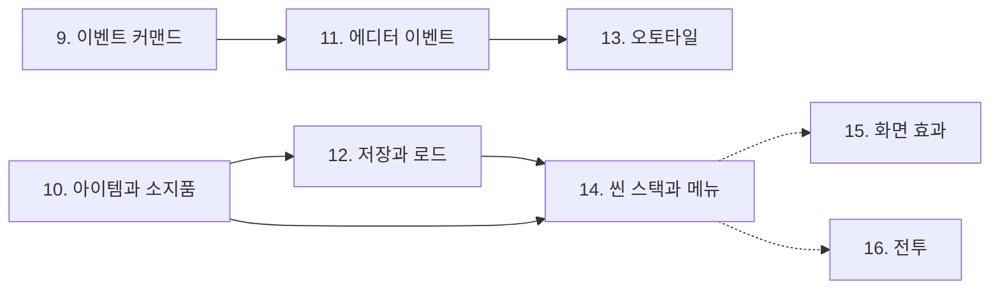

# 다음 로드맵 (v2): 게임을 만들 수 있는 엔진에서, 게임을 만드는 엔진으로

> 작성일: 2026-08-20. [index.md](index.md)의 1차 로드맵(1~9단계)이 끝난 뒤의 계획이다.
> index.md는 계속 입구이자 진행 추적표이며, 이 문서는 **왜 그 순서인가**를 적는다.

## 1. 1차 로드맵이 증명한 것과 남긴 것

1차 로드맵의 목표 문장은 이것이었다.

> InitialEditor로 맵을 그리고 스크립트를 작성하면, Initial2D에서 캐릭터가 걸어다니고,
> NPC에게 말을 걸면 대화창이 뜨는 게임이 실행된다.

증명되었다. 그리고 이슈 24가 그 증명의 빈 곳을 짚어 9단계가 열렸고, 9단계가 이벤트를
데이터로 만들면서 **에디터가 게임을 만들 수 있는 길**이 처음 열렸다.

남은 것은 셋이다.

1. **게임이 게임처럼 굴러가지 않는다.** 걷고 읽는 것 말고 할 일이 없었다 (10단계가 답한다).
2. **에디터가 아직 이벤트를 못 만든다.** 데이터는 준비되었는데 편집기가 없다 (11단계).
3. **껐다 켜면 다 사라진다.** 5분짜리 데모라 티가 안 났을 뿐이다 (12단계).

## 2. 다음 로드맵의 한 문장

> **Lua를 한 줄도 쓰지 않고, 에디터에서 맵과 이벤트를 만들고, 그렇게 만든 게임을
> 저장하고 이어서 할 수 있다.**

1차 로드맵이 "엔진이 되는가"였다면, 이번은 "**도구가 되는가**"다.

## 3. 순서를 정한 기준

순서는 기능의 크기가 아니라 **막히는 순서**로 정했다. 실제로 게임을 만들다가 먼저
막히는 것이 먼저다.

1. 할 일이 없다 → 아이템과 심부름 (10)
2. 이벤트를 손으로 적어야 한다 → 에디터 (11)
3. 껐다 켜면 사라진다 → 저장 (12)
4. 맵을 그리는 게 고통스럽다 → 오토타일 (13)
5. 창을 겹칠 수가 없다 → 씬 스택과 메뉴 (14)
6. 연출이 밋밋하다 → 화면 효과 (15)
7. 장르를 넓히고 싶다 → 전투 (16)

4번까지가 "도구가 되는가"의 답이고, 5번부터는 "무엇을 만들 것인가"에 달렸다.
**5번 이후는 순서가 아니라 후보 목록이다.**

## 4. 단계별 계획

### 10단계: 아이템과 소지품 ([11-game-systems.md](11-game-systems.md))

**막히는 자리**: 잠긴 문이 영원히 잠겨 있고, 여관 주인이 말하는 은화 두 닢이 게임 안에
없다. 선택지가 대사만 바꾼다.

**만드는 것**: `scripts/rpg/inventory.lua`(소지품), `scripts/rpg/menu.lua`(소지품 창),
커맨드 `giveItem`/`takeItem`과 `{ item = ... }` 조건. 그 위에 심부름 사슬 하나.

**크기**: 소. C++ 무수정.

### 11단계: 에디터가 이벤트를 만든다 ([12-editor-events.md](12-editor-events.md))

**막히는 자리**: 이벤트가 데이터가 되었는데 편집기가 없다. 그리고 지금 에디터로 맵을
열어 저장하면 **이벤트가 사라진다.** 가만히 두는 것이 더 위험한 상태다.

**만드는 것**: 커맨드 스키마 한 장(`resources/schema/event-commands.json`)과 그것을
읽어 폼을 만드는 에디터 화면. 마일스톤 1(잃지 않기)만으로도 값어치가 있다.

**크기**: 대. 두 저장소에 걸친다. **가장 값어치가 큰 단계**이며, 이것이 끝나야
"에디터로 게임을 만든다"가 말이 된다.

### 12단계: 저장과 로드

**막히는 자리**: `ctx.state`가 껐다 켜면 사라진다. 데모를 넘어가는 순간 첫 번째로
막히는 곳이다.

**만드는 것과 설계 메모**:

- **세이브 하나 = `state` + 지금 어디에 서 있는가.** `state`는 이미 순수 데이터
  하나(플래그, 변수, 소지품)이고, 여기에 맵 이름, 타일 좌표, 방향, BGM 슬롯을 더하면
  끝이다. 새 자료구조가 필요 없다는 것이 6단계 설계의 배당금이다.
- **필요한 엔진 기능은 둘.**
  1. `Json.Save(path, table)`: 지금은 `Json.Load`만 있다. 범용 기능이며
     ("플래피버드의 최고 점수에도 말이 되는가?"에 그렇다고 답할 수 있다) 코어에 넣어도 원칙에 어긋나지
     않는다. 순환 참조와 함수는 거부하고 어디서 걸렸는지 알린다.
  2. **쓰기 가능한 경로.** 데스크톱은 실행 폴더 옆이 되지만 안드로이드는 안 된다
     (APK 안의 assets는 파일 시스템이 아니다). `SDL_GetPrefPath`를 쓰는
     `GetSaveDirectory()` 바인딩 하나. **주의**: `lua_prot.cpp`는 GDI와 공용이므로,
     GDI 쪽 동작을 바꾸지 않도록 SDL2 플랫폼 층에 두고 GDI에는 현재 폴더를 돌려주는
     기본값만 둔다 (CLAUDE.md의 GDI 무수정 원칙).
- **이벤트가 도는 중에는 저장하지 않는다.** 실행기는 코루틴이고 코루틴은 직렬화할 수
  없다. RPG Maker와 같은 규칙이며, 소지품 창처럼 "한가할 때만"으로 막는다.
- **슬롯 셋과 타이틀의 "이어하기".** 타이틀 메뉴에 항목 하나가 는다. 세이브가 없으면
  회색으로 둔다.
- **직렬화할 수 없는 것이 `state`에 들어가지 못하게 한다.** 지금도 순수 데이터지만,
  검증 하나를 넣어 두면 나중에 누가 함수를 넣었을 때 저장이 아니라 테스트가 먼저 깨진다.

**크기**: 중. C++ 두 곳(바인딩 하나, 경로 하나).

### 13단계: 오토타일

**막히는 자리**: 맵을 손으로 그릴 때 가장 먼저 답답해지는 부분. 9단계와 10단계에서
항구 마을의 길과 광장과 물가를 **생성기의 후처리 한 번**으로 이어 붙였는데
(`generate_port_maps.py`의 `blend_sand`), 그것은 생성기가 아니라 에디터가 할 일이다.

**설계 메모: 굽기냐 실어 나르기냐**

두 갈래가 있고, **굽기를 권한다**.

| | 굽기 (권장) | 실어 나르기 |
|---|---|---|
| 방식 | 에디터가 오토타일을 계산해 **최종 gid**로 내보낸다 | 맵 포맷에 `(autotileId, shape)`를 넣고 엔진이 푼다 |
| 엔진 | **무수정** | 렌더러와 로더를 고쳐야 한다 |
| 맵 포맷 | v2 그대로 | v3 |
| 다시 열어 편집 | 원본 정보가 없다 → 에디터가 `autotile` 배열을 **덤으로 실어 둔다**. 엔진은 그냥 무시한다 | 그대로 |
| 런타임 변경 | 안 된다 (게임 중 지형이 바뀌는 연출) | 된다 |

굽기의 "덤으로 실어 두기"는 v2의 `events`와 정확히 같은 패턴이다. **엔진이 모르는
필드를 맵 파일이 실어 나르고, 에디터만 읽는다.** 그 패턴이 이미 한 번 통했다는 것이
근거다. 런타임에 지형이 바뀌는 연출이 필요해지면 그때 실어 나르기로 옮긴다.

에디터에는 이미 `AutoTile.ts`(Wang blob 6x8)가 있다. 쓰이지 않고 있을 뿐이다.

**크기**: 대. 주로 에디터.

### 14단계: 씬 스택과 메뉴 화면

**막히는 자리**: `SwitchScene(name)`은 교체다. 맵 위에 메뉴를 겹칠 수가 없다.
10단계의 소지품 창은 "씬이 아니라 씬 안의 창"으로 피해 갔는데, 그 회피는 창 하나까지다.
장비, 상태, 저장, 설정이 붙으면 화면이 스스로 서야 한다.

**만드는 것**: push/pop이 되는 씬 스택(C++ 또는 Lua 층인지는 그때 판단), 그 위의 메뉴
화면. 소지품 창은 메뉴의 항목 하나로 들어간다.

**크기**: 중.

### 15단계 이후: 후보

여기부터는 순서가 아니다. **만들려는 게임이 요구하는 것이 다음이 된다.**

| 후보 | 언제 필요해지는가 | 어디에 붙는가 | 크기 |
|---|---|---|---|
| 화면 효과 (색조, 픽처, 날씨) | 저녁이 오는 연출을 하고 싶을 때. 기획서 9절이 미룬 것 | C++ 렌더러 + Lua API | 중 |
| ~~전투~~ → **앞당겨졌다** | 저자의 기획서 반입(2026-08-23)으로 **알데바란 트랙**(횡스크롤 액션, [aldebaran-1-core.md](aldebaran-1-core.md)~3)이 되었다. RPG 전투가 아니라 별도 게임이며, 전부 `scripts/games/aldebaran/` | Lua | 대 |
| 데이터베이스 (아이템, 적, 스킬) | 아이템이 스무 개가 넘을 때. 지금은 Lua 표 하나로 충분하다 | 에디터 + JSON | 중 |
| 오디오 채널 분리 (BGS, ME) | 파도 소리와 음악을 따로 다룰 때 | C++ 오디오 | 소 |
| 다국어 | 이 게임에는 필요 없다. 다음 게임에서 | Lua | 중 |

## 5. 이야기는 어디로 가는가

기획서([docs/design/port-town.md](../design/port-town.md))는 저자의 자작곡에서 세계를
가져왔고, **말로만 존재하는 장소 셋**을 남겨 두었다. 그것이 다음 게임의 지도다.

| 장소 | 지금 | 무엇이 있어야 갈 수 있는가 |
|---|---|---|
| 요정의 숲 | 아이와 등대지기의 대사 속 | 맵 한두 장, 오토타일(13), 화면 효과(15) |
| 사막 항로 | 선장의 대사 속 | 배 위의 장면 (씬 스택(14)이나 이동 연출) |
| 천공의 끝 | 등대지기가 한 번 입에 올린다 | 전투(16)나 그에 준하는 클라이맥스 |

엔진의 단계와 이야기의 장소가 짝을 이루고 있다는 점이 중요하다. **기능을 위한 기능을
만들지 않기 위한 장치**다. 어떤 단계를 할지 망설여지면 "그것 없이 어느 장소를 못
만드는가"를 묻는다.

## 6. 하지 않기로 한 것

- **3D, 물리 엔진, 네트워크.** 2D 엔진이다.
- **비주얼 스크립팅(노드 그래프).** 이벤트 커맨드 목록이 그 자리를 이미 채운다.
- **에디터의 Electron 전환.** 브리지 서버 방식이 3단계에서 정해졌고 잘 돌고 있다.
- **RPG 전용 개념의 C++ 이식.** 성능 문제가 실측으로 드러나기 전까지는 Lua에 둔다.
  지금 데모는 헤드리스 소프트웨어 렌더러에서도 60fps를 넘긴다.

## 7. 갱신 규칙

[index.md](index.md)와 같다. 단계를 시작하면 index.md의 진행 상황 표를 🟡로 바꾸고,
끝나면 그 단계 문서의 체크리스트와 표를 함께 갱신한다. **계획이 현실과 어긋나면 계획
문서를 고친다. 문서는 계약이 아니라 지도다.**
